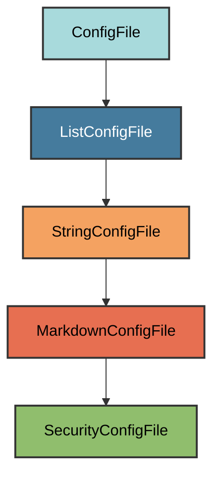

# Security Configuration

The `SecurityConfigFile` manages the `SECURITY.md` file for the project.

## Overview

Creates a SECURITY.md file that:

- Uses a minimal best practices template
- Covers vulnerability reporting guidelines
- Inserts user's email from git config
- Located at the project root
- Works for both private and public repositories

## Inheritance



**Inherits from**: `MarkdownConfigFile`

**What this means**:

- Markdown file format (`.md` extension)
- Text-based validation
- User can replace with their own security policy
- File is considered correct if it exists and is non-empty

## File Location

**Path**: `SECURITY.md` (project root)

**Extension**: `.md` - Standard Markdown extension.

**Filename**: `SECURITY` (uppercase) - The standard community health file
recognized by GitHub and other platforms.

## How It Works

### Automatic Generation

When initialized via `uv run pyrig mkroot`, the file is created by:

1. **Load template**: Uses embedded minimal template
2. **Insert email**: Replaces `[INSERT CONTACT METHOD]`
with user's email from git config
3. **Write file**: Creates SECURITY.md with content

### Template Content

The template includes:

1. **Reporting a Vulnerability**: Email contact, not public issues
2. **What to include**: Description, steps, versions, impact

### Automatic Creation

```bash
uv run pyrig mkroot
```

### Generated Content

The template creates a SECURITY.md with:

- **Warning**: Do not report via public issues
- **Email contact**: Auto-inserted from git config
- **Required information**: What to include in reports
- **Response commitment**: Timeline and credit policy

### Using a Custom Policy

Replace the SECURITY.md file content with your own security policy. The file
will be considered valid as long as it exists and contains content.

## Validation Logic

The validation checks if SECURITY.md exists and is non-empty. This allows users
to replace the template with their own security policy.

**Required element**: File must exist and contain text.

## Why This Template?

The template follows minimal best practices:

- **Private reporting**: Vulnerabilities should not be public
- **Clear contact**: Email address for reports
- **Actionable**: What information to include
- **Responsive**: Sets expectations for response time

## Best Practices

1. **Monitor the email**: Respond to security reports promptly
2. **Keep it confidential**: Don't discuss until fixed
3. **Credit reporters**: Acknowledge their contribution
4. **Customize if needed**: Add supported versions table if maintaining multiple
5. **Link from README**: Consider referencing SECURITY.md in your README

**Tip**: GitHub automatically detects SECURITY.md and displays it in the
repository's community health files and security tab.
