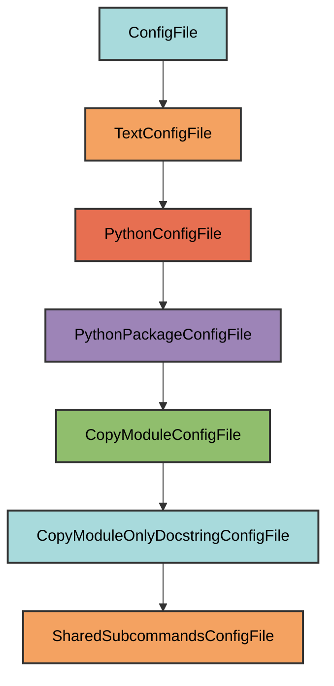

# shared_subcommands.py Configuration

The `SharedSubcommandsConfigFile` manages the `dev/cli/shared_subcommands.py`
file.

## Overview

Creates a shared_subcommands.py file that:

- Copies only the docstring from `pyrig.dev.cli.shared_subcommands`
- Provides a place to define CLI subcommands shared across all pyrig projects
- Automatically discovered by pyrig's CLI system
- Allows creating reusable commands available in all your pyrig-based projects

## Inheritance



**Inherits from**: `CopyModuleOnlyDocstringConfigFile`

**What this means**:

- Copies only the docstring from the source module
- Allows you to add custom implementation
- Automatically determines target path
- Ensures parent directory is a valid Python package

## File Location

**Path**: `{package_name}/dev/cli/shared_subcommands.py`

**Source module**: `pyrig.dev.cli.shared_subcommands`

**Path transformation**: `pyrig.dev.cli.shared_subcommands` →
`{package_name}.dev.cli.shared_subcommands` →
`{package_name}/dev/cli/shared_subcommands.py`

## How It Works

### Automatic Generation

When initialized via `uv run pyrig mkroot`, the file is created with:

1. **Docstring copy**: Only the docstring from
   `pyrig.dev.cli.shared_subcommands` is copied
2. **Package structure**: The `dev/cli/` directory is created
3. **Ready for customization**: You can add your own shared subcommand functions

### Generated Content

```python
"""Shared CLI subcommands available in all pyrig projects."""
```

The file contains only the docstring, allowing you to add shared CLI commands.

## Usage

### Automatic Creation

```bash
uv run pyrig mkroot
```

### Purpose

This file is where you define CLI subcommands that should be available across
all your pyrig-based projects. Commands defined here are shared and reusable.

See the [CLI Subcommands documentation](../cli/subcommands.md) for details on
creating custom commands.

## Best Practices

1. **Don't modify the docstring**: Keep the copied docstring intact
2. **Add shared commands**: Define functions that are useful across multiple
   projects
3. **Keep it generic**: Shared commands should work in any pyrig project
4. **Document thoroughly**: Add clear docstrings since these are reused
