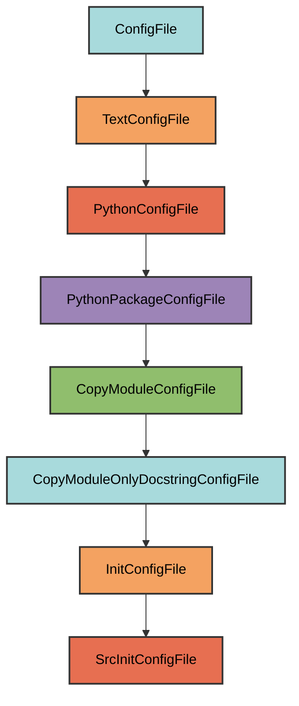

# src/**init**.py Configuration

The `SrcInitConfigFile` manages the `src/__init__.py` file.

## Overview

Creates a src package that:

- Mirrors the structure of `pyrig.src`
- Copies only the docstring from the source module
- Ensures the src directory exists with proper package structure
- Provides a place for application source code

## Inheritance



**Inherits from**: `InitConfigFile`

**What this means**:

- Creates `__init__.py` files for package initialization
- Copies only the docstring from `pyrig.src`
- Automatically determines target path
- Ensures parent directory is a valid Python package

## File Location

**Path**: `{package_name}/src/__init__.py`

**Source module**: `pyrig.src`

**Path transformation**: `pyrig.src` → `{package_name}.src` →
`{package_name}/src/__init__.py`

## How It Works

### Automatic Generation

When initialized via `uv run pyrig mkroot`, the file is created with:

1. **Docstring copy**: Only the docstring from `pyrig.src.__init__.py` is copied
2. **Package structure**: The `src/` directory is created
3. **Package initialization**: Parent directories get `__init__.py` files

### Generated Content

```python
"""Source code package for application logic."""
```

The file contains only the docstring, allowing you to add your application's
source code.

## Usage

### Automatic Creation

```bash
uv run pyrig mkroot
```

### Purpose

This package is where you add your application's source code. The `src/`
directory contains the core business logic and utilities for your project.

## Best Practices

1. **Don't modify the docstring**: Keep the copied docstring intact
2. **Add application code**: Create modules and packages for your application
   logic
3. **Follow pyrig patterns**: Use the same structure as pyrig's src directory
