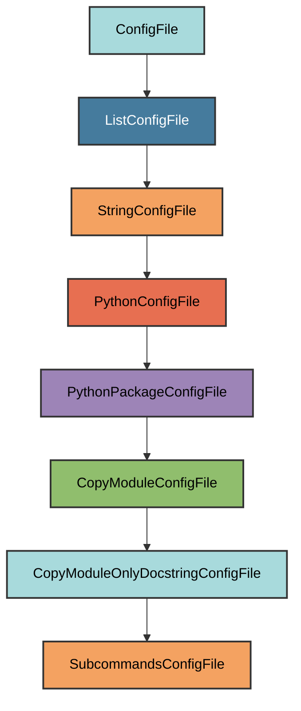

# subcommands.py Configuration

The `SubcommandsConfigFile` manages the `{package_name}/rig/cli/subcommands.py`
file.

## Overview

Creates a subcommands.py file that:

- Copies only the docstring from `pyrig.rig.cli.subcommands`
- Provides a place to define custom CLI subcommands
- Automatically discovered by pyrig's CLI system
- Allows extending the CLI with project-specific commands

## Inheritance



**Inherits from**: `CopyModuleOnlyDocstringConfigFile`

**What this means**:

- Copies only the docstring from the source module
- Allows you to add custom implementation
- Automatically determines target path
- Ensures parent directory is a valid Python package

## File Location

**Path**: `{package_name}/rig/cli/subcommands.py`

**Source module**: `pyrig.rig.cli.subcommands`

**Path transformation**: `pyrig.rig.cli.subcommands` →
`{package_name}.rig.cli.subcommands` → `{package_name}/rig/cli/subcommands.py`

## How It Works

### Automatic Generation

When initialized via `uv run pyrig mkroot`, the file is created with:

1. **Docstring copy**: Only the docstring from `pyrig.rig.cli.subcommands` is
   copied
2. **Package structure**: The `rig/cli/` directory is created
3. **Ready for customization**: You can add your own subcommand functions

### Generated Content

The file contains only the docstring, allowing you to add custom CLI commands.

## Usage

### Automatic Creation

```bash
uv run pyrig mkroot
```

### Purpose

This file is where you define custom CLI subcommands specific to your project.
Any function defined here becomes a CLI command.

See the [CLI Subcommands documentation](../cli/subcommands.md) for details on
creating custom commands.

## Best Practices

1. **Don't modify the docstring**: Keep the copied docstring intact
2. **Add command functions**: Define functions that will become CLI commands
3. **Follow naming conventions**: Use clear, descriptive function names
4. **Add docstrings**: Document your commands for help text
