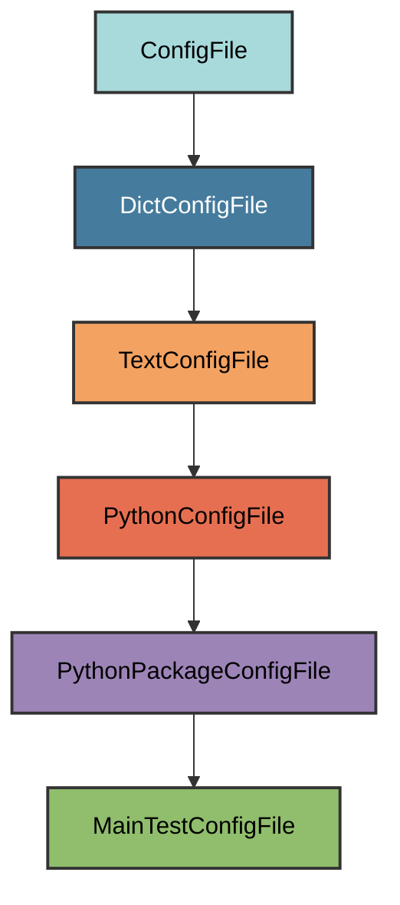

# test_main.py Configuration

The `MainTestConfigFile` manages the `tests/test_{package_name}/test_main.py`
file.

## Overview

Creates a test_main.py file that:

- Tests the CLI entry point (main.py)
- Uses the `main_test_fixture` autouse fixture
- Ensures the CLI responds correctly
- Validates the main function exists and works

## Inheritance



**Inherits from**: `PythonPackageConfigFile` (via `DictConfigFile`)

**What this means**:

- Python file with package structure
- Ensures parent directory is a valid Python package
- Text-based validation (checks for required content)
- Allows modifications as long as `test_main` function exists

## File Location

**Path**: `tests/test_{package_name}/test_main.py` (e.g.,
`tests/test_myapp/test_main.py`)

**Extension**: `.py` - Python source file.

**Filename**: `test_main` - Test file for main.py.

**Path transformation**:

1. Start with `pyrig.main` → `tests.test_pyrig.test_main`
2. Replace `test_pyrig` with `test_{package_name}` →
   `tests.test_myapp.test_main`
3. Convert to file path → `tests/test_myapp/test_main.py`

## How It Works

### Automatic Generation

When initialized via `uv run pyrig mkroot`, the file is created with:

1. **Test function**: A `test_main` function that uses the `main_test_fixture`
2. **Fixture usage**: The autouse fixture validates the CLI works
3. **Simple assertion**: Just checks the fixture returns None

### Generated Content

```python
"""test module."""


def test_main(main_test_fixture: None) -> None:
    """Test func for main."""
    assert main_test_fixture is None
```

The test relies on the `main_test_fixture` autouse fixture to do the actual
validation.

### Validation Logic

The validation checks for the test function:

**Required element**: A `def test_main` function.

**Flexible content**: You can add additional tests or modify the implementation
as long as `test_main` exists.

## Usage

### Automatic Creation

```bash
uv run pyrig mkroot
```

### Purpose

This file tests the CLI entry point by:

- Using the `main_test_fixture` which runs `uv run myapp --help`
- Ensuring the CLI responds without errors
- Validating the main function is properly configured

See the [Testing documentation](../tests/index.md) for details on the test
infrastructure.

## Best Practices

1. **Keep the test_main function**: Don't remove it, as it validates the CLI
2. **Add more tests**: You can add additional tests for CLI functionality
3. **Use the fixture**: The `main_test_fixture` does the heavy lifting
4. **Test CLI commands**: Add tests for your custom subcommands
