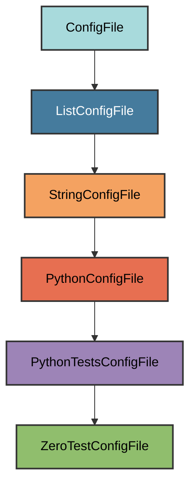

# test_zero.py Configuration

The `ZeroTestConfigFile` manages the `tests/test_zero.py` file.

## Overview

Creates a test_zero.py file that:

- Provides a placeholder test when no other tests exist
- Ensures pytest runs successfully even with no real tests
- Triggers execution of autouse fixtures
- Contains a single empty test function

## Inheritance



**Inherits from**: `PythonTestsConfigFile` (via `ListConfigFile`)

**What this means**:

- Python file in the tests directory
- Located at `tests/test_zero.py`
- Text-based validation (checks for required content)
- Simple placeholder test

## File Location

**Path**: `tests/test_zero.py`

**Extension**: `.py` - Python source file.

**Filename**: `test_zero` - Derived from class name `ZeroTestConfigFile` with
special handling to reverse the parts (zero_test → test_zero).

## How It Works

### Automatic Generation

When initialized via `uv run pyrig mkroot`, the file is created with:

1. **Empty test**: A single test function that does nothing
2. **Docstring**: Explains the file's purpose
3. **Fixture execution**: Ensures autouse fixtures run even with no real tests

### Generated Content

```python
"""Contains an empty test."""


def test_zero() -> None:
    """Empty test.

    Exists so that when no tests are written yet the base fixtures are executed.
    """
```

The test does nothing but ensures pytest has at least one test to run.

## Usage

### Automatic Creation

```bash
uv run pyrig mkroot
```

### Purpose

This file ensures that:

- Pytest runs successfully even when you haven't written tests yet
- Autouse fixtures execute (which validate project structure)
- CI/CD pipelines don't fail due to "no tests collected"

See the [Testing documentation](../tests/index.md) for details on the test
infrastructure.

## Best Practices

1. **Keep it simple**: Don't add logic to this test
2. **Delete when ready**: Remove this file once you have real tests
3. **Don't rely on it**: This is a placeholder, not a real test
