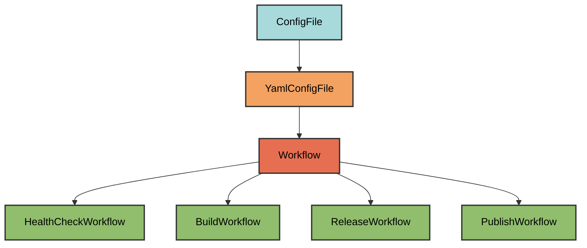
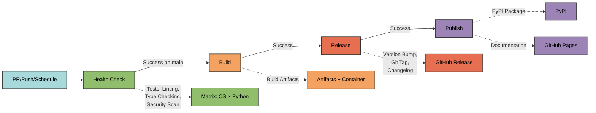

# Workflow Architecture

GitHub Actions workflows for CI/CD automation in pyrig projects.

## Overview

Pyrig provides a declarative API for building GitHub Actions workflows through the `Workflow` base class. All workflow config files inherit from this class and generate YAML files in `.github/workflows/`.

## Inheritance Hierarchy



## Workflow Base Class

The `Workflow` class provides:

### Core Structure

- **Jobs**: Define workflow jobs with dependencies, strategies, and steps
- **Steps**: Individual actions or shell commands within jobs
- **Triggers**: Events that start the workflow (push, PR, schedule, workflow_run)
- **Permissions**: GitHub token permissions for the workflow
- **Matrix Strategies**: Run jobs across OS and Python version combinations

### Declarative API

Instead of writing YAML manually, you define workflows in Python:

```python
class MyWorkflow(Workflow):
    @classmethod
    def get_jobs(cls) -> dict[str, Any]:
        return cls.get_job(
            job_func=cls.my_job,
            runs_on=cls.UBUNTU_LATEST,
            steps=[
                cls.step_checkout_repository(),
                cls.step_setup_project_mgt(python_version="3.12"),
                cls.step_run_tests(),
            ]
        )
```

### Naming Conventions

- **Workflow name**: Generated from class name (e.g., `HealthCheckWorkflow` → `"Health Check"`)
- **Job IDs**: Generated from method names (e.g., `job_health_check_matrix` → `"health_check_matrix"`)
- **Step IDs**: Generated from method names (e.g., `step_run_tests` → `"run_tests"`)

### Opt-Out Mechanism

Workflows can be opted out by replacing all steps with `step_opt_out_of_workflow()`. This creates a valid workflow that never runs, allowing users to disable workflows without deleting files. Or if you empty the file it will be regenerated on next `uv run myapp mkroot` with the opt-out steps for you. So just empty the file and run `uv run myapp mkroot` to opt out.

## Concrete Workflows

Pyrig provides four workflows that form a complete CI/CD pipeline:

### 1. Health Check Workflow

**File**: `.github/workflows/health_check.yaml`

**Triggers**:
- Pull requests
- Pushes to main
- Scheduled (daily, staggered by dependency depth)

**Jobs**:
- **health_check_matrix**: Runs across OS (Ubuntu, Windows, macOS) and Python versions
  - Linting (ruff)
  - Type checking (ty, mypy)
  - Security scanning (bandit)
  - Tests with coverage (pytest)
  - Coverage upload (codecov)
- **health_check**: Aggregates matrix results

**Purpose**: Continuous integration - ensures code quality on every change.

### 2. Build Workflow

**File**: `.github/workflows/build.yaml`

**Triggers**:
- After health check completes successfully on main

**Jobs**:
- **build_artifacts**: Builds project artifacts across OS matrix
- **build_container_image**: Builds container image (Ubuntu only)

**Purpose**: Creates distributable artifacts after CI passes.

### 3. Release Workflow

**File**: `.github/workflows/release.yaml`

**Triggers**:
- After build workflow completes successfully

**Jobs**:
- **release**: Creates GitHub release
  - Bumps patch version
  - Commits and pushes changes
  - Creates and pushes git tag
  - Downloads artifacts from build workflow
  - Generates changelog
  - Creates GitHub release with artifacts

**Permissions**: `contents: write`, `actions: read`

**Purpose**: Automates versioning and GitHub releases.

### 4. Publish Workflow

**File**: `.github/workflows/publish.yaml`

**Triggers**:
- After release workflow completes successfully

**Jobs**:
- **publish_package**: Publishes to PyPI
  - Builds wheel
  - Publishes with PYPI_TOKEN (if configured)
- **publish_documentation**: Publishes to GitHub Pages
  - Builds MkDocs site
  - Uploads and deploys to Pages

**Permissions**: `pages: write`, `id-token: write` (for docs job)

**Purpose**: Distributes package and documentation.

## Workflow Pipeline



## Best Practices

1. **Don't edit YAML directly**: Modify the Python workflow classes instead
2. **Use opt-out for customization**: Replace steps with `step_opt_out_of_workflow()` to disable
3. **Configure secrets**: Add REPO_TOKEN, PYPI_TOKEN, CODECOV_TOKEN to repository secrets
4. **Test locally**: Run `uv run myapp mkroot` to regenerate workflows after changes

