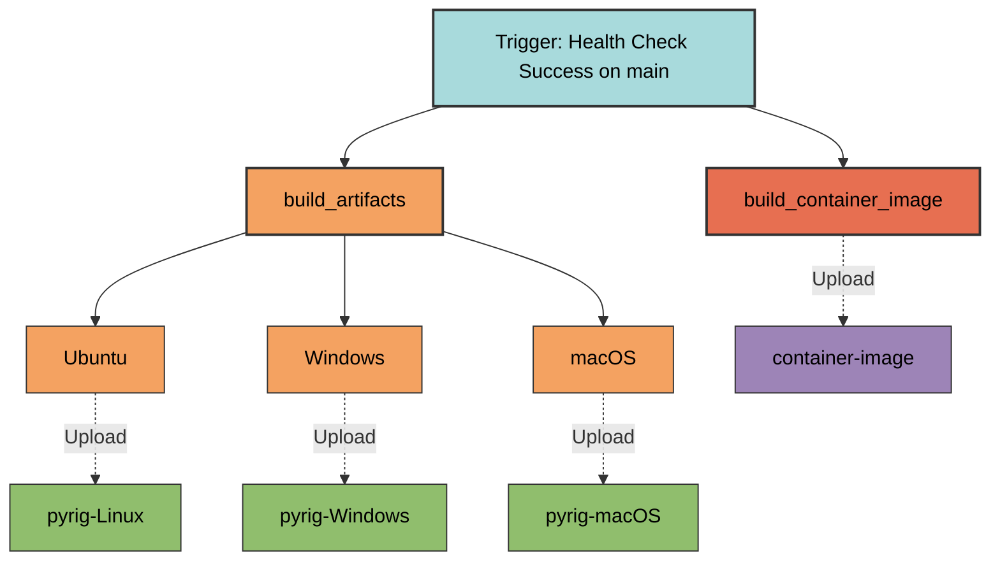
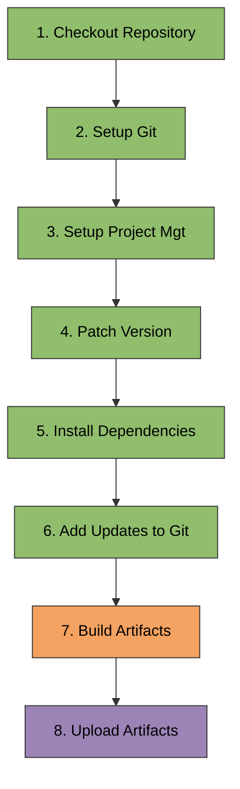
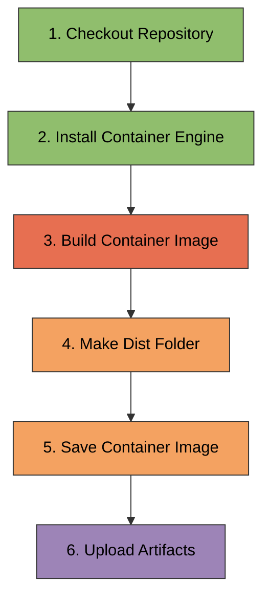

# build.yaml

Artifact building workflow that creates distributable packages and container
images.

## Overview

**File**: `.github/workflows/build.yaml`  
**Class**: `BuildWorkflow` in `pyrig.dev.configs.workflows.build`  
**Inherits**: `Workflow`

The build workflow runs after successful health checks on the main branch. It
builds platform-specific artifacts (executables, wheels) across OS matrix and
creates a container image. These artifacts are uploaded for the release workflow
to publish.

## Triggers

### Workflow Run

- **Workflow**: `Health Check`
- **Event**: `completed`
- **Branches**: `main`
- **Condition**: Only runs if health check succeeded

**Why workflow_run?** Ensures artifacts are only built after all tests pass on
main branch.

### Workflow Dispatch

- **Purpose**: Manual trigger for testing

## Job Flow

## Jobs

### 1. build_artifacts

**Runs on**: Matrix of OS (Ubuntu, Windows, macOS) **Strategy**:
`fail-fast: true` **Condition**:
`github.event.workflow_run.conclusion == 'success'`

**Step Flow**:

**Steps**:

1. **Checkout Repository** (`actions/checkout@main`)
   - Clones the repository code

2. **Setup Git**
   - Configures git user as `github-actions[bot]`

3. **Setup Project Mgt** (`astral-sh/setup-uv@main`)
   - Installs uv package manager
   - Uses Python 3.14 (latest supported version)

4. **Patch Version**
   - Bumps patch version in `pyproject.toml`
   - Stages change with `git add`

5. **Install Python Dependencies**
   - Updates lock file: `uv lock --upgrade`
   - Installs dependencies: `uv sync`

6. **Add Dependency Updates To Git**
   - Stages `pyproject.toml` and `uv.lock`

7. **Build Artifacts**
   - Runs `uv run pyrig build`
   - Executes all builder classes in `myapp/dev/builders/`
   - Creates platform-specific executables, wheels, etc.
   - Outputs to `dist/` directory

8. **Upload Artifacts** (`actions/upload-artifact@main`)
   - Uploads `dist/` directory
   - Artifact name: `pyrig-{OS}` (e.g., `pyrig-Linux`, `pyrig-Windows`,
     `pyrig-macOS`)
   - Available for download in release workflow

**Why matrix?** Different OS produce different artifacts (Linux ELF, Windows
EXE, macOS Mach-O).

### 2. build_container_image

**Runs on**: Ubuntu latest **Condition**:
`github.event.workflow_run.conclusion == 'success'`

**Step Flow**:

**Steps**:

1. **Checkout Repository** (`actions/checkout@main`)
   - Clones the repository code

2. **Install Container Engine** (`redhat-actions/podman-install@main`)
   - Installs Podman container engine
   - Uses `GITHUB_TOKEN` for authentication

3. **Build Container Image**
   - Runs `podman build -t pyrig .`
   - Uses `Containerfile` in repository root
   - Tags image as `pyrig`

4. **Make Dist Folder**
   - Creates `dist/` directory: `mkdir -p dist`

5. **Save Container Image**
   - Exports image to tarball: `podman save -o dist/pyrig.tar pyrig`
   - Creates portable image archive

6. **Upload Artifacts** (`actions/upload-artifact@main`)
   - Uploads `dist/pyrig.tar`
   - Artifact name: `container-image`
   - Available for distribution or deployment

**Why Podman?** Daemonless, rootless container engine preferred over Docker for
security and simplicity.

## Environment Variables

- **PYTHONDONTWRITEBYTECODE**: `1` (prevents `.pyc` files)
- **UV_NO_SYNC**: `1` (prevents automatic sync on uv commands)

## Artifacts Produced

### Platform Artifacts

- **pyrig-Linux**: Linux executables and wheels
- **pyrig-Windows**: Windows executables and wheels
- **pyrig-macOS**: macOS executables and wheels

### Container Image

- **container-image**: Podman/Docker image tarball (`pyrig.tar`)

## Usage

### Automatic Trigger

Runs automatically when health check succeeds on main branch.

### Manual Trigger

GitHub Actions tab → Build → Run workflow

### Downloading Artifacts

1. Go to workflow run in GitHub Actions
2. Scroll to "Artifacts" section
3. Download platform-specific or container artifacts

## Best Practices

1. **Define builders**: Create builder classes in `myapp/dev/builders/` for
   custom artifacts
2. **Test locally**: Run `uv run pyrig build` before pushing
3. **Check all platforms**: Verify artifacts build successfully on all OS
4. **Keep Containerfile updated**: Ensure container image builds correctly
