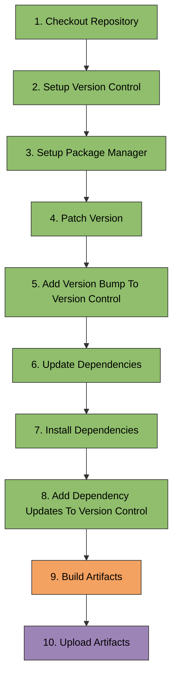
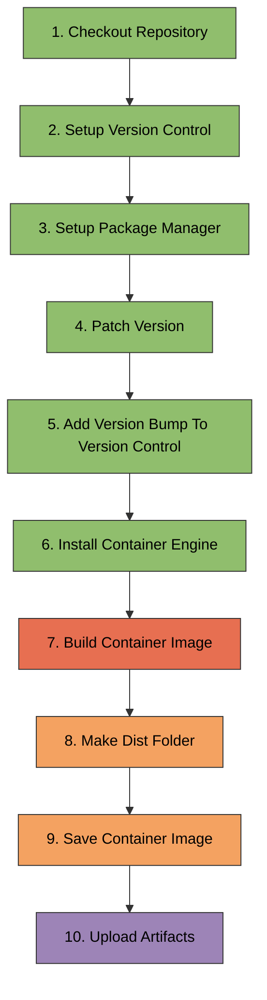

# build.yml

Artifact building workflow that creates distributable packages and container
images.

## Overview

**File**: `.github/workflows/build.yml`
**Class**: `BuildWorkflowConfigFile` in `pyrig.rig.configs.workflows.build`  
**Inherits**: `WorkflowConfigFile`

The build workflow runs after successful health checks on the main branch. It
builds platform-specific artifacts (executables, wheels) across OS matrix and
creates a container image. These artifacts are uploaded for the release workflow
to create releases.

## Triggers

### WorkflowConfigFile Run

- **WorkflowConfigFile**: `Health Check`
- **Event**: `completed`
- **Branches**: `main`
- **Condition**: Only runs if health check succeeded and was not cron-triggered

**Why workflow_run?** Ensures artifacts are only built after all tests pass on
main branch.

**Why exclude cron?** Scheduled health checks validate dependencies daily but
shouldn't trigger releases. Only actual code changes (push) should create new
releases.

### WorkflowConfigFile Dispatch

- **Purpose**: Manual trigger for testing

## Job Flow

## Jobs

### 1. build_artifacts

**Runs on**: Matrix of OS (Ubuntu, Windows, macOS) **Strategy**:
`fail-fast: true` **Condition**: Health check succeeded and not cron-triggered

**Step Flow**:

**Steps**:

1. **Checkout Repository** (`actions/checkout@main`)
   - Clones the repository code

2. **Setup Version Control**
   - Configures git user as `github-actions[bot]`

3. **Setup Package Manager** (`astral-sh/setup-uv@main`)
   - Installs uv package manager
   - Uses the default Python version (latest supported)

4. **Patch Version**
   - Bumps patch version: `uv version --bump patch`
   - Updates `pyproject.toml` with new version

5. **Add Version Bump To Version Control**
   - Stages `pyproject.toml` and `uv.lock`

6. **Update Dependencies**
   - Updates lock file: `uv lock --upgrade`

7. **Install Dependencies**
   - Installs dependencies: `uv sync`

8. **Add Dependency Updates To Version Control**
   - Stages `pyproject.toml` and `uv.lock`

9. **Build Artifacts**
   - Runs `uv run pyrig build`
   - Executes configured builder classes
     (e.g., `myapp/rig/builders/` in a consumer repo)
   - Creates platform-specific executables, wheels, etc.
   - Outputs to `dist/` directory

10. **Upload Artifacts** (`actions/upload-artifact@main`)
    - Uploads `dist/` directory
    - Artifact name: `pyrig-{OS}` (e.g., `pyrig-Linux`, `pyrig-Windows`,
      `pyrig-macOS`)
    - Available for download in release workflow

**Why matrix?** Different OS produce different artifacts (Linux ELF, Windows
EXE, macOS Mach-O).

### 2. build_container_image

**Runs on**: Ubuntu latest **Condition**:
Health check succeeded and not cron-triggered

**Step Flow**:

**Steps**:

1. **Checkout Repository** (`actions/checkout@main`)
   - Clones the repository code

2. **Setup Version Control**
   - Configures git user as `github-actions[bot]`

3. **Setup Package Manager** (`astral-sh/setup-uv@main`)
   - Installs uv package manager
   - Uses the default Python version (latest supported)

4. **Patch Version**
   - Bumps patch version: `uv version --bump patch`
   - Updates `pyproject.toml` with new version

5. **Add Version Bump To Version Control**
   - Stages `pyproject.toml` and `uv.lock`

6. **Install Container Engine** (`redhat-actions/podman-install@main`)
   - Installs Podman container engine
   - Uses `GITHUB_TOKEN` for authentication

7. **Build Container Image**
   - Runs `podman build -t pyrig .`
   - Uses `Containerfile` in repository root
   - Tags image as `pyrig`

8. **Make Dist Folder**
   - Creates `dist/` directory: `mkdir -p dist`

9. **Save Container Image**
   - Exports image to tarball: `podman save -o dist/pyrig.tar pyrig`
   - Creates portable image archive

10. **Upload Artifacts** (`actions/upload-artifact@main`)
    - Uploads `dist/pyrig.tar`
    - Artifact name: `container-image`
    - Available for distribution or deployment

**Why Podman?** Daemonless, rootless container engine preferred over Docker for
security and simplicity.

## Environment Variables

- **PYTHONDONTWRITEBYTECODE**: `1` (prevents `.pyc` files)
- **UV_NO_SYNC**: `1` (prevents automatic sync on uv commands)

## Artifacts Produced

### Platform Artifacts

- **pyrig-Linux**: Linux executables and wheels
- **pyrig-Windows**: Windows executables and wheels
- **pyrig-macOS**: macOS executables and wheels

### Container Image

- **container-image**: Podman/Docker image tarball (`pyrig.tar`)

## Usage

### Automatic Trigger

Runs automatically when health check succeeds on main branch.

### Manual Trigger

GitHub Actions tab → Build → Run workflow

### Downloading Artifacts

1. Go to workflow run in GitHub Actions
2. Scroll to "Artifacts" section
3. Download platform-specific or container artifacts

## Best Practices

1. **Define builders**: Create builder classes in `myapp/rig/builders/` for
   custom artifacts
2. **Test locally**: Run `uv run pyrig build` before pushing
3. **Check all platforms**: Verify artifacts build successfully on all OS
4. **Keep Containerfile updated**: Ensure container image builds correctly
