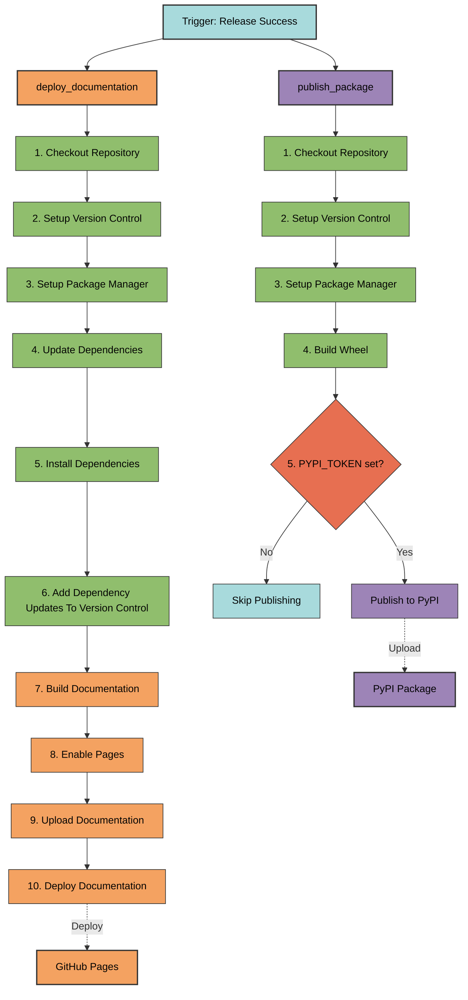

# deploy.yml

Deployment workflow that publishes packages to PyPI and deploys documentation to
GitHub Pages.

## Overview

**File**: `.github/workflows/deploy.yml`
**Class**: `DeployWorkflow` in `pyrig.dev.configs.workflows.deploy`
**Inherits**: `Workflow`

The deploy workflow is the final step in the CI/CD pipeline. It runs after
successful releases and publishes the package to PyPI and deploys documentation
to GitHub Pages. These jobs run in parallel.

## Triggers

### Workflow Run

- **Workflow**: `Release`
- **Event**: `completed`
- **Condition**: Only runs if release succeeded

**Why workflow_run?** Ensures deployment only happens after version is tagged
and release is created.

### Workflow Dispatch

- **Purpose**: Manual trigger for testing

## Job Flow



## Jobs

### 1. publish_package

**Runs on**: Ubuntu latest
**Condition**: `github.event.workflow_run.conclusion == 'success'`

**Steps**:

1. **Checkout Repository** (`actions/checkout@main`)
   - Clones the repository code

2. **Setup Version Control**
   - Configures git user as `github-actions[bot]`

3. **Setup Package Manager** (`astral-sh/setup-uv@main`)
   - Installs uv package manager
   - Uses the default Python version (latest supported)

4. **Build Wheel**
   - Runs `uv build`
   - Creates wheel (`.whl`) and source distribution (`.tar.gz`)
   - Outputs to `dist/` directory

5. **Publish To Pypi**
   - Runs `uv publish --token ${{ secrets.PYPI_TOKEN }}`
   - Uploads wheel and source distribution to PyPI
   - **Conditional**: Only runs if `PYPI_TOKEN` is configured
   - Skips with message if token not set

**Why conditional?** Allows workflow to succeed even without PyPI token (useful
for private packages or testing).

### 2. deploy_documentation

**Runs on**: Ubuntu latest
**Condition**: `github.event.workflow_run.conclusion == 'success'`
**Permissions**:

- **pages**: `write` (deploy to GitHub Pages)
- **id-token**: `write` (OIDC authentication for Pages)

**Steps**:

1. **Checkout Repository** (`actions/checkout@main`)
   - Clones the repository code

2. **Setup Version Control**
   - Configures git user as `github-actions[bot]`

3. **Setup Package Manager** (`astral-sh/setup-uv@main`)
   - Installs uv package manager
   - Uses the default Python version (latest supported)

4. **Update Dependencies**
   - Updates lock file: `uv lock --upgrade`

5. **Install Dependencies**
   - Installs dependencies: `uv sync`
   - Required for MkDocs and plugins

6. **Add Dependency Updates To Version Control**
   - Stages `pyproject.toml` and `uv.lock`

7. **Build Documentation**
   - Runs `uv run mkdocs build`
   - Generates static site from `docs/` directory
   - Uses `mkdocs.yml` configuration
   - Outputs to `site/` directory

8. **Enable Pages** (`actions/configure-pages@main`)
   - Enables GitHub Pages for the repository
   - Uses `REPO_TOKEN` for authentication
   - Sets `enablement: true`
   - Configures Pages to deploy from Actions

9. **Upload Documentation** (`actions/upload-pages-artifact@main`)
   - Uploads `site/` directory as Pages artifact
   - Prepares for deployment

10. **Deploy Documentation** (`actions/deploy-pages@main`)
    - Deploys uploaded artifact to GitHub Pages
    - Site becomes available at `https://{username}.github.io/{repo}/`
    - Uses GitHub-provided OIDC
(requires `id-token: write`; no secret token needed)

## Environment Variables

- **PYTHONDONTWRITEBYTECODE**: `1` (prevents `.pyc` files)
- **UV_NO_SYNC**: `1` (prevents automatic sync on uv commands)

## Required Secrets

- **PYPI_TOKEN**: PyPI API token (optional, skips publishing if not set)
- **REPO_TOKEN**: Fine-grained personal access token with pages write permission
  (for enabling Pages)

## Deployment Destinations

### PyPI

- **URL**: `https://pypi.org/project/{package-name}/`
- **Install**: `pip install {package-name}` or `uv add {package-name}`

### GitHub Pages

- **URL**: `https://{username}.github.io/{repo}/`
- **Content**: MkDocs documentation site with Material theme

## Usage

### Automatic Trigger

Runs automatically when release workflow succeeds.

### Manual Trigger

GitHub Actions tab → Deploy → Run workflow

### Viewing Published Content

**PyPI Package**:

```bash
pip install myapp
# or
uv add myapp
```

**Documentation**: Visit `https://{username}.github.io/{repo}/`

## Best Practices

1. **Configure PYPI_TOKEN**: Required for publishing to PyPI (get from pypi.org
   account settings)
2. **Configure REPO_TOKEN**: Required for enabling GitHub Pages
3. **Test docs locally**: Run `uv run mkdocs serve` before pushing
4. **Verify PyPI upload**: Check package page after deployment
5. **Check Pages deployment**: Visit docs URL after workflow completes
6. **Optional**: Consider switching to PyPI trusted publishing if you prefer
OIDC-based publishing instead of long-lived tokens (requires workflow changes)
