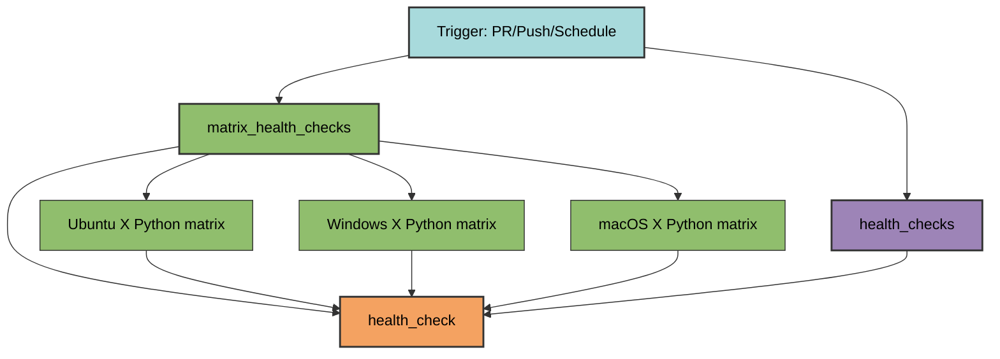
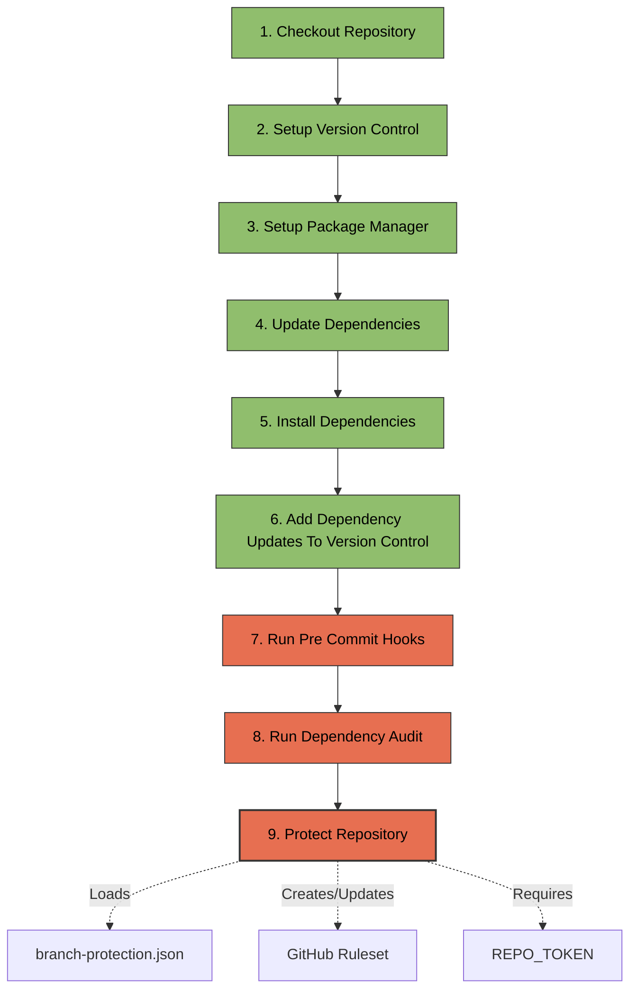
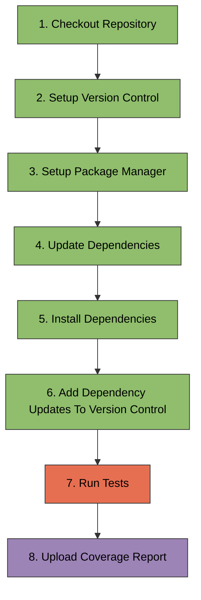

# health_check.yml

Continuous integration workflow that validates code quality and runs tests.

## Overview

**File**: `.github/workflows/health_check.yml`
**Class**: `HealthCheckWorkflowConfigFile`
in `pyrig.rig.configs.workflows.health_check`  
**Inherits**: `WorkflowConfigFile`

The health check workflow is the first step in the CI/CD pipeline. It runs on
every pull request, push to main, and daily on a staggered schedule. It
validates code quality through linting, type checking, security scanning (code +
dependencies), and comprehensive testing across multiple OS and Python versions.

## Triggers

### Pull Request

- **Events**: `opened`, `synchronize`, `reopened`
- **Purpose**: Validate changes before merging

### Push

- **Branches**: `main`
- **Purpose**: Validate main branch after merge

### Schedule

- **Cron**: `0 {hour} * * *` (daily at staggered hour)
- **Staggering**: Hour offset based on dependency depth to pyrig
- **Purpose**: Catch issues from dependency updates

**Why staggered?** If your package depends on pyrig, and pyrig releases at
midnight, your package runs at 1 AM. This prevents failures when dependencies
release right before your scheduled run and keeps all packages up to date at the
same time if you have lots of packages depending in a line.

### Workflow Dispatch

- **Purpose**: Manual trigger for testing

## Job Flow



## Jobs

### 1. health_checks

**Runs on**: Ubuntu latest
**Purpose**: Runs quality checks and applies branch protection rules

This job runs independently from the test matrix to run quality checks that only
need to run once (not per OS/Python version). It sets up the environment, runs
prek hooks, dependency audit, and applies the branch protection ruleset.

**Step Flow**:



**Steps**:

1. **Checkout Repository** (`actions/checkout@main`)
   - Clones the repository code

2. **Setup Version Control**
   - Configures git user as `github-actions[bot]`
   - Standardizes git identity for any future automated commits

3. **Setup Package Manager** (`astral-sh/setup-uv@main`)
   - Installs uv package manager
   - Sets up the default Python version (latest supported)

4. **Update Dependencies**
   - Updates lock file: `uv lock --upgrade`

5. **Install Dependencies**
   - Installs dependencies: `uv sync`

6. **Add Dependency Updates To Version Control**
   - Stages `pyproject.toml` and `uv.lock`

7. **Run Pre Commit Hooks**
   - Runs `uv run prek run --all-files`
   - Executes: ruff (formatting + linting), ty (type checking), bandit
     (security), rumdl (markdown linting)
   - Fails if any hook fails

8. **Run Dependency Audit**
   - Runs `uv run pip-audit`
   - Scans installed dependencies for known vulnerabilities

9. **Protect Repository**
   - Runs `uv run pyrig protect-repo`
   - Loads configuration from `branch-protection.json`
   - Creates or updates branch protection ruleset on GitHub
   - Requires `REPO_TOKEN` secret

**Why separate?** Running quality checks as a separate job means they only run
once instead of per matrix combination. The `health_check` aggregator job (which
waits for both this job and the matrix) is the required status check for PRs.

### 2. matrix_health_checks

**Runs on**: Matrix of OS × Python versions
**Strategy**: `fail-fast: true` (stop all jobs if one fails)
**Matrix**:

- **OS**: Ubuntu, Windows, macOS (latest)
- **Python**: All versions from `pyproject.toml` `requires-python` (e.g., 3.12,
  3.13, 3.14)

**Step Flow**:



**Steps**:

1. **Checkout Repository** (`actions/checkout@main`)
   - Clones the repository code

2. **Setup Version Control**
   - Configures git user as `github-actions[bot]`
   - Required for commits in later workflows

3. **Setup Package Manager** (`astral-sh/setup-uv@main`)
   - Installs uv package manager
   - Sets up Python from matrix version

4. **Update Dependencies**
   - Updates lock file: `uv lock --upgrade`
   - Tests against the latest dependency versions resolved at workflow time

5. **Install Dependencies**
   - Installs dependencies: `uv sync`

6. **Add Dependency Updates To Version Control**
   - Stages `pyproject.toml` and `uv.lock`
   - Prepares for potential commit in release workflow

7. **Run Tests**
   - Runs `uv run pytest --log-cli-level=INFO --cov-report=xml`
   - Executes all tests with coverage measurement
   - Generates `coverage.xml` report
   - Requires 90% coverage (from `pyproject.toml`)

8. **Upload Coverage Report** (`codecov/codecov-action@main`)
   - Uploads `coverage.xml` to Codecov
   - Uses `CODECOV_TOKEN` secret
   - Only fails CI if token is configured

**Why matrix?** Testing across OS and Python versions catches platform-specific
bugs and ensures compatibility.

### 3. health_check

**Runs on**: Ubuntu latest
**Needs**: `matrix_health_checks`, `health_checks` (waits for both to complete)
**Purpose**: Aggregates job results into single job for branch protection
rules, you will see the purpose of this once you make a Pull Request and wait
for the checks to complete.

**Steps**:

1. **Aggregate Jobs**
   - Echoes aggregation message
   - Provides single job status for GitHub branch protection

**Why aggregate?** GitHub branch protection can require this single job instead
of tracking all matrix combinations and the health_checks job individually.

## Environment Variables

- **PYTHONDONTWRITEBYTECODE**: `1` (prevents `.pyc` files)
- **UV_NO_SYNC**: `1` (prevents automatic sync on uv commands)

## Required Secrets

- **REPO_TOKEN**: Fine-grained PAT with administration, contents, pages
  permissions
- **CODECOV_TOKEN**: Codecov upload token (recommended, required for private
  repos)
  - See the [Getting Started - Codecov setup](../../more/getting-started.md#accounts--tokens) for details

## Usage

### Automatic Creation

```bash
uv run pyrig mkroot
```

### Manual Trigger

GitHub Actions tab → Health Check → Run workflow

## Best Practices

1. **Fix failures immediately**: Health check blocks the entire pipeline
2. **Monitor coverage**: Maintain 90% minimum coverage
3. **Check all matrix jobs**: Don't ignore platform-specific failures
4. **Update dependencies regularly**: Scheduled runs catch breaking changes
   early
