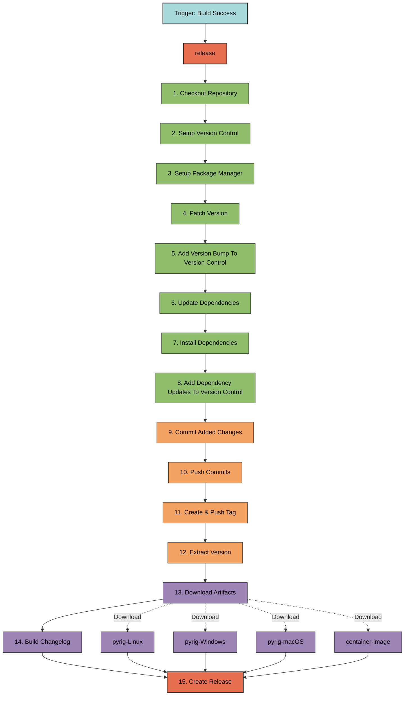

# release.yml

Release creation workflow that versions, tags, and publishes GitHub releases.

## Overview

**File**: `.github/workflows/release.yml`
**Class**: `ReleaseWorkflow` in `pyrig.rig.configs.workflows.release`  
**Inherits**: `Workflow`

The release workflow runs after successful artifact builds. It bumps the
version, commits changes, creates git tags, generates changelogs, and publishes
GitHub releases with all artifacts attached.

## Triggers

### Workflow Run

- **Workflow**: `Build`
- **Event**: `completed`
- **Condition**: Only runs if build succeeded

**Why workflow_run?** Ensures releases are only created after artifacts are
successfully built.

### Workflow Dispatch

- **Purpose**: Manual trigger for testing

## Permissions

- **contents**: `write` (create commits, tags, releases)
- **actions**: `read` (download artifacts from build workflow)

## Job Flow

## Jobs

### release

**Runs on**: Ubuntu latest  
**Condition**: `github.event.workflow_run.conclusion == 'success'`

**Steps**:

1. **Checkout Repository** (`actions/checkout@main`)
   - Clones the repository code
   - Uses `REPO_TOKEN` for authentication (required for protected branches)

2. **Setup Version Control**
   - Configures git user as `github-actions[bot]`

3. **Setup Package Manager** (`astral-sh/setup-uv@main`)
   - Installs uv package manager
   - Uses the default Python version (latest supported)

4. **Patch Version**
   - Bumps patch version: `uv version --bump patch`
   - Updates `pyproject.toml` with new version

5. **Add Version Bump To Version Control**
   - Stages `pyproject.toml` and `uv.lock`

6. **Update Dependencies**
   - Updates lock file: `uv lock --upgrade`

7. **Install Dependencies**
   - Installs dependencies: `uv sync`

8. **Add Dependency Updates To Version Control**
   - Stages `pyproject.toml` and `uv.lock`

9. **Commit Added Changes**
   - Commits all staged changes, e.g. version bump and dependency updates
   - Message:
     `[skip ci] CI/CD: Committing possible staged changes`
   - `--no-verify`: Skips prek hooks, as they are already run in the health
     check workflow
   - `[skip ci]`: Prevents triggering another workflow run

10. **Push Commits**
    - Pushes commit to main branch: `git push`
    - Requires `REPO_TOKEN` with write access

11. **Create And Push Tag**
    - Creates version tag: `git tag v$(uv version --short)`
    - Pushes tag: `git push origin v$(uv version --short)`
    - Example: `v0.1.5`

12. **Extract Version**
    - Extracts version to output variable
    - Sets `version=v{version}` in `$GITHUB_OUTPUT`
    - Used by later steps

13. **Download Artifacts From Workflow Run** (`actions/download-artifact@main`)
    - Downloads all artifacts from build workflow
    - Uses `run-id` from triggering workflow
    - `merge-multiple: true`: Combines all artifacts into `dist/`
    - Downloads: `pyrig-Linux`, `pyrig-Windows`, `pyrig-macOS`,
      `container-image`

14. **Build Changelog** (`mikepenz/release-changelog-builder-action@develop`)
    - Generates changelog from commits since last release
    - Groups by PR labels (features, fixes, etc.)
    - Uses `GITHUB_TOKEN` for API access
    - Outputs to `changelog` variable

15. **Create Release** (`ncipollo/release-action@main`)
    - Creates GitHub release
    - **Tag**: Version from step 12 (e.g., `v0.1.5`)
    - **Name**: `{repo-name} v{version}` (e.g., `pyrig v0.1.5`)
    - **Body**: Changelog from step 14
    - **Artifacts**: All files in `dist/*` (platform artifacts + container
      image)

## Environment Variables

- **PYTHONDONTWRITEBYTECODE**: `1` (prevents `.pyc` files)
- **UV_NO_SYNC**: `1` (prevents automatic sync on uv commands)

## Required Secrets

- **REPO_TOKEN**: Fine-grained PAT with contents write permission (for pushing
  to protected main branch)
- **GITHUB_TOKEN**: Automatically provided by GitHub Actions (for downloading
  artifacts and creating releases)

## Versioning Strategy

- **Automatic patch bumps**: Every release increments patch version (0.1.4 →
  0.1.5)
- **Manual major/minor bumps**: Edit `pyproject.toml` manually and commit to
  trigger release with new version

## Usage

### Automatic Trigger

Runs automatically when build workflow succeeds.

### Manual Trigger

GitHub Actions tab → Release → Run workflow

### Viewing Releases

Repository → Releases tab → See all published releases with artifacts

## Best Practices

1. **Configure REPO_TOKEN**: Required for pushing to protected branches
2. **Use conventional commits**: Improves changelog generation (feat:, fix:,
   etc.)
3. **Review releases**: Check GitHub Releases page after workflow completes
4. **Download artifacts**: Test artifacts before publishing to PyPI

**Note**: The daily scheduled health check validates your project against the
latest dependencies but does not trigger releases. Only actual code changes
(push to main) trigger the full build → release → deploy pipeline. This means
breaking changes from dependencies are caught early by the health check,
allowing you to address them before they become problems, without creating
unnecessary releases.
