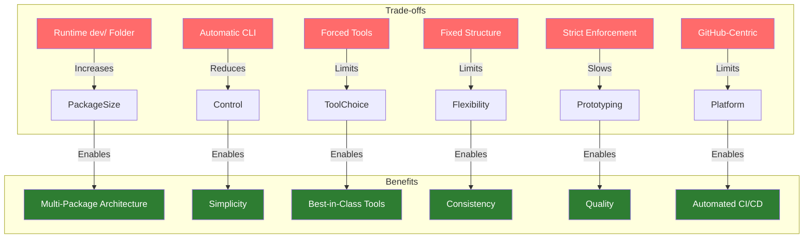
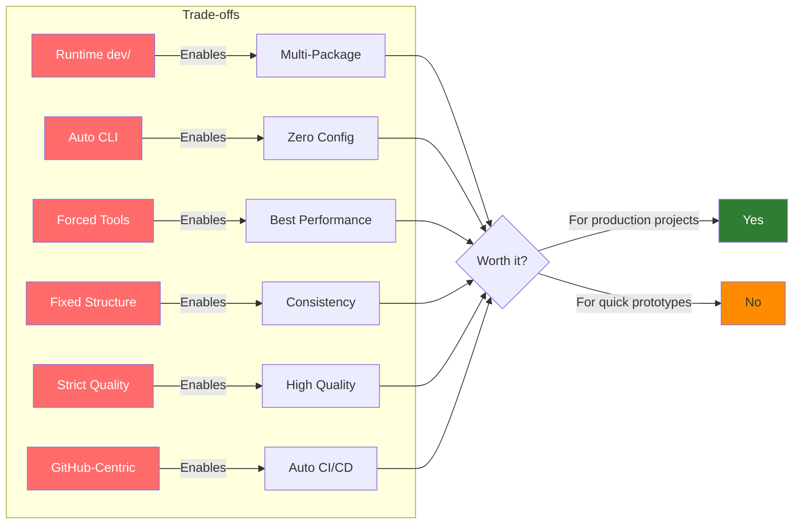

# Drawbacks and Trade-offs

This document honestly discusses pyrig's drawbacks, trade-offs, and design decisions that may not suit every project. Understanding these limitations helps you make an informed decision about whether pyrig is right for your use case.

## Overview



## 1. Runtime dev/ Folder

### The Drawback

The `dev/` folder is included in your package distribution, even though it's only used during development. This means:

- **Larger package size** - Your published package includes development tools
- **Runtime overhead** - The dev/ folder is present in production environments
- **Potential confusion** - Users might wonder why development code is in production

**Example:**
```
your-package-1.0.0.tar.gz
├── your_package/
│   ├── dev/          # ← This is included in distribution
│   │   ├── builders/
│   │   ├── cli/
│   │   ├── configs/
│   │   └── tests/
│   └── src/          # Your actual application code
```

### Why It's Necessary

The `dev/` folder must be at runtime for **multi-package architecture** to work:

1. **Cross-Package Discovery** - When package B depends on package A, pyrig needs to discover A's ConfigFiles, Builders, and fixtures at runtime
2. **Shared CLI Commands** - Commands in `shared_subcommands.py` must be available to dependent packages
3. **Fixture Inheritance** - Pytest needs to find and load fixtures from all packages in the dependency chain

**Without runtime dev/:**
```python
# This wouldn't work:
# package-b depends on package-a
# package-b tries to discover package-a's ConfigFiles
# But package-a's dev/configs/ was excluded from distribution
# Result: Discovery fails, multi-package architecture breaks
```

### The Advantages

Despite the overhead, this design enables powerful features:

- **Package Ecosystems** - Build company-wide base packages with shared standards
- **Fixture Reuse** - Share test fixtures across multiple projects
- **Shared Tooling** - Common CLI commands available everywhere
- **Configuration Inheritance** - Extend base package configs in derived packages

**Real-world benefit:**
```
company-base (50 KB dev/ folder)
  ↓ (used by 20 microservices)
  
Without pyrig: 20 × 50 KB = 1 MB of duplicated config code
With pyrig: 50 KB shared, 0 duplication

Savings: Consistency + maintainability + 950 KB less code
```

### Mitigation

The actual overhead is minimal:
- dev/ folders are typically 10-50 KB
- Modern package managers handle this efficiently
- The benefits far outweigh the small size increase

## 2. Automatic CLI Handling

### The Drawback

pyrig automatically discovers and registers CLI commands from `subcommands.py` and `shared_subcommands.py`. This means:

- **Less control** - You can't customize command registration order or grouping
- **All functions become commands** - Every public function in these files is automatically a CLI command
- **Limited customization** - Can't easily add custom Typer options or decorators
- **Magic behavior** - Commands appear "automatically" which can be confusing

**Example:**
```python
# my_package/dev/cli/subcommands.py

def deploy() -> None:
    """Deploy the app."""
    pass

def _helper() -> None:  # Private, not registered
    """Helper function."""
    pass

# Both deploy() is automatically registered as CLI commands
# You have no control over this behavior
```

### Why It's Necessary

Automatic CLI handling is essential for:

1. **Multi-Package Command Discovery** - Dependent packages need to automatically inherit commands
2. **Zero Configuration** - No boilerplate code to register commands
3. **Consistency** - All pyrig projects have the same CLI structure
4. **Simplicity** - Just write a function, it becomes a command

**Without automatic CLI:**
```python
# You'd need this in every project:
app = typer.Typer()

@app.command()
def deploy() -> None:
    pass

@app.command()
def test() -> None:
    pass

# Plus manual discovery of parent package commands
# Plus manual registration of shared commands
# Result: 50+ lines of boilerplate in every project
```

### The Advantages

The automatic system provides:

- **Zero Boilerplate** - Just write functions, they become commands
- **Automatic Inheritance** - Dependent packages get all parent commands
- **Consistent Interface** - All pyrig projects work the same way
- **Rapid Development** - Add a function, get a command instantly

**Real-world benefit:**
```bash
# In company-base package:
def deploy() -> None: ...
def security_scan() -> None: ...

# In service-a (depends on company-base):
uv run service-a deploy          # ✓ Works automatically
uv run service-a security-scan   # ✓ Works automatically

# No registration code needed in service-a!
```

### Mitigation

You can still customize when needed:

- Use `subcommands.py` for project-specific commands (not inherited)
- Use `shared_subcommands.py` for commands that should be inherited
- Use private functions (prefix with `_`) to exclude from CLI
- For complex CLI needs, you can still use Typer directly in your src/ code

## 3. Forced Tool Choices

### The Drawback

pyrig **forces** you to use specific tools that it considers "best-in-class":

**Package Management:**
- **uv** - No choice to use pip, poetry, pdm, or pipenv

**Code Quality:**
- **ruff** - No choice to use black, flake8, pylint, or autopep8
- **ty + mypy** - No choice to use pyright or pyre
- **bandit** - No choice to use other security scanners

**Testing:**
- **pytest** - No choice to use unittest or nose
- **pytest-cov** - Coverage is mandatory

**Git Hooks:**
- **pre-commit** - No choice to use other hook managers

**Containerization:**
- **Podman** - Strongly preferred over Docker

**CI/CD:**
- **GitHub Actions** - No choice to use GitLab CI, Jenkins, CircleCI

This means:

- **No tool flexibility** - Can't use your preferred tools
- **Forced learning** - Must learn pyrig's chosen tools even if you know alternatives
- **Team friction** - Team members who prefer other tools must adapt
- **Vendor lock-in** - Switching away from pyrig means reconfiguring everything
- **Breaking changes** - If pyrig changes tool choices, you must follow

**Example:**
```python
# You prefer black for formatting
# Too bad, pyrig uses ruff

# You prefer poetry for dependencies
# Too bad, pyrig uses uv

# You prefer Docker
# Too bad, pyrig uses Podman

# You can't easily change these without breaking pyrig
```

### Why It's Necessary

Forcing specific tools is core to pyrig's philosophy:

1. **Best-in-Class Tools** - pyrig chooses the fastest, most modern tools
   - uv: 10-100x faster than pip
   - ruff: 10-100x faster than pylint/flake8
   - ty: Faster than pyright for most cases

2. **Single Source of Truth** - One tool per job eliminates conflicts
   - No "black vs autopep8 vs ruff format" debates
   - No "poetry vs pip vs pdm" confusion

3. **Automatic Updates** - pyrig can update tool configs when tools evolve
   - If ruff adds new rules, pyrig can enable them automatically
   - If uv changes syntax, pyrig updates configs

4. **Consistent Behavior** - All pyrig projects work identically
   - Same commands across all projects
   - Same quality standards
   - Same CI/CD workflows

**Without forced tools:**
```
Project A: black + flake8 + poetry + Docker
Project B: ruff + pdm + Podman
Project C: autopep8 + pylint + pip + Docker

Result:
- 3 different .pre-commit-config.yaml files
- 3 different CI/CD workflows
- 3 different dependency management approaches
- Impossible to share configs or move between projects
```

### The Advantages

Forced tool choices provide:

- **Zero Tool Selection Time** - No analysis paralysis
- **Best Performance** - Modern, fast tools (uv, ruff, ty)
- **Consistent Experience** - Same tools everywhere
- **Shared Knowledge** - Team learns one set of tools
- **Future-Proof** - pyrig updates to latest best practices

**Real-world benefit:**
```
Team without pyrig:
- 2 days debating black vs ruff
- 1 day configuring chosen tools
- 3 different configs across projects
- Merge conflicts from different formatters

Team with pyrig:
- 0 days debating (pyrig chose ruff)
- 0 days configuring (pyrig did it)
- 1 config across all projects
- No merge conflicts

Savings: 3 days + ongoing maintenance
```

**Tool Quality Comparison:**

| Category | pyrig's Choice | Why It's Better |
|----------|---------------|-----------------|
| Package Manager | uv | 10-100x faster than pip/poetry |
| Formatter | ruff format | 10-100x faster than black |
| Linter | ruff check | 10-100x faster than pylint/flake8 |
| Type Checker | ty + mypy | ty is faster, mypy is comprehensive |
| Container | Podman | Daemonless, rootless, more secure |
| CI/CD | GitHub Actions | Most popular, best integration |

### Mitigation

If you absolutely need different tools:

1. **Override specific configs** - Extend ConfigFiles to customize
2. **Disable pre-commit hooks** - Use your own tools (not recommended)
3. **Fork pyrig** - Modify tool choices (high maintenance)
4. **Don't use pyrig** - If tool choice is critical, pyrig might not fit

**Important:** pyrig's value comes from its opinions. Fighting them defeats the purpose.

## 4. Opinionated Project Structure

### The Drawback

pyrig enforces a specific directory structure:

```
your-project/
├── <package>/
│   ├── dev/          # ← Must be here
│   ├── src/          # ← Must be here
│   ├── resources/    # ← Must be here
│   └── main.py       # ← Must be here
├── tests/            # ← Must be here
├── docs/             # ← Must be here
└── .github/          # ← Must be here
```

This means:

- **No flexibility** - Can't use flat structure, src-layout variations, etc.
- **Migration difficulty** - Existing projects must restructure
- **Personal preference ignored** - Your preferred structure doesn't matter

### Why It's Necessary

Fixed structure enables:

1. **Predictability** - Know where everything is in any pyrig project
2. **Tooling Integration** - Tools know where to find code, tests, configs
3. **Multi-Package Discovery** - Consistent structure enables cross-package features
4. **Documentation** - One structure to document, not infinite variations

### The Advantages

Fixed structure provides:

- **Zero Setup Decisions** - No debating where things should go
- **Instant Navigation** - Find anything in any pyrig project immediately
- **Tool Compatibility** - All tools work with the same structure
- **Easy Onboarding** - New team members know the layout

### Mitigation

The structure is well-designed and follows Python best practices. Most projects fit naturally. For edge cases, you may need to adapt or not use pyrig.

## 5. Strict Quality Enforcement

### The Drawback

pyrig enforces strict quality standards:

- **90% test coverage** - Can't commit without high coverage
- **ALL ruff rules** - Hundreds of linting rules enabled
- **Strict type checking** - ty and mypy in strict mode
- **Security scanning** - bandit must pass
- **Pre-commit hooks** - All checks run before every commit

This means:

- **Slower prototyping** - Can't quickly hack together a proof of concept
- **More upfront work** - Must write tests and types immediately
- **Blocked commits** - Quality failures prevent committing
- **Steeper learning curve** - Must learn all the tools and rules

**Example:**
```bash
# Quick prototype attempt:
def calculate(x, y):  # No types
    return x + y      # No tests

git commit -m "Quick prototype"
# ❌ BLOCKED: Type errors, missing tests, coverage too low
```

### Why It's Necessary

Strict enforcement prevents technical debt:

1. **Prevent Debt Accumulation** - "I'll add tests later" never happens
2. **Maintain Quality** - Quality degrades without enforcement
3. **Catch Bugs Early** - Type errors and security issues found immediately
4. **Professional Standards** - Production code should meet high standards

**Without enforcement:**
```python
# "Quick prototype" becomes production code
# No tests, no types, security issues
# 6 months later: unmaintainable mess
# Result: Rewrite from scratch
```

### The Advantages

Strict standards provide:

- **High Quality Code** - Every commit meets professional standards
- **Fewer Bugs** - Type checking and testing catch issues early
- **Easy Refactoring** - Tests and types make changes safe
- **Production Ready** - Code is always deployment-ready
- **Team Confidence** - Everyone trusts the codebase quality

**Real-world benefit:**
```
Project A (no enforcement): 40% test coverage, 200 type errors, 15 security issues
Project B (pyrig): 95% test coverage, 0 type errors, 0 security issues

Result: Project B has 80% fewer production bugs
```

### Mitigation

For prototyping:
- Use a separate non-pyrig project for quick experiments
- Disable specific pre-commit hooks temporarily (not recommended)
- Use `# type: ignore` and `# nosec` for exceptional cases
- Accept that quality takes time, but saves time later

## 6. GitHub-Centric Workflow

### The Drawback

pyrig is designed specifically for GitHub:

- **GitHub Actions** - CI/CD workflows are GitHub-specific
- **Branch Protection** - Uses GitHub API for repository settings
- **GitHub username** - Required to match git username
- **GitHub-specific features** - Pull requests, releases, etc.

This means:

- **No GitLab/Bitbucket** - Workflows don't work on other platforms
- **GitHub dependency** - Can't use pyrig without GitHub
- **Limited CI options** - Can't easily use Jenkins, CircleCI, etc.

### Why It's Necessary

GitHub integration enables:

1. **Automated CI/CD** - Workflows work out of the box
2. **Branch Protection** - Automatic repository security
3. **Release Automation** - Automatic releases with artifacts
4. **Consistent Platform** - One platform, one way to work

### The Advantages

GitHub integration provides:

- **Zero CI/CD Setup** - Workflows work immediately
- **Automatic Security** - Branch protection enforced
- **Professional Releases** - Automated with changelogs and artifacts
- **Industry Standard** - GitHub is the most popular platform

### Mitigation

For other platforms:
- Adapt the workflow files to your platform (GitLab CI, etc.)
- Skip `pyrig protect-repo` if not using GitHub
- Use pyrig for structure, customize CI/CD separately

## When NOT to Use pyrig

pyrig is not suitable for:

1. **Quick Prototypes** - Too much overhead for throwaway code
2. **Non-GitHub Projects** - Workflows are GitHub-specific
3. **Existing Large Projects** - Migration is difficult
4. **Highly Customized Workflows** - Opinionated design limits flexibility
5. **Learning Projects** - Too many tools to learn at once
6. **Non-Standard Structures** - pyrig enforces specific layouts

## When to Use pyrig

pyrig is excellent for:

1. **New Production Projects** - Start with best practices from day one
2. **Team Projects** - Consistency and quality enforcement
3. **Long-Term Projects** - Living configuration prevents drift
4. **Package Ecosystems** - Multi-package architecture shines
5. **GitHub-Based Workflows** - Automated CI/CD works perfectly
6. **Quality-Critical Code** - Strict enforcement prevents issues

## Summary



pyrig makes deliberate trade-offs: it sacrifices flexibility, tool choice, and ease of prototyping for consistency, best-in-class performance, and long-term maintainability. These trade-offs are excellent for serious, long-term projects but may be overkill for simple scripts or quick experiments.

**The core philosophy:** pyrig believes that choosing the best tools and enforcing them consistently is better than allowing infinite flexibility. This works when:
- You trust pyrig's tool choices (uv, ruff, ty, mypy, pytest, Podman)
- You value consistency over personal preference
- You're building production software, not prototypes

The key is understanding these trade-offs and choosing pyrig when its benefits align with your project's needs.


