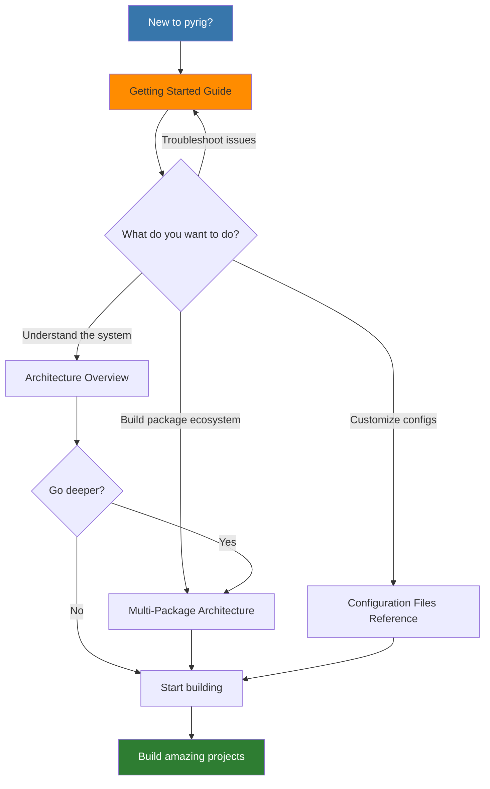

# pyrig Documentation

<!-- tooling -->

<!-- code-quality -->

<!-- package-info -->

<!-- ci/cd -->

<!-- documentation -->

---

> A Python toolkit that standardizes and automates project setup, configuration and development.

---

Welcome to the pyrig documentation! pyrig is a Python toolkit that standardizes and automates project setup, configuration, and development.

## Quick Navigation

## Getting Started

New to pyrig? Start here:

- **[Getting Started](getting-started.md)** - Complete guide to creating your first pyrig project
  - Prerequisites and setup
  - Step-by-step initialization
  - Understanding project structure
  - Your first code and tests
  - Common issues and solutions

## Architecture

- **[Architecture Overview](architecture.md)** - Visual guide to pyrig's architecture
  - System architecture diagrams
  - Data flow visualizations
  - Plugin architecture
  - Component interactions

## Core Concepts

- **[ConfigFile System](configfile-system.md)** - Deep dive into pyrig's living configuration system
  - How ConfigFiles work
  - Subset validation explained
  - Intelligent config merging
  - Format-specific base classes
  - Creating custom ConfigFiles
  - Real-world examples

- **[Builder System](builder-system.md)** - Deep dive into pyrig's artifact build system
  - How Builders work
  - The build process explained
  - Platform suffix handling
  - PyInstallerBuilder for executables
  - Creating custom Builders
  - Real-world examples

- **[Testing System](testing-system.md)** - Deep dive into pyrig's testing and fixture system
  - How fixture discovery works
  - Autouse fixtures that enforce best practices
  - Session, module, and class-scoped fixtures
  - Factory fixtures for isolated testing
  - Creating custom fixtures
  - Real-world examples

- **[Multi-Package Architecture](multi-package-architecture.md)** - Build package ecosystems with cross-package discovery of ConfigFiles, Builders, and fixtures
  - Dependency graph system
  - Cross-package discovery
  - Real-world examples
  - Best practices

## Configuration Files

- **[Configuration Files Reference](config-files/index.md)** - Detailed documentation for every config file managed by pyrig
  - ConfigFile base classes
  - Builder system
  - CLI commands
  - Test fixtures

## Comparison

- **[pyrig vs Other Tools](comparison.md)** - How pyrig compares to other project management tools
  - Cookiecutter comparison
  - Copier comparison
  - Poetry and PDM comparison
  - Feature matrix
  - Use case recommendations

## Drawbacks and Trade-offs

- **[Drawbacks and Trade-offs](drawbacks.md)** - Honest discussion of pyrig's limitations
  - Runtime dev/ folder overhead
  - Automatic CLI handling limitations
  - Forced tool choices (uv, ruff, ty, mypy, pytest, Podman)
  - Fixed project structure
  - Strict quality enforcement
  - GitHub-centric workflow
  - When NOT to use pyrig
