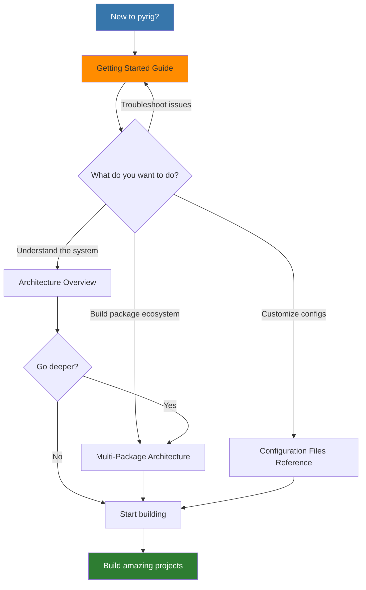

# pyrig Documentation

Welcome to the pyrig documentation! pyrig is a Python toolkit that standardizes and automates project setup, configuration, and development.

## Quick Navigation

## Getting Started

New to pyrig? Start here:

- **[Getting Started](getting-started.md)** - Complete guide to creating your first pyrig project
  - Prerequisites and setup
  - Step-by-step initialization
  - Understanding project structure
  - Your first code and tests
  - Common issues and solutions

## Architecture

- **[Architecture Overview](architecture.md)** - Visual guide to pyrig's architecture
  - System architecture diagrams
  - Data flow visualizations
  - Plugin architecture
  - Component interactions

## Core Concepts

- **[Multi-Package Architecture](multi-package-architecture.md)** - Build package ecosystems with cross-package discovery of ConfigFiles, Builders, and fixtures
  - Dependency graph system
  - Cross-package discovery
  - Real-world examples
  - Best practices

## Configuration Files

- **[Configuration Files Reference](config-files/index.md)** - Detailed documentation for every config file managed by pyrig
  - ConfigFile base classes
  - Builder system
  - CLI commands
  - Test fixtures

## Comparison

- **[pyrig vs Other Tools](comparison.md)** - How pyrig compares to other project management tools
  - Cookiecutter comparison
  - Copier comparison
  - Poetry and PDM comparison
  - Feature matrix
  - Use case recommendations
