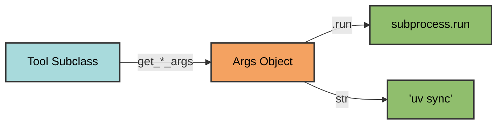
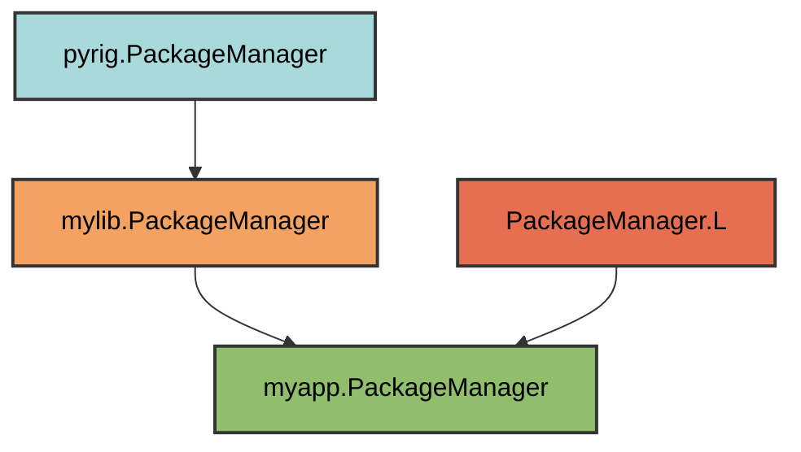

# Tool Architecture

pyrig's management system provides type-safe wrappers around command-line tools
(uv, git, ruff, pytest, etc.) through a composable `Tool` and `Args` pattern.

## Design Pattern

The management system follows a consistent pattern:

1. Each tool (uv, git, pytest) is a `Tool` subclass
2. Tool methods return `Args` objects (command argument tuples)
3. `Args` objects execute directly or convert to strings
4. All command construction is centralized and testable



## The Tool Base Class

`Tool` is the abstract base class for all tool wrappers:

```python
from abc import ABC, abstractmethod
from pyrig.src.processes import Args

class Tool(ABC):
    @classmethod
    @abstractmethod
    def name(cls) -> str:
        """Return the tool command name (e.g., 'git', 'uv')."""

    @classmethod
    def get_args(cls, *args: str) -> Args:
        """Construct Args with tool name prepended."""
        return Args((cls.name(), *args))
```

### Required Methods

| Method | Purpose | Example Return |
|--------|---------|----------------|
| `name()` | Tool command name | `"uv"`, `"git"`, `"ruff"` |
| `get_*_args()` | Construct specific commands | `Args(("uv", "sync"))` |

### Creating a Tool Subclass

```python
from pyrig.dev.management.base.base import Tool
from pyrig.src.processes import Args

class MyTool(Tool):
    @classmethod
    def name(cls) -> str:
        return "mytool"

    @classmethod
    def get_build_args(cls, *args: str) -> Args:
        return cls.get_args("build", *args)

# Usage
args = MyTool.get_build_args("--verbose")
print(args)  # mytool build --verbose
args.run()   # Executes: mytool build --verbose
```

## The Args Class

`Args` is an immutable tuple subclass that represents command-line arguments:

```python
class Args(tuple[str, ...]):
    def __str__(self) -> str:
        """Convert to space-separated string."""
        return " ".join(self)

    def run(self, *args: str, **kwargs) -> subprocess.CompletedProcess:
        """Execute command via subprocess."""
        return run_subprocess(self, *args, **kwargs)
```

### Key Features

- **Immutable**: Cannot be modified after creation
- **Composable**: Can be extended with additional arguments
- **Printable**: Converts to readable command string
- **Executable**: Run directly via `.run()`

### Usage Examples

```python
from pyrig.dev.management.package_manager import PackageManager

# Get Args object
args = PackageManager.L.get_install_dependencies_args()
print(args)  # uv sync

# Execute the command
result = args.run()
print(result.returncode)  # 0

# Add extra arguments
args = PackageManager.L.get_args("run", "pytest", "-v")
print(args)  # uv run pytest -v
```

## The `.L` Property

Every Tool subclass has an `.L` (Leaf) class property that returns the deepest
subclass in the inheritance hierarchy:

```python
# Instead of:
PackageManager.get_install_dependencies_args()

# Always use:
PackageManager.L.get_install_dependencies_args()
```

### Why Use `.L`?

The `.L` property enables **subclass discovery across dependencies**. When a
package depends on pyrig, it can subclass any Tool to customize behavior:



When you call `PackageManager.L`, pyrig:

1. Discovers all packages depending on pyrig
2. Looks for equivalent `management` modules in each package
3. Finds all subclasses of `PackageManager`
4. Returns the deepest leaf class (most derived)

This means your customizations automatically apply everywhere the Tool is used.

### How It Works

```python
from propert.classproperty import cached_classproperty
from pyrig.src.modules.package import discover_leaf_subclass_across_dependents

class Tool(ABC):
    @cached_classproperty
    def L(cls) -> type[Self]:
        return discover_leaf_subclass_across_dependents(
            cls=cls,
            dep=pyrig,
            load_pkg_before=management,
        )
```

The result is cached, so subsequent calls are instant.

## Composition Pattern

Tools can compose other tools. For example, `ProjectTester` wraps pytest through
uv:

```python
class ProjectTester(Tool):
    @classmethod
    def name(cls) -> str:
        return "uv"  # Runs through uv

    @classmethod
    def get_test_args(cls, *args: str) -> Args:
        return cls.get_args("run", "pytest", *args)
```

This produces `uv run pytest ...` commands.

## Replacing Tools

While pyrig is [opinionated about tooling](../more/drawbacks.md#opinionated-tooling),
the `.L` property mechanism means you can technically replace any tool with your
own implementation.

### How It Works

Since pyrig uses `.L` everywhere internally, subclassing a Tool and overriding
`name()` will affect all pyrig operations that use that tool:

```python
# myapp/dev/management/container_engine.py
from pyrig.dev.management.container_engine import (
    ContainerEngine as BaseContainerEngine
)

class ContainerEngine(BaseContainerEngine):
    @classmethod
    def name(cls) -> str:
        return "docker"  # Instead of "podman"
```

Now all pyrig code that calls `ContainerEngine.L.get_*_args()` will use Docker
instead of Podman.

### Additional Work Required

**We do not recommend replacing tools** because it requires significant
additional work beyond subclassing. pyrig's components are interconnected,
although we try to keep that absolutely minimal. Some tools are easier to
replace than others. For example, replacing Podman with Docker is much easier
than replacing uv with pip/poetry as uv is used everywhere. However everythngis
handled via the Tool classes, we do not hardcode tool use anywhere else:

| Tool Replacement | Additional Changes Needed |
|------------------|---------------------------|
| Podman → Docker | Subclass workflows to setup Docker instead of Podman in GitHub Actions |
| uv → pip/poetry | Subclass nearly everything - package installation, execution, building |
| ruff → black/flake8 | Subclass pre-commit config, workflow steps |
| pytest → unittest | Subclass test runner, coverage config, workflow steps |
| ty → mypy | Subclass pre-commit config, pyproject settings |

### Example: Docker Instead of Podman

To switch from Podman to Docker, you need to:

1. **Subclass ContainerEngine** (changes the CLI tool):

```python
# myapp/dev/management/container_engine.py
from pyrig.dev.management.container_engine import (
    ContainerEngine as BaseContainerEngine
)

class ContainerEngine(BaseContainerEngine):
    @classmethod
    def name(cls) -> str:
        return "docker"
```

Note: You also need to subclass any other methods that might do `podman`
-specific things, like `get_save_args()` which uses `image_file.stem` as the
image name.

2. **Subclass affected workflows** (changes CI/CD setup):

```python
# myapp/dev/configs/workflows/build.py
from pyrig.dev.configs.workflows.build import BuildWorkflow as BaseBuildWorkflow

class BuildWorkflow(BaseBuildWorkflow):
    @classmethod
    def get_jobs(cls) -> dict:
        jobs = super().get_jobs()
        # Replace podman setup with docker setup
        for job in jobs.values():
            steps = job.get("steps", [])
            # Remove podman setup, add docker setup
            job["steps"] = [
                s for s in steps
                if "podman" not in str(s).lower()
            ]
            # Add docker setup step
            job["steps"].insert(1, {
                "name": "Set up Docker",
                "uses": "docker/setup-buildx-action@v3"
            })
        return jobs
```

### Why We Don't Recommend This

1. **Interconnected components**: Tools affect configs, workflows, pre-commit
   hooks, and CI/CD pipelines
2. **Maintenance burden**: You must keep your overrides in sync with pyrig
   updates
3. **Testing complexity**: Your customizations may break with new pyrig versions
4. **Lost benefits**: You lose pyrig's tested, integrated toolchain

### When It Makes Sense

Tool replacement might be justified if:

- Your organization mandates specific tools (e.g., Docker over Podman)
- You're migrating an existing project with established tooling
- You have specific requirements pyrig's tools don't meet

For most users, pyrig's default tooling provides the best experience with zero
configuration.

### See Also

- [Trade-offs](../more/drawbacks.md) - What you sacrifice and gain with pyrig
- [Tooling](../more/tooling.md) - Why pyrig chose each tool
- [Partial Opt-Out](../more/drawbacks.md#partial-opt-out-use-pyrig-without-the-automation) -
  Use pyrig for setup only
