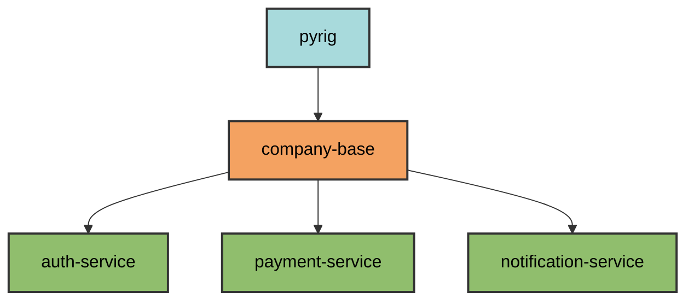

# Example Usage: Microservices Ecosystem

This guide demonstrates pyrig's power in a real-world scenario: building a
standardized microservices ecosystem for a company.

## Scenario

You're building multiple Python microservices that need:

- **Consistent standards** across all services
- **Custom company-wide configurations** (logging, monitoring, security)
- **Automatic synchronization** when standards change
- **Self-healing** infrastructure via autouse fixtures

## Architecture Overview



**Dependency chain**: `pyrig` → `company-base` → `auth-service`,
`payment-service`, `notification-service`

## Step 1: Create Base Package

Create `company-base` that extends pyrig with company standards:

```bash
# Create repository
gh repo create company/company-base --public  # Or private if you want
git clone https://github.com/company/company-base.git
cd company-base

# Initialize with pyrig
uv init
uv add pyrig
uv run pyrig init
```

This creates a complete project structure with all pyrig's defaults.

## Step 2: Add Custom Config File

Add a company-wide logging configuration that all microservices will inherit.

**Create**: `company_base/dev/configs/logging_config.py`

```python
"""Company-wide logging configuration."""

from pathlib import Path
from typing import Any
from pyrig.dev.configs.base.yaml import YamlConfigFile


class LoggingConfigFile(YamlConfigFile):
    """Logging configuration for all company microservices."""

    @classmethod
    def get_parent_path(cls) -> Path:
        """Place in config/ directory."""
        return Path("config")

    @classmethod
    def get_configs(cls) -> dict[str, Any]:
        """Required logging configuration."""
        return {
            "logging": {
                "version": 1,
                "formatters": {
                    "json": {
                        "class": "pythonjsonlogger.jsonlogger.JsonFormatter",
                        "format": "%(name)s %(levelname)s %(message)s"
                    }
                },
                "handlers": {
                    "console": {
                        "class": "logging.StreamHandler",
                        "formatter": "json",
                        "level": "INFO"
                    }
                },
                "root": {
                    "level": "INFO",
                    "handlers": ["console"]
                }
            }
        }
```

**What happens**:

- File created at `config/logging_config.yaml` when you run
  `uv run pyrig mkroot`
- **Automatically discovered** via pyrig's ConfigFile discovery system
- **Inherited by all services** that depend on `company-base`

## Step 3: Override MkDocs Theme

Customize documentation theme for company branding.

**Create**: `company_base/dev/configs/docs/mkdocs.py`

```python
"""Company-branded MkDocs configuration."""

from pathlib import Path
from typing import Any
from pyrig.dev.configs.docs.mkdocs import MkdocsConfigFile as BaseMkdocsCF


class MkdocsConfigFile(BaseMkdocsCF):
    """Company-branded documentation theme."""

    @classmethod
    def get_configs(cls) -> dict[str, Any]:
        """Override theme with company colors."""
        config = super().get_configs()

        # Add company branding
        config["theme"]["palette"] = [
            {
                "scheme": "slate",
                "primary": "deep purple",  # Company color
                "accent": "amber",         # Company accent
                "toggle": {
                    "icon": "material/brightness-4",
                    "name": "Light mode",
                },
            },
            {
                "scheme": "default",
                "primary": "deep purple",
                "accent": "amber",
                "toggle": {
                    "icon": "material/brightness-7",
                    "name": "Dark mode",
                },
            },
        ]

        # Add company logo
        config["theme"]["logo"] = "assets/logo.png"
        config["theme"]["favicon"] = "assets/favicon.ico"

        return config
```

**Key mechanism**:

- **Subclass** pyrig's `MkdocsConfigFile` with the same name
- **Leaf class override**: pyrig's discovery system automatically keeps only the
  most-derived (leaf) class when multiple classes are found in the
  inheritance chain
- **All microservices** automatically get company branding

## Step 4: Adjust Pyproject Settings

Add company-specific dependencies and settings.

**Create**: `company_base/dev/configs/pyproject.py`

```python
"""Company pyproject.toml with additional dependencies."""

from typing import Any
from pyrig.dev.configs.pyproject import PyprojectConfigFile as BasePyprojectCF


class PyprojectConfigFile(BasePyprojectCF):
    """Company pyproject with monitoring and logging."""

    @classmethod
    def get_dependencies(cls) -> list[str]:
        """Add company-standard runtime dependencies."""
        deps = super().get_dependencies()
        return [
            *deps,
            "python-json-logger>=2.0.0",  # JSON logging
            "prometheus-client>=0.19.0",   # Metrics
            "sentry-sdk>=1.40.0",          # Error tracking
        ]

    @classmethod
    def get_configs(cls) -> dict[str, Any]:
        """Add company-specific tool configs."""
        config = super().get_configs()

        # Add custom ruff rules for company standards
        config["tool"]["ruff"]["lint"]["ignore"].extend([
            "T201",  # Allow print statements in microservices
        ])

        # Adjust coverage threshold for microservices
        config["tool"]["pytest"]["ini_options"]["addopts"] = (
            "--cov=. --cov-report=term-missing --cov-fail-under=85"
        )

        return config
```

**What this does**:

- **Adds dependencies** to all microservices automatically
- **Adjusts linting rules** company-wide
- **Lowers coverage** to 85% (more realistic for microservices)

## Step 5: Create First Microservice

Now create `auth-service` that depends on `company-base`:

```bash
# Create repository
gh repo create company/auth-service
git clone https://github.com/company/auth-service.git
cd auth-service

# Initialize with pyrig
uv init
uv add git+https://github.com/company/company-base.git  # This also brings in pyrig
uv run pyrig init
```

Note: If you are a company your repos probably will not be public so you will
need tokens and stuff to do uv add. If you manage a package ecosystem for pypi
then you can use uv add like usual

**What gets created automatically**:

```text
auth-service/
├── config/
│   └── logging_config.yaml        # ✓ From company-base
├── mkdocs.yml                      # ✓ Company-branded theme
├── pyproject.toml                  # ✓ With company dependencies
├── auth_service/
│   ├── dev/
│   │   ├── configs/               # ✓ Can add service-specific configs
│   │   ├── cli/                   # ✓ Service-specific commands
│   │   └── tests/                 # ✓ Service-specific fixtures
│   └── src/                       # ✓ Your auth logic here
└── tests/                          # ✓ Mirrored structure
```

See the full generated project tree at:
[Getting Started Documentation](getting-started.md)

**All company standards applied automatically!**

## Step 6: The Magic - Automatic Synchronization

Here's where pyrig shines. When you update `company-base`, all services heal
themselves.

### Update Company Standards

In `company-base`, add a security requirement:

**Update**: `company_base/dev/configs/pyproject.py`

```python
@classmethod
def get_dependencies(cls) -> list[str]:
    """Add company-standard runtime dependencies."""
    deps = super().get_dependencies()
    return [
        *deps,
        "python-json-logger>=2.0.0",
        "prometheus-client>=0.19.0",
        "sentry-sdk>=1.40.0",
        "cryptography>=42.0.0",  # NEW: Company security requirement
    ]
```

**Commit and release**:

```bash
cd company-base
git add .
git commit -m "Add cryptography requirement"
git push
# GitHub Actions automatically releases new version
```

### Services Auto-Heal

In `auth-service`:

```bash
# Update company-base dependency
uv add company-base --upgrade

# Run tests (triggers autouse fixtures)
uv run pytest
# or just do
uv run pyrig mkroot
```

Note: A nice thing is that this can not go unnoticed. Lets say you add a change
like described above here. Then your pipelines in Github that pyrig creates for
you will fail because the ConfigFile is not correct anymore. So the responsible
autouse fixture will fail and GitHub will notify you because the health-check
workflow failed. Then you just need to open your repo in your IDE, run
`pyrig mkroot` or `pytest` review the changes and commit and push.

**What happens automatically**:

1. **`assert_root_is_correct` fixture runs** (session-level autouse)
2. **Detects** `pyproject.toml` is missing `cryptography>=42.0.0`
3. **Calls** `make_project_root()` to fix it
4. **Adds** the missing dependency to the file
5. **Tests fails** pytest will raise with a descriptive error message of which
   Config Files were not correct. Then you can check the git diff of what
   changed

Note: We decided against it to just autoadd these changes as that would be too
much magic and also things possibly can interfere with other customisations you
made, so yprig raises to not do things silently. The only changes pyrig silently
autoadds are `uv lock --upgrade` in the release workflow, which keeps your
dependecies automatically up to date even when you do not work on a project for
a while.

**Only minimal manual intervention needed!**

## Step 7: Service-Specific Customization

Each service can still customize while keeping company standards.

**In `auth-service`**, add service-specific config:

**Create**: `auth_service/dev/configs/auth_config.py`

```python
"""Auth service specific configuration."""

from pathlib import Path
from typing import Any
from pyrig.dev.configs.base.yaml import YamlConfigFile


class AuthConfigFile(YamlConfigFile):
    """JWT and OAuth configuration."""

    @classmethod
    def get_parent_path(cls) -> Path:
        return Path("config")

    @classmethod
    def get_configs(cls) -> dict[str, Any]:
        return {
            "auth": {
                "jwt_algorithm": "RS256",
                "token_expiry": 3600,
                "oauth_providers": ["google", "github"]
            }
        }
```

**Result**: `auth-service` has both:

- ✓ Company-wide `logging_config.yaml` (from `company-base`)
- ✓ Service-specific `auth_config.yaml` (from `auth-service`)

## Step 8: Create More Services

Create `payment-service` and `notification-service` the same way:

```bash
# Payment service
uv init && uv add company-base && uv run pyrig init

# Notification service
uv init && uv add company-base && uv run pyrig init
```

**All three services now have**:

- ✓ Same logging configuration
- ✓ Same documentation theme
- ✓ Same dependencies (including `cryptography`)
- ✓ Same linting rules
- ✓ Same coverage threshold
- ✓ Automatic healing via autouse fixtures

## How It Works: The Discovery Mechanism

pyrig uses a sophisticated discovery system to find and initialize
configurations across package dependencies. For complete technical details, see:

- **[ConfigFile Architecture](../configs/architecture.md)** - Discovery,
  validation, and initialization process
- **[Fixture Sharing](../tests/fixtures.md)** - How fixtures are discovered and
  shared
- **[Autouse Fixtures](../tests/autouse.md)** - Self-healing validation system

### Quick Overview

**ConfigFile Discovery**:

1. Build dependency graph: `pyrig → company-base → auth-service`
2. Find all `<package>.dev.configs` modules
3. Discover all ConfigFile subclasses
4. Keep only leaf classes (classes with no subclasses sharing the same name)
5. Initialize all leaf classes

**Autouse Fixture Healing**:

1. `tests/conftest.py` activates pyrig's test plugins
2. Discover fixtures from all packages in dependency chain
3. `assert_root_is_correct` runs on every test session
4. Validates all ConfigFiles are correct
5. Raises descriptive error if validation fails (prompting you to review the
   changes from `make_project_root` that the autouse fixture did to fix the
   issue)

## Propagation Flow

When you update the base package, changes automatically propagate to all
dependent services:

1. **Update company-base** - Make changes to config files
2. **Release new version** - GitHub Actions automatically creates release
3. **Services update dependency** - Run `uv add company-base --upgrade`
4. **Run pytest or pyrig mkroot** - Triggers validation
5. **assert_root_is_correct runs** - Autouse fixture validates all configs
6. **If incorrect** - `make_project_root()` discovers and initializes all
   ConfigFiles
7. **Files created/updated** - Missing configs added, incorrect values fixed
8. **Tests continue** - Or fail with descriptive error showing what changed

See [Autouse Fixtures](../tests/autouse.md) for details on the validation
system.

## Real-World Benefits

### Scenario: Security Audit Requires New Dependency

**Problem**: Security audit requires all services use `bandit` for security
scanning.

**Solution** (5 minutes):

1. **Update `company-base/dev/configs/pyproject.py`**:

   ```python
   @classmethod
   def get_dev_dependencies(cls) -> list[str]:
       deps = super().get_dev_dependencies()
       return [*deps, "bandit>=1.7.0"]
   ```

2. **Commit and push** → GitHub Actions releases `company-base` v1.2.0

3. **In each service**:

   ```bash
   # all you gotta do
   uv lock --upgrade && uv sync
   uv run pytest  # Auto-heals to add bandit or do pyrig mkroot
   # commit and push and the new release etc happens automatically
   ```

**Result**: All your microservices now have `bandit` without manual edits.

### Scenario: Change Documentation Theme

**Problem**: Rebrand requires new colors and logo.

**Solution** (2 minutes):

1. **Update `company-base/dev/configs/docs/mkdocs.py`**: Change colors, then do
   the same steps as above
2. **Release** new version
3. **Services update** → All docs sites automatically rebranded at GitHub Pages

### Scenario: New Microservice

**Problem**: Need to create `inventory-service` with all company standards.

**Solution** (30 seconds):

```bash
uv init && uv add company-base && uv run pyrig init
```

**Result**: Production-ready service with all standards in 30 seconds.

## Key Takeaways

1. **One source of truth**: `company-base` defines all standards
2. **Automatic propagation**: Changes flow to all services via dependency
   updates
3. **Self-healing**: Autouse fixtures ensure compliance on every test run
4. **Override flexibility**: Services can customize while keeping standards by
   subclassing with the same class name
5. **Leaf class pattern**: Subclassing with the same name automatically
   overrides parent configs (pyrig keeps only the most-derived class)
6. **Discovery mechanism**: Dependency graph + module discovery enables
   multi-package architecture
7. **Zero manual sync**: No need to manually update 50+ services

## Advanced: Multi-Level Inheritance

You can create deeper hierarchies:

```text
pyrig
  └── company-base (company standards)
      ├── backend-base (backend-specific: databases, APIs)
      │   ├── auth-service
      │   └── payment-service
      └── ml-base (ML-specific: models, training)
          ├── recommendation-service
          └── fraud-detection-service
```

Each level adds/overrides configs, and leaf services inherit the entire chain.

## Testing the Setup

Verify everything works if you want:

**In `company-base`**:

```bash
# Verify config discovery
uv run python -c "
from pyrig.dev.configs.base.base import ConfigFile
configs = ConfigFile.get_all_subclasses()
print(f'Found {len(configs)} config files')
for c in configs:
    print(f'  - {c.__module__}.{c.__name__}')
"

# Run tests to verify autouse fixtures work
uv run pytest -v
```

**In `auth-service`**:

```bash
# Verify inherited configs
cat mkdocs.yml  # Should show company theme
cat pyproject.toml  # Should show company dependencies

# Verify auto-healing
rm mkdocs.yml  # Delete inherited config
uv run pytest  # Auto-recreates it!
cat mkdocs.yml  # Should show company theme
```

## Summary

pyrig's multi-package architecture enables:

1. **Centralized standards** in base packages
2. **Automatic discovery** via dependency graph traversal
3. **Override mechanism** via subclassing with the same class name (leaf classes
   automatically override parents)
4. **Self-healing** via autouse fixtures on every test run
5. **Zero manual sync** across unlimited services

This pattern scales from 2 services to infinite+ services with the same
simplicity.

Note: If you somehow end up creating a structure over 20 dependencies deep in a
dependency chain, the health check cron will get confused as the day has only 24
hours and it staggers it per hour. See more at:
[Health Check Documentation](../configs/workflows/health_check.md)
