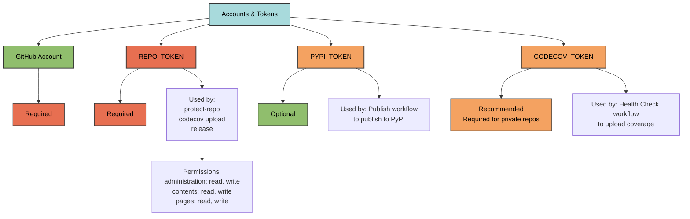

# Getting Started

Complete guide to setting up a new pyrig project from scratch.

pyrig provides **minimal best practices fully working defaults for everything a
project needs**. This guide will walk you through setting up a complete,
production-ready Python project in minutes.

## Prerequisites

### Required Software

**Git**:

```bash
# Verify installation
git --version

# Configure user (should match GitHub username)
git config --global user.name "YourGitHubUsername"
git config --global user.email "your.email@example.com"
```

**uv** (Python package manager):

```bash
# Install uv
curl -LsSf https://astral.sh/uv/install.sh | sh

# Verify installation
uv --version
```

**Podman** (for containerization):

```bash
# Linux
sudo apt install podman  # Debian/Ubuntu
sudo dnf install podman  # Fedora

# macOS
brew install podman

# Verify installation
podman --version
```

### Accounts & Tokens



**GitHub Account**:

- Create account at [github.com](https://github.com)
- Verify email address

**GitHub Personal Access Token (REPO_TOKEN)** - **Required**:

1. Go to GitHub Settings → Developer settings → Personal access tokens →
   Fine-grained tokens
2. Select scopes:
   - `administration: read, write` (for `pyrig protect-repo`)
   - `contents: read, write` (for CI/CD)
   - `pages: read, write` (for GitHub Pages)
3. Click "Generate token"
4. **Copy token immediately** (you won't see it again)
5. Add token to your repository secrets

**PyPI Token (PYPI_TOKEN)** - **Optional** (for publishing):

1. Create account at [pypi.org](https://pypi.org)
2. Create an API token
3. Scope: "Entire account" (recommended change to specific project after first
   publish)
4. Click "Add token"
5. **Copy token immediately** (you won't see it again)
6. Add token to your repository secrets

**Codecov Account** - **Recommended** (for coverage badge and reporting):

1. Visit [codecov.io](https://codecov.io)
2. Click "Log in with GitHub" to create account and link GitHub
3. That's it - your account is ready

**Codecov Token (CODECOV_TOKEN)** - **Recommended** (for uploading coverage):

1. Go to your repository on Codecov
2. Navigate to Settings → General
3. Copy the repository upload token
4. Add token to your GitHub repository secrets as `CODECOV_TOKEN`

**Note**:

- **For private repos**: CODECOV_TOKEN is **required**
- **For public repos**: CODECOV_TOKEN is **recommended** but optional. Without
  it, you must enable tokenless upload in Codecov settings (Settings → General →
  "Allow tokenless upload")
- The token provides better reliability and security for all repos

## Setup Steps

### 1. Create GitHub Repository

```bash
# On GitHub.com:
# 1. Click "New repository"
# 2. Name: my-project
# 3. Description: Your project description
# 4. Public or Private
# 5. You do not need to initialize with README, 
#   .gitignore bc pyrig will create it for you. 
#   (create a licence if you do not want the MIT license)
# 6. Click "Create repository"
```

### 2. Clone Repository

```bash
# Clone the empty repository
git clone https://github.com/YourUsername/my-project.git
cd my-project

# Verify remote is set
git remote -v
# Should show: origin  https://github.com/YourUsername/my-project.git
```

**Note**: Git user.name doesn't have to match GitHub username exactly, as long
as `git remote -v` shows the correct GitHub URL after cloning. But if you use
pyrig init before having cloned the repo and therefore not having a remote set,
pyrig will default to your user name under `git config user.name`. pyrig's init
command will also work without a cloned repo, but it is recommended to clone it
first and then run `uv run pyrig init` to avoid any potential issues.

### 3. Initialize Project with uv

```bash
# Initialize Python project
uv init
```

### 4. Add pyrig Dependency

```bash
# Add pyrig to project
uv add pyrig
```

### 5. Run pyrig init

```bash
# Initialize pyrig project
uv run pyrig init
```

This command runs several automated steps to set up your complete project. See
the [init command documentation](../cli/commands/init.md) for detailed
information about each step.

**Summary of steps:**

1. Adding dev dependencies (pyrig-dev)
2. Syncing venv (install all dependencies)
3. Creating priority config files (LICENSE, pyproject.toml, etc.)
4. Syncing venv (install project itself, activate CLI)
5. Creating project root (all config files and directory structure)
6. Creating test files (test skeletons for all code)
7. Installing pre-commit hooks (install hooks into git repository)
8. Adding all files to version control (stage all files)
9. Running pre-commit hooks (format and lint)
10. Running tests (validate everything works)
11. Committing initial changes (create initial git commit)

### 6. Add Repository Secrets (for CI/CD)

On GitHub.com, go to your repository:

1. Settings → Secrets and variables → Actions
2. Click "New repository secret"
3. Add each secret:

**REPO_TOKEN**:

- Name: `REPO_TOKEN`
- Secret: Your GitHub fine-grained personal access token with permissions:
  - `administration: read, write`
  - `contents: read, write`
  - `pages: read, write`
- Click "Add secret"

**PYPI_TOKEN** (optional):

- Name: `PYPI_TOKEN`
- Secret: Your PyPI token
- Click "Add secret"

**CODECOV_TOKEN** (optional, but recommended):

- Name: `CODECOV_TOKEN`
- Secret: Your Codecov token
- Click "Add secret"

### 7. Push to GitHub

```bash
# Push initial commit
git push -u origin main
```

### 8. Verify Workflows

On GitHub.com:

1. Go to Actions tab
2. Health Check workflow should run automatically
3. Verify all jobs pass (should just take a 2-3 minutes on an empty project)

## What You Get

After completing setup, your project has:

**Complete Project Structure**:

```text
my-project/
├── my_project/                      # Source code package
│   ├── __init__.py
│   ├── main.py                      # CLI entry point
│   ├── py.typed                     # PEP 561 type marker
│   ├── dev/                         # Development infrastructure
│   │   ├── __init__.py
│   │   ├── builders/                # Build artifact definitions
│   │   │   └── __init__.py
│   │   ├── cli/                     # CLI command system
│   │   │   ├── __init__.py
│   │   │   ├── subcommands.py       # Project commands
│   │   │   └── shared_subcommands.py # Shared commands
│   │   ├── configs/                 # Config file managers
│   │   │   └── __init__.py
│   │   ├── management/              # Tools wrappers
│   │   │   └── __init__.py
│   │   └── tests/                   # Test infrastructure
│   │       ├── __init__.py
│   │       └── fixtures/
│   │           └── __init__.py
│   ├── resources/                   # Static resources
│   │   └── __init__.py
│   └── src/                         # Application logic
│       └── __init__.py
│
├── tests/                           # Test files (mirrors source)
│   ├── __init__.py
│   ├── conftest.py                  # Pytest configuration
│   ├── test_zero.py                 # Initial test
│   └── test_my_project/             # Mirrors my_project/ structure
│       ├── __init__.py
│       ├── test_main.py
│       ├── test_dev/                # Mirrors my_project/dev/
│       │   ├── __init__.py
│       │   ├── test_builders/
│       │   │   └── __init__.py
│       │   ├── test_cli/
│       │   │   ├── __init__.py
│       │   │   ├── test_subcommands.py
│       │   │   └── test_shared_subcommands.py
│       │   ├── test_configs/
│       │   │   └── __init__.py
│       │   └── test_tests/
│       │       └── __init__.py
│       ├── test_resources/          # Mirrors my_project/resources/
│       │   └── __init__.py
│       └── test_src/                # Mirrors my_project/src/
│           └── __init__.py
│
├── docs/                            # MkDocs documentation
│   ├── index.md                     # Documentation homepage
│   └── api.md                       # API reference (auto-generated)
│
├── .github/                         # GitHub configuration
│   └── workflows/                   # CI/CD workflows
│       ├── health_check.yaml        # Tests, linting, type checking
│       ├── build.yaml               # Build artifacts
│       ├── release.yaml             # Version and release
│       └── publish.yaml             # PyPI and docs publishing
│
├── .env                             # Environment variables (not committed)
├── .experiment.py                   # file for experiments (not committed)
├── .gitignore                       # Git ignore patterns
├── .pre-commit-config.yaml          # Pre-commit hooks
├── .python-version                  # Python version (3.12+)
├── Containerfile                    # Podman/Docker image definition
├── LICENSE                          # MIT license
├── README.md                        # Project readme
├── mkdocs.yml                       # MkDocs configuration
├── pyproject.toml                   # Project metadata and tool configs
└── uv.lock                          # Dependency lock file
```

### 9. Start coding

Start coding in `my_project/src/` and write tests in `tests/`.

Execute your code with `uv run my-project main`.

**Documentation**:

- `docs/index.md` - Documentation homepage with badges and project description
- `docs/api.md` - API reference auto-generated from Python docstrings
- `mkdocs.yml` - MkDocs configuration with Material theme

**CI/CD**:

- `.github/workflows/` - GitHub Actions workflows for automation

**Configuration Files**:

- `pyproject.toml` - Project metadata, dependencies, tool configs
- `.gitignore` - Git ignore patterns
- `.pre-commit-config.yaml` - Pre-commit hooks
- `mkdocs.yml` - Documentation configuration
- `Containerfile` - Container image definition
- `LICENSE` - MIT license
- `.env` - Environment variables (not committed)

... and more config files detailed in
[Configs Documentation](../configs/index.md)

**CI/CD Workflows**: See
[Workflows Documentation](../configs/workflows/index.md) for details on health
check, build, release, and publish workflows.

**Development Tools**: See [Tooling Documentation](tooling.md) for complete tool
choices and rationale.

**CLI Commands**:

```bash
uv run my-project --help     # Your CLI
uv run my-project version    # Display version
```

See [CLI Documentation](../cli/index.md) for all available commands.

## Next Steps

After completing setup:

- **Add your code** to `my_project/src/`
- **Create custom commands** in `my_project/dev/cli/subcommands.py`
- **Add custom configs** in `my_project/dev/configs/`
- **Write tests** in `tests/` (mirroring source structure)
- **Build artifacts** with `uv run pyrig build`

## Additional Resources

- [CLI Documentation](../cli/index.md) - Command reference and creating custom
  commands
- [Configuration Files](../configs/index.md) - Config file system and
  customization
- [Testing Documentation](../tests/index.md) - Test structure and fixtures
- [Builder Documentation](../builders/index.md) - Creating distributable
  artifacts
- [Example Usage](example-usage.md) - Real-world microservices ecosystem example
- [Tooling](tooling.md) - Tool choices and rationale
- [Trade-offs](drawbacks.md) - What you sacrifice and gain
