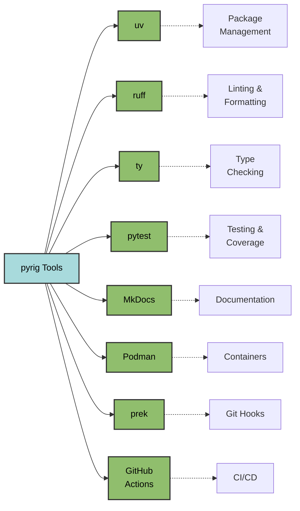

# Tooling

pyrig makes opinionated tooling choices to provide a consistent, modern
development experience. This document explains which tools are used and why.

## Tool Ecosystem



## Package Management

### uv

**Purpose**: Python package and project manager

**Why**:

- 10-100x faster than pip/poetry
- Built-in virtual environment management
- Unified tool for dependencies, builds, and execution
- Modern build backend (`uv_build`)
- Replaces pip, poetry, virtualenv, and setuptools

**Usage**:

```bash
uv sync              # Install dependencies
uv add package       # Add dependency
uv run pytest        # Run command in venv
uv version --bump    # Bump version
```

## Code Quality

### Ruff

**Purpose**: Linter and formatter

**Why**:

- 10-100x faster than flake8/black/isort combined
- Replaces multiple tools (flake8, black, isort, pyupgrade, etc.)
- All rules enabled by default (opinionated)
- Auto-fixes most issues
- Written in Rust for speed

**Configuration**: Enables ALL rules with minimal exceptions (D203, D213,
COM812, ANN401)

### ty

**Purpose**: Type checker

**Why**:

- Static type checker
- Catches type errors before execution
- Configured to error on warnings for strictness
- Modern, fast type checker from Astral (creators of ruff and uv)

### Bandit

**Purpose**: Security vulnerability scanner

**Why**:

- Identifies common security issues
- Scans for hardcoded passwords, SQL injection, etc.
- Runs automatically in prek hooks
- Skips assert checks in test files

### pip-audit

**Purpose**: Dependency vulnerability auditing

**Why**:

- Checks installed dependencies for known vulnerabilities (advisories/CVEs)
- Catches supply-chain risks that static code scanners (like Bandit) cannot
- Runs in CI so issues are caught before merge/release

## Testing

### pytest

**Purpose**: Testing framework

**Why**:

- Most popular Python testing framework
- Rich plugin ecosystem
- Powerful fixture system
- Better than unittest (which pyrig explicitly forbids)

**Configuration**: 90% coverage requirement enforced

### pytest-cov

**Purpose**: Coverage reporting

**Why**:

- Integrates seamlessly with pytest
- Generates coverage reports
- Enforces coverage thresholds
- Uploads to Codecov in CI

### pytest-mock

**Purpose**: Mocking utilities

**Why**:

- Simplifies mocking in tests
- Better API than unittest.mock
- Integrates with pytest fixtures

### Codecov

**Purpose**: Coverage tracking and reporting

**Why**:

- Visualizes coverage trends over time
- Integrates with GitHub PRs
- Tracks coverage across matrix builds
- Free for open source

**Setup**: See
[Getting Started - Codecov Account](getting-started.md#accounts--tokens) for
setup instructions

## Documentation

### MkDocs

**Purpose**: Documentation site generator

**Why**:

- Simple, markdown-based documentation
- Material theme provides modern UI
- Auto-deploys to GitHub Pages
- Supports Mermaid diagrams

### mkdocs-mermaid2-plugin

**Purpose**: Mermaid diagram support

**Why**:

- Enables visual diagrams in documentation
- Diagrams as code (version controlled)
- Renders flowcharts, sequence diagrams, etc.

## Build & Distribution

### PyInstaller

**Purpose**: Executable builder

**Why**:

- Creates standalone executables
- Cross-platform support (Linux, Windows, macOS)
- No Python installation required for users
- Bundles all dependencies

### setuptools

**Purpose**: Build utilities

**Why**:

- Required by PyInstaller
- Provides package_resources utilities
- Industry standard (though being replaced by uv)

## Version Control

### Git

**Purpose**: Version control system

**Why**:

- Industry standard
- Required by pyrig
- Enables collaboration and history tracking

### prek

**Purpose**: Git hook manager

**Why**:

- Runs quality checks before commits
- Prevents bad code from entering repository
- Configurable hooks (ruff, ty, bandit, rumdl)
- Enforces consistency across team
- Rust-based, fast drop-in replacement for pre-commit using TOML config

### GitHub

**Purpose**: Code hosting and CI/CD platform

**Why**:

- Industry standard for open source
- GitHub Actions for CI/CD
- Branch protection and rulesets
- Free for public repositories

### PyGithub

**Purpose**: GitHub API client

**Why**:

- Automates repository configuration
- Sets branch protection rules
- Manages releases and artifacts
- Python-native API

## Containerization

### Podman

**Purpose**: Container engine

**Why**:

- Daemonless (more secure than Docker)
- Rootless by default (better security)
- Docker-compatible CLI
- Technically superior to Docker
- Used in CI/CD workflows

**Note**: Docker works too, but Podman is strongly recommended.

## CLI Framework

### Typer

**Purpose**: CLI application framework

**Why**:

- Modern, type-hint based CLI creation
- Automatic help generation
- Built on Click (battle-tested)
- Excellent developer experience
- Only runtime dependency of pyrig

## Philosophy

pyrig's tooling choices prioritize:

1. **Speed**: Rust-based tools (ruff, uv) over Python equivalents
2. **Strictness**: All linting rules, strict typing, high coverage
3. **Simplicity**: Fewer tools that do more (ruff replaces 5+ tools)
4. **Security**: Podman over Docker, bandit scanning,
dependency auditing, signed commits
5. **Automation**: Prek hooks, autouse fixtures, CI/CD workflows
6. **Modern**: Latest Python versions, modern build backends, current best
   practices

These choices are opinionated but proven to create maintainable, high-quality
Python projects.

**Tool Evolution**: pyrig will switch tools when better alternatives emerge. For
example, we migrated from poetry to uv when uv proved to be significantly faster
and more capable, and from mypy to ty for faster, runtime type checking. We
continuously evaluate the ecosystem and adopt superior tools as they mature.

**Replacing Tools**: While not recommended, you can replace any tool by
subclassing the Tool wrapper classes in `rig/tools/`. pyrig uses the `.I`
(leaf) property internally, so your subclasses automatically apply. However,
tools are interconnected with configs, workflows, and CI/CD - replacing one
often requires changes to others.
See [Tool Architecture - Replacing Tools](../tools/architecture.md#tool-replacement-complexity)
for details on how to do this and what additional work is required.
