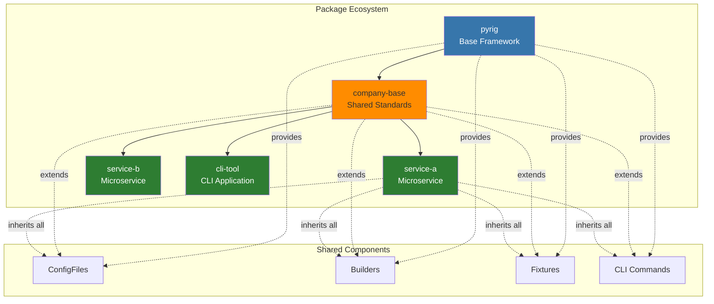
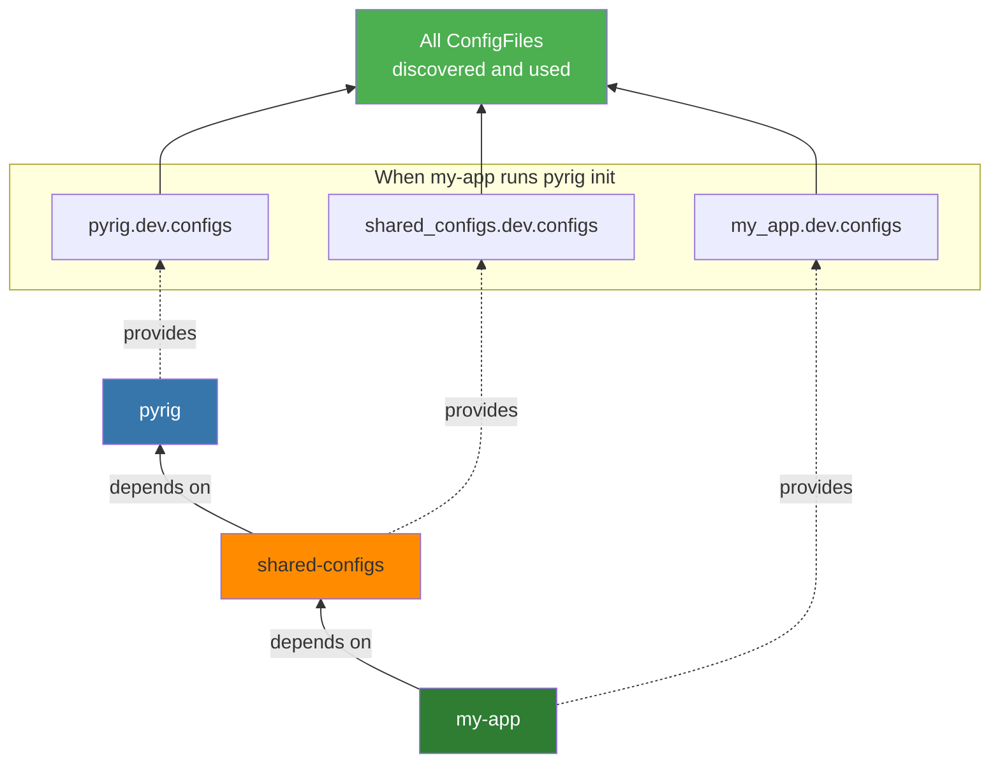
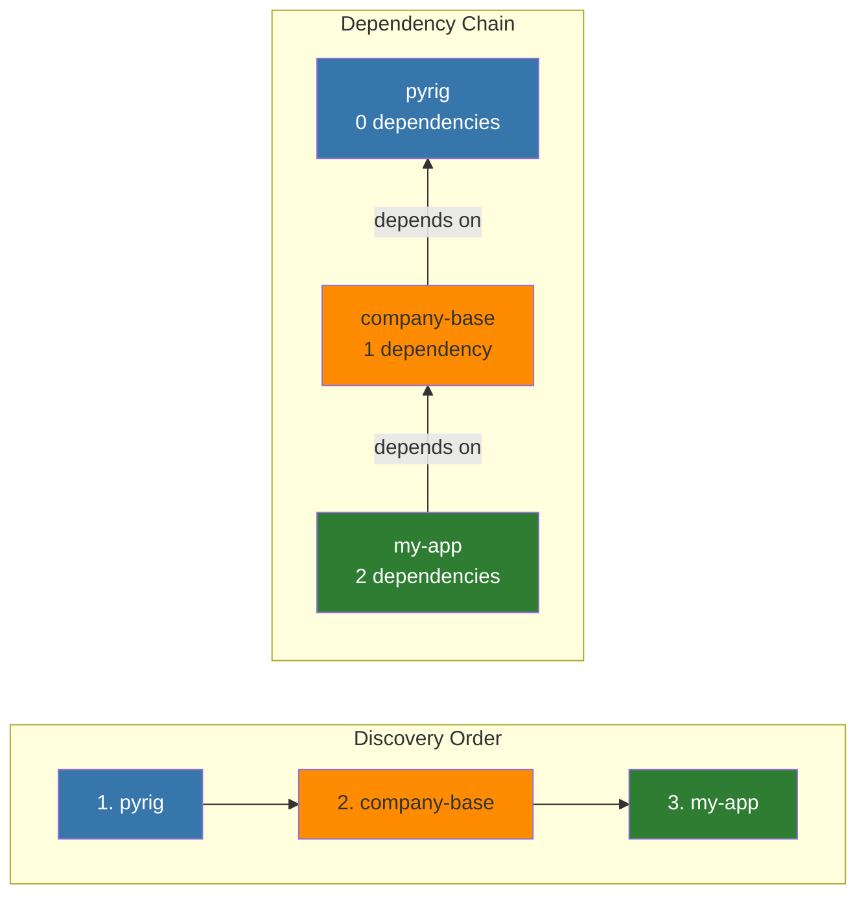
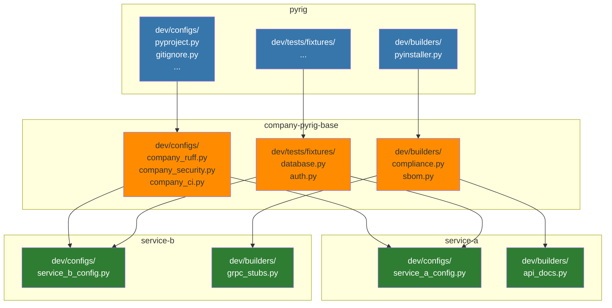

# Multi-Package Architecture

## Overview

One of pyrig's most powerful features is its **multi-package architecture**: the ability to automatically discover and integrate ConfigFiles, Builders, and pytest fixtures across multiple packages in your ecosystem.



This enables you to:
- **Share configuration** across multiple projects
- **Build package ecosystems** with common tooling
- **Extend base packages** with project-specific customizations
- **Reuse test fixtures** across your entire codebase

## How It Works

### The Dependency Graph

At the core of pyrig's multi-package architecture is the `DependencyGraph` class, which:

1. **Scans all installed packages** using `importlib.metadata`
2. **Builds a dependency graph** showing which packages depend on which
3. **Finds all packages** that depend on pyrig (directly or indirectly)
4. **Discovers extensible components** (ConfigFiles, Builders, fixtures) in those packages

```python
from pyrig.src.modules.package import DependencyGraph

# Create the dependency graph
graph = DependencyGraph()

# Find all packages that depend on pyrig
dependents = graph.get_all_depending_on("pyrig")
# Returns: [myapp, other_pkg, shared_configs, ...]
```

### Cross-Package Discovery

When you run `pyrig init` or `pyrig build`, pyrig:

1. **Identifies all packages** depending on pyrig
2. **Looks for equivalent modules** in each package (e.g., `<package>.dev.configs`)
3. **Discovers all subclasses** of ConfigFile, Builder, etc.
4. **Initializes/executes them** in dependency order

This means if you have:



When `my-app` runs `pyrig init`, it discovers and uses:
- ConfigFiles from `pyrig.dev.configs`
- ConfigFiles from `shared_configs.dev.configs`
- ConfigFiles from `my_app.dev.configs`

## Use Cases

### Use Case 1: Shared Configuration Across Projects

**Scenario**: You have multiple microservices that should all use the same linting rules, pre-commit hooks, and CI/CD workflows.

**Solution**: Create a shared configuration package.

```bash
# Create shared-configs package
mkdir shared-configs
cd shared-configs
uv init
uv add pyrig
uv run pyrig init
```

```python
# shared_configs/dev/configs/strict_ruff.py
"""Stricter ruff configuration for all company projects."""

from pyrig.dev.configs.pyproject import PyprojectConfigFile as BasePyprojectConfigFile

class PyprojectConfigFile(PyprojectConfigFile):  # Note: filenames are derived from class name if not overridden in a method get_filename
    """Extends pyproject.toml with stricter ruff rules."""
    
    @classmethod
    def get_configs(cls) -> dict:
        config = super().get_configs()
        
        # Add company-specific ruff rules
        config["tool"]["ruff"]["lint"]["ignore"].remove("ANN401")  # Require specific types
        config["tool"]["ruff"]["lint"]["select"].append("FURB")  # Add refurb rules
        
        return config
```

Now in your application:
```bash
# In your app
uv add shared-configs
uv run pyrig init  # Automatically uses PyprojectConfigFile from shared-configs!
```

### Use Case 2: Custom Builders for Your Organization

**Scenario**: All your projects need to generate OpenAPI specs and deploy to Kubernetes.

**Solution**: Create shared builders in a base package.

```python
# shared_tools/dev/builders/openapi.py
"""OpenAPI spec builder for all services."""

from pathlib import Path
from pyrig.dev.builders.base.base import Builder

class OpenAPIBuilder(Builder):
    """Generates OpenAPI specification."""

    @classmethod
    def create_artifacts(cls, temp_artifacts_dir: Path) -> None:
        """Generate OpenAPI spec from code."""
        # Your OpenAPI generation logic
        spec = cls._generate_openapi_spec()
        spec_file = temp_artifacts_dir / "openapi.yaml"
        spec_file.write_text(spec)

    @classmethod
    def _generate_openapi_spec(cls) -> str:
        """Generate the OpenAPI specification."""
        # Implementation here
        return "openapi: 3.0.0\n..."
```

```python
# shared_tools/dev/builders/k8s.py
"""Kubernetes manifest builder."""

from pathlib import Path
from pyrig.dev.builders.base.base import Builder

class K8sManifestBuilder(Builder):
    """Generates Kubernetes deployment manifests."""

    @classmethod
    def create_artifacts(cls, temp_artifacts_dir: Path) -> None:
        """Generate K8s manifests."""
        manifest = cls._generate_k8s_manifest()
        manifest_file = temp_artifacts_dir / "deployment.yaml"
        manifest_file.write_text(manifest)

    @classmethod
    def _generate_k8s_manifest(cls) -> str:
        """Generate Kubernetes manifest."""
        app_name = cls.get_app_name()
        return f"""
apiVersion: apps/v1
kind: Deployment
metadata:
  name: {app_name}
spec:
  replicas: 3
  selector:
    matchLabels:
      app: {app_name}
  template:
    metadata:
      labels:
        app: {app_name}
    spec:
      containers:
      - name: {app_name}
        image: {app_name}:latest
"""
```

Now any project that depends on `shared-tools`:
```bash
uv add shared-tools
uv run pyrig build  # Automatically runs OpenAPIBuilder and K8sManifestBuilder!
```

### Use Case 3: Shared Test Fixtures

**Scenario**: Multiple packages need the same database fixtures, mock clients, or test data.

**Solution**: Define fixtures in a shared package.

```python
# test_utils/dev/tests/fixtures/database.py
"""Shared database fixtures."""

import pytest
from sqlalchemy import create_engine
from sqlalchemy.orm import Session

@pytest.fixture
def db_engine():
    """Create a test database engine."""
    engine = create_engine("sqlite:///:memory:")
    yield engine
    engine.dispose()

@pytest.fixture
def db_session(db_engine):
    """Create a test database session."""
    connection = db_engine.connect()
    transaction = connection.begin()
    session = Session(bind=connection)

    yield session

    session.close()
    transaction.rollback()
    connection.close()

@pytest.fixture
def sample_user(db_session):
    """Create a sample user for testing."""
    from myapp.models import User
    user = User(username="testuser", email="test@example.com")
    db_session.add(user)
    db_session.commit()
    return user
```

In your application's `tests/conftest.py`:
```python
"""Test configuration."""

# This line is automatically added by pyrig
pytest_plugins = ["pyrig.dev.tests.conftest"]

# Fixtures from test_utils are automatically discovered!
# No need to import them - they're available in all tests
```

Now in your tests:
```python
# tests/test_my_app/test_src/test_users.py
"""User tests."""

def test_user_creation(db_session, sample_user):
    """Test user creation."""
    # db_session and sample_user are from test_utils package!
    assert sample_user.username == "testuser"
    assert db_session.query(User).count() == 1
```

### Use Case 4: Shared CLI Commands

**Scenario**: You want all your organization's projects to have common CLI commands like `deploy`, `security-scan`, and `lint-all`.

**Solution**: Define shared commands in a base package.

```python
# company_tools/dev/cli/shared_subcommands.py
"""Shared CLI commands for all company projects."""

import typer
from pyrig.dev.utils.cli import get_project_name_from_argv


def deploy() -> None:
    """Deploy the application to production."""
    project_name = get_project_name_from_argv()
    typer.echo(f"Deploying {project_name} to production...")
    # Your deployment logic here


def security_scan() -> None:
    """Run security scanning on the project."""
    typer.echo("Running security scan...")
    from pyrig.src.os.os import run_subprocess

    result = run_subprocess(["bandit", "-r", "."])
    if result.returncode == 0:
        typer.echo("✅ Security scan passed!")
    else:
        typer.echo("❌ Security issues found!")
        raise typer.Exit(1)


def lint_all() -> None:
    """Run all linting tools."""
    typer.echo("Running ruff...")
    from pyrig.src.os.os import run_subprocess

    run_subprocess(["ruff", "check", "."])
    run_subprocess(["ruff", "format", "--check", "."])
    typer.echo("✅ Linting complete!")
```

Now any project that depends on `company-tools`:
```bash
# In service-a
uv add company-tools
uv run service-a deploy
# Deploying service-a to production...

uv run service-a security-scan
# Running security scan...
# ✅ Security scan passed!

uv run service-a lint-all
# Running ruff...
# ✅ Linting complete!

# In service-b (also depends on company-tools)
uv run service-b deploy
# Deploying service-b to production...
```

**Built-in Example: The `version` Command**

Pyrig itself includes a shared command as an example:

```python
# pyrig/dev/cli/shared_subcommands.py
from importlib.metadata import version as get_version
import typer
from pyrig.dev.utils.cli import get_project_name_from_argv

def version() -> None:
    """Display the version information."""
    project_name = get_project_name_from_argv()
    typer.echo(f"{project_name} version {get_version(project_name)}")
```

This command is automatically available in **every package that depends on pyrig**:

```bash
# In pyrig itself
uv run pyrig version
# pyrig version 0.1.0

# In your project
uv run my-awesome-project version
# my-awesome-project version 1.2.3

# In any dependent package
uv run other-service version
# other-service version 2.0.0
```

See [shared_subcommands.py documentation](config-files/shared-subcommands.md) for more details.

## How Discovery Works

### ConfigFile Discovery

When `pyrig init` or `pyrig mkroot` runs:

1. **Build dependency graph**: Find all packages depending on pyrig
2. **For each package**: Look for `<package>.dev.configs` module
3. **Scan for ConfigFile subclasses**: Find all classes extending ConfigFile
4. **Initialize in order**: Priority files first, then ordered, then all others

```python
# From pyrig/dev/configs/base/base.py
@classmethod
def get_all_subclasses(cls) -> list[type["ConfigFile"]]:
    """Discover all non-abstract ConfigFile subclasses.

    Searches all packages depending on pyrig for ConfigFile subclasses.
    """
    return get_all_nonabst_subcls_from_mod_in_all_deps_depen_on_dep(
        cls,      # ConfigFile base class
        pyrig,    # The dependency to search for
        configs,  # The module pattern to look for
        discard_parents=True,
    )
```

### Builder Discovery

When `pyrig build` runs:

1. **Build dependency graph**: Find all packages depending on pyrig
2. **For each package**: Look for `<package>.dev.builders` module
3. **Scan for Builder subclasses**: Find all classes extending Builder
4. **Instantiate each**: Triggers the build process

```python
# From pyrig/dev/builders/base/base.py
@classmethod
def get_non_abstract_subclasses(cls) -> list[type["Builder"]]:
    """Discover all non-abstract Builder subclasses.

    Searches all packages depending on pyrig for Builder subclasses.
    """
    return get_all_nonabst_subcls_from_mod_in_all_deps_depen_on_dep(
        cls,      # Builder base class
        pyrig,    # The dependency to search for
        builders, # The module pattern to look for
        discard_parents=True,
    )
```

### Fixture Discovery

When pytest runs:

1. **Load conftest.py**: Your `tests/conftest.py` registers `pyrig.dev.tests.conftest` as a plugin
2. **Pyrig's conftest**: Discovers all packages depending on pyrig
3. **For each package**: Look for `<package>.dev.tests.fixtures` module
4. **Scan for all Python files**: Find all `.py` files in the fixtures module
5. **Register as plugins**: Add them to `pytest_plugins` for automatic fixture availability

```python
# From pyrig/dev/tests/conftest.py
# Find the fixtures module in all packages that depend on pyrig
fixtures_pkgs = get_same_modules_from_deps_depen_on_dep(fixtures, pyrig)

pytest_plugin_paths: list[Path] = []
for pkg in fixtures_pkgs:
    # Get absolute and relative paths for the fixtures module
    absolute_path = ModulePath.pkg_type_to_dir_path(pkg)
    # Find all Python files in the fixtures module
    for path in absolute_path.rglob("*.py"):
        pytest_plugin_paths.append(path)

# Convert paths to module names and register as pytest plugins
pytest_plugins = [
    ModulePath.relative_path_to_module_name(path) for path in pytest_plugin_paths
]
```

### Shared Subcommand Discovery

When you run your CLI (e.g., `uv run my-app --help`):

1. **Build dependency graph**: Find all packages depending on pyrig
2. **For each package**: Look for `<package>.dev.cli.shared_subcommands` module
3. **Scan for functions**: Find all public functions in each module
4. **Register commands**: Add them to the Typer app
5. **Make them available**: Commands are now callable

```python
# From pyrig/dev/cli/cli.py
def add_shared_subcommands() -> None:
    """Discover and register all shared CLI subcommands.

    This discovers all packages inheriting from pyrig and loads their
    shared_subcommands modules, registering all public functions as CLI
    commands.
    """
    package_name = get_pkg_name_from_argv()
    package = import_module(package_name)

    # Get all shared_subcommands modules from dependency chain
    all_shared_subcommands_modules = get_same_modules_from_deps_depen_on_dep(
        shared_subcommands,  # The module pattern to look for
        pyrig,               # The dependency to search for
        until_pkg=package,   # Stop at current package
    )

    # Register all functions from each module
    for shared_subcommands_module in all_shared_subcommands_modules:
        sub_cmds = get_all_functions_from_module(shared_subcommands_module)
        for sub_cmd in sub_cmds:
            app.command()(sub_cmd)
```

**Example Discovery Chain:**

```
When running: uv run my-app --help

1. Discovers: pyrig.dev.cli.shared_subcommands
   - Finds: version()

2. Discovers: company_base.dev.cli.shared_subcommands
   - Finds: deploy(), security_scan(), lint_all()

3. Discovers: my_app.dev.cli.shared_subcommands
   - Finds: (any shared commands defined in my_app)

Result: All commands are available in my-app CLI
```

## Creating a Multi-Package Ecosystem

### Step 1: Create a Base Package

```bash
# Create your base package
mkdir my-company-pyrig-base
cd my-company-pyrig-base

# Initialize with pyrig
uv init
uv add pyrig
uv run pyrig init

# Publish to PyPI or private registry
uv build
uv publish
```

### Step 2: Add Shared ConfigFiles

```python
# my_company_pyrig_base/dev/configs/company_standards.py
"""Company-wide configuration standards."""

from pathlib import Path
from pyrig.dev.configs.base.base import YamlConfigFile

class CompanyStandardsConfigFile(YamlConfigFile):
    """Company coding standards configuration."""

    @classmethod
    def get_parent_path(cls) -> Path:
        return Path(".company")

    @classmethod
    def get_configs(cls) -> dict:
        return {
            "company": "My Company",
            "standards_version": "2.0",
            "required_coverage": 95,
            "code_review_required": True,
        }
```

### Step 3: Add Shared Builders

```python
# my_company_pyrig_base/dev/builders/compliance.py
"""Compliance report builder."""

from pathlib import Path
from pyrig.dev.builders.base.base import Builder

class ComplianceReportBuilder(Builder):
    """Generates compliance reports for auditing."""

    @classmethod
    def create_artifacts(cls, temp_artifacts_dir: Path) -> None:
        """Generate compliance report."""
        report = cls._generate_compliance_report()
        report_file = temp_artifacts_dir / "compliance-report.json"
        report_file.write_text(report)

    @classmethod
    def _generate_compliance_report(cls) -> str:
        """Generate the compliance report."""
        import json
        return json.dumps({
            "project": cls.get_app_name(),
            "compliant": True,
            "checks": ["security", "licensing", "dependencies"]
        }, indent=2)
```

### Step 4: Add Shared Fixtures

```python
# my_company_pyrig_base/dev/tests/fixtures/auth.py
"""Shared authentication fixtures."""

import pytest

@pytest.fixture
def mock_auth_token():
    """Provide a mock authentication token."""
    return "mock-token-12345"

@pytest.fixture
def authenticated_client(mock_auth_token):
    """Provide an authenticated test client."""
    from myapp.client import Client
    return Client(auth_token=mock_auth_token)
```

### Step 5: Use in Your Applications

```bash
# In your application
mkdir my-app
cd my-app

uv init
uv add pyrig
uv add my-company-pyrig-base  # Add your base package!

uv run pyrig init
```

Now `my-app` automatically gets:
- ✅ All ConfigFiles from `my-company-pyrig-base`
- ✅ All Builders from `my-company-pyrig-base`
- ✅ All fixtures from `my-company-pyrig-base`
- ✅ Plus all the standard pyrig ConfigFiles, Builders, and fixtures

### Step 6: Override or Extend

You can override base package behavior in your application:

```python
# my_app/dev/configs/app_specific.py
"""Override company standards for this app."""

from my_company_pyrig_base.dev.configs.company_standards import CompanyStandardsConfigFile

class AppSpecificStandardsConfigFile(CompanyStandardsConfigFile):
    """App-specific overrides."""

    @classmethod
    def get_configs(cls) -> dict:
        config = super().get_configs()
        # This app needs higher coverage
        config["required_coverage"] = 98
        return config
```

## Package Discovery Order

Packages are discovered and processed in **dependency order** (packages with fewer dependencies first):



This ensures:
- Base configurations are loaded first
- Derived packages can override or extend base behavior
- Dependencies are always available when needed

## Best Practices

### ✅ DO

- **Create base packages** for shared configuration across projects
- **Use semantic versioning** for your base packages
- **Document your ConfigFiles** so users know what they do
- **Test your base packages** thoroughly before publishing
- **Use dependency order** to your advantage (base → derived)
- **Publish to PyPI** or a private registry for easy distribution

### ❌ DON'T

- **Don't create circular dependencies** between packages
- **Don't hardcode project-specific values** in base packages
- **Don't override pyrig's core ConfigFiles** unless necessary
- **Don't make breaking changes** to base packages without versioning
- **Don't forget to document** your multi-package architecture

## Troubleshooting

### Issue: ConfigFiles/Builders not discovered

**Symptom**: Your custom ConfigFile or Builder isn't being used

**Cause**: Package not installed or not in dependency graph

**Solution**:
```bash
# Ensure package is installed
uv add my-base-package

# Verify it's in the dependency graph
uv run python -c "
from pyrig.src.modules.package import DependencyGraph
graph = DependencyGraph()
deps = graph.get_all_depending_on('pyrig')
print([d.__name__ for d in deps])
"

# Should show: ['my_base_package', 'my_app', ...]
```

### Issue: Fixtures not available in tests

**Symptom**: `fixture 'my_fixture' not found`

**Cause**: Fixture package not installed or conftest not configured

**Solution**:
```bash
# Ensure package is installed
uv add my-fixtures-package

# Verify conftest.py has pytest_plugins
cat tests/conftest.py
# Should contain: pytest_plugins = ["pyrig.dev.tests.conftest"]

# Re-run pyrig init if needed
uv run pyrig init
```

### Issue: Conflicting ConfigFiles

**Symptom**: Two packages define the same ConfigFile

**Cause**: Multiple packages trying to manage the same file

**Solution**:
```python
# In the derived package, extend instead of replace
from base_package.dev.configs.my_config import MyConfigFile

class ExtendedMyConfigFile(MyConfigFile):
    """Extends base configuration."""

    @classmethod
    def get_configs(cls) -> dict:
        config = super().get_configs()
        # Add to config instead of replacing
        config["new_key"] = "new_value"
        return config
```

## Real-World Example

Here's a complete example of a company with multiple services:



**When `service-a` runs `pyrig init`:**
- Gets all ConfigFiles from `pyrig`
- Gets all ConfigFiles from `company-pyrig-base`
- Gets all ConfigFiles from `service-a`
- All are initialized in dependency order

**When `service-a` runs `pyrig build`:**
- Runs all Builders from `pyrig`
- Runs all Builders from `company-pyrig-base` (compliance, SBOM)
- Runs all Builders from `service-a` (API docs)

**When `service-a` runs tests:**
- Has access to all fixtures from `pyrig`
- Has access to all fixtures from `company-pyrig-base` (database, auth)
- Has access to all fixtures from `service-a`

## See Also

- [ConfigFile Documentation](config-files/configs-init.md) - Creating custom ConfigFiles
- [Builder Documentation](config-files/builders-init.md) - Creating custom Builders
- [Fixture Documentation](config-files/fixtures-init.md) - Creating custom fixtures
- [Getting Started Guide](getting-started.md) - Initial project setup
- [DependencyGraph API](../pyrig/src/modules/package.py) - Source code reference


