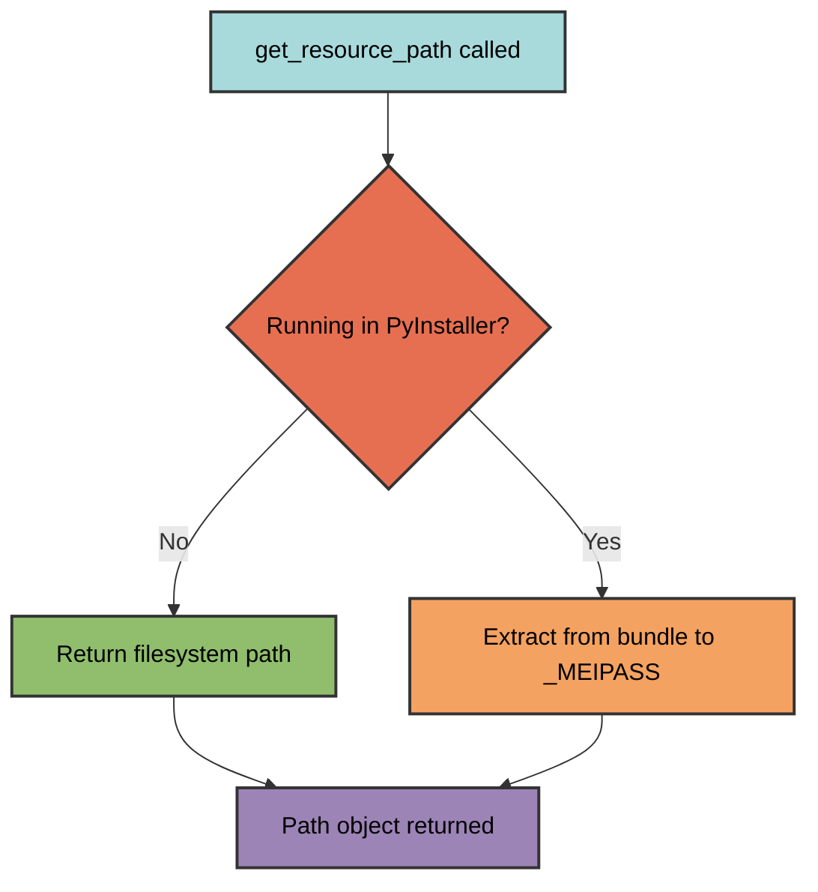
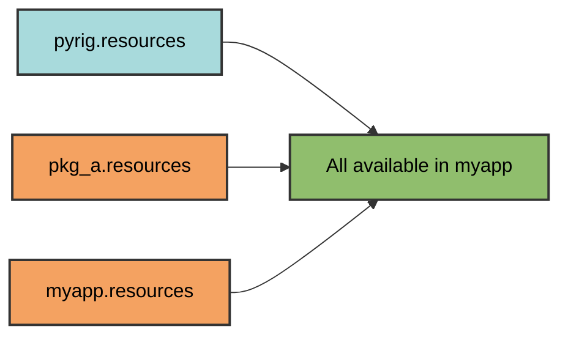

# Resource Management

pyrig's resource system provides unified access to static files that works seamlessly in both development and PyInstaller executables.

## Resource Package Structure

Resources are stored in a dedicated package within your project:

```
myapp/
└── resources/
    ├── __init__.py          # Required for package
    ├── icon.png             # Application icon
    ├── config.json          # Configuration files
    ├── data.csv             # Data files
    └── templates/           # Subdirectories supported
        ├── email.html
        └── report.html
```

The `resources` package is automatically created by pyrig when you run `uv run myapp mkroot`.

## Accessing Resources

### Using `get_resource_path`

The `get_resource_path` function provides cross-platform, environment-agnostic access to resources:

```python
from pathlib import Path
from pyrig.src.resource import get_resource_path
import myapp.resources

# Get path to a resource file
config_path = get_resource_path("config.json", myapp.resources)

# Use the path like any other Path object
config_data = config_path.read_text()
print(config_path)  # Development: /path/to/myapp/resources/config.json
                    # PyInstaller: /tmp/_MEIxxxxxx/myapp/resources/config.json
```

### How It Works



`get_resource_path` uses `importlib.resources` internally, which:
1. **In development**: Returns the actual file path
2. **In PyInstaller**: Extracts the bundled file to `_MEIPASS` temp directory
3. **Returns**: A `Path` object that works in both environments

### Function Signature

```python
def get_resource_path(name: str, package: ModuleType) -> Path:
    """Get the filesystem path to a resource file.
    
    Args:
        name: Filename including extension (e.g., "icon.png")
        package: The resources package module object
    
    Returns:
        Path object pointing to the resource file
    """
```

## Examples

### How Pyinstaller gets the icon.png

```python
from PIL import Image
from pyrig.src.resource import get_resource_path
from myapp import resources

def load_icon() -> Image.Image:
    """Load application icon."""
    icon_path = get_resource_path("icon.png", resources)
    return Image.open(icon_path)
```

### Example with Subpackage

```python
import pandas as pd
from pyrig.src.resource import get_resource_path
from myapp.resources import subpkg

def load_data() -> pd.DataFrame:
    """Load CSV data."""
    data_path = get_resource_path("data.csv", subpkg)
    return pd.read_csv(data_path)
```

### Example with another pkg depending on pyrig

```python
import pandas as pd
from pyrig.src.resource import get_resource_path
from pkg_a.resources import subpkg

def load_data() -> pd.DataFrame:
    """Load CSV data."""
    data_path = get_resource_path("data.csv", subpkg)
    return pd.read_csv(data_path)
```

You see there is no multiarchitectureneeded for this and in fact this works with any package and its files as this uses `importlib.resources` under the hood.

## Multi-Package Resource Inheritance

Resources from all packages in the dependency chain are available, simply import the resources module from the package you want to access and pass it to `get_resource_path` with the file name that you want to access:



## Files in pyrig resources

Pyrig provides the following resources:
- GITIGNORE
- LATEST_PYTHON_VERSION
- MIT_LICENSE_TEMPLATE

These are all used during the `pyrig init` or better `pyrig mkroot` command.
These files are used as fallbacks if the API request to fetch the latest information of these files fail.
pyrig also keeps them automatically updated in itself. So when github changes its gitgnore file for python then pyrig on its next release will have the updated file in resources and once your pyrig version gets updated you will get the updated file as well. As updates happen automatically via autouse fixtures and github workflows, this will be seemless and you wont even notice it probably.


