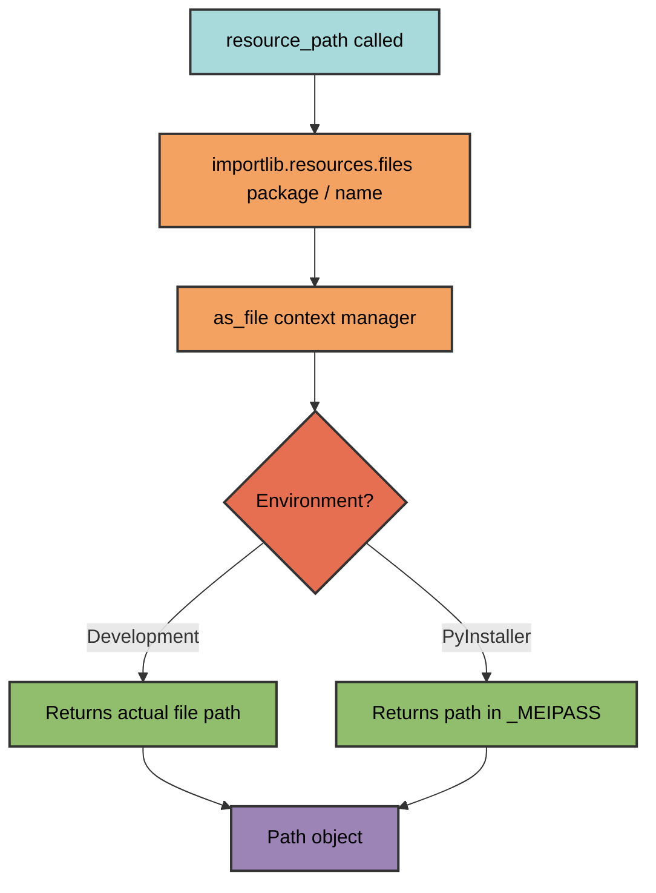
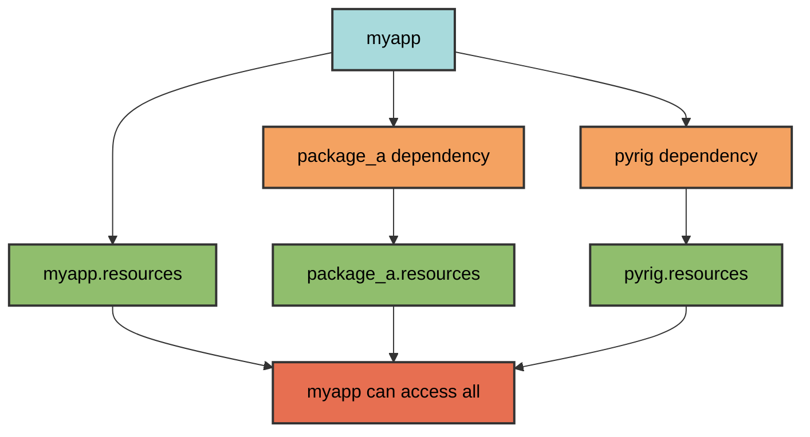

# Resource Management

pyrig's resource system provides unified access to static files that works
seamlessly in both development and PyInstaller executables.

## Resource Package Structure

Resources are stored in a dedicated package within your project:

```text
myapp/
└── resources/
    ├── __init__.py          # Required for package
    ├── icon.png             # Application icon
    ├── config.json          # Configuration files
    ├── data.csv             # Data files
    └── templates/           # Subdirectories supported
        ├── email.html
        └── report.html
```

The `resources` package is automatically created by pyrig when you run
`uv run pyrig mkroot`.

## Accessing Resources

### Using `resource_path`

The `resource_path` function provides cross-platform, environment-agnostic
access to resources:

```python
from pyrig.src.resource import resource_path
import myapp.resources

# Get path to a resource file
config_path = resource_path("config.json", myapp.resources)

# Use the path like any other Path object
config_data = config_path.read_text()
print(config_path)  # Development: /path/to/myapp/resources/config.json
                    # PyInstaller: /tmp/_MEIxxxxxx/myapp/resources/config.json
```

**Important**: For regular file-based packages, the returned `Path` points to
the actual file on disk and remains valid. However, for zip-imported packages
or certain PyInstaller configurations, the path points to a temporary
extraction that may be cleaned up when the internal context manager exits. For
maximum compatibility, use the returned path immediately or copy the file
contents if persistence is needed.

### How It Works

`resource_path` uses `importlib.resources.files()` and `as_file()` to
provide a unified interface:



**What happens:**

1. **Development**: `importlib.resources` returns the actual filesystem path to
   the resource
2. **PyInstaller**: `importlib.resources` extracts the bundled resource to the
   `_MEIPASS` temporary directory and returns that path
3. **Result**: A `Path` object that works identically in both environments

The environment detection and extraction is handled automatically by
`importlib.resources` - your code doesn't need to know which environment it's
running in.

## Usage Examples

### Loading an Image File

```python
from PIL import Image
from pyrig.src.resource import resource_path
from myapp import resources

def load_icon() -> Image.Image:
    """Load application icon."""
    icon_path = resource_path("icon.png", resources)
    return Image.open(icon_path)
```

### Loading Data from a Subpackage

```python
import pandas as pd
from pyrig.src.resource import resource_path
from myapp.resources import data  # subpackage

def load_csv() -> pd.DataFrame:
    """Load CSV data from resources/data/ subpackage."""
    csv_path = resource_path("users.csv", data)
    return pd.read_csv(csv_path)
```

### Reading Configuration Files

```python
import json
from pyrig.src.resource import resource_path
from myapp import resources

def load_config() -> dict:
    """Load JSON configuration."""
    config_path = resource_path("config.json", resources)
    return json.loads(config_path.read_text())
```

## Accessing Resources from Dependencies

Each package has its own `resources/` directory. You can access resources from
any package in your dependency chain by importing that package's resources
module:

```python
# Access your own resources
from myapp import resources as myapp_resources
icon = resource_path("icon.png", myapp_resources)

# Access dependency resources
from package_a import resources as package_a_resources
template = resource_path("template.html", package_a_resources)

# Access pyrig's resources
from pyrig import resources as pyrig_resources
gitignore = resource_path("GITIGNORE", pyrig_resources)
```



**Key point**: Resources are not "inherited" or merged - each package maintains
its own resources. You simply import the specific package's resources module to
access its files.

## Pyrig's Built-in Resources

Pyrig includes the following resource files in `pyrig/resources/`:

- **CONTRIBUTOR_COVENANT_CODE_OF_CONDUCT.md** - Contributor Covenant 2.1 code of
  conduct template
- **GITIGNORE** - GitHub's standard Python .gitignore template
- **LATEST_PYTHON_VERSION** - Latest stable Python version number
- **MIT_LICENSE_TEMPLATE** - MIT license template text

### How They're Used

These files serve as **fallback templates** when creating new projects with
`uv run pyrig mkroot` (which is called by `uv run pyrig init`).

When pyrig needs these files, it:

1. **First attempts** to fetch the latest version from the internet (GitHub API,
   endoflife.date API, etc.)
2. **Falls back** to the bundled resource file if the network request fails
3. **Automatically updates** the bundled resource file when running as pyrig
   itself (not in user projects)

This fallback mechanism uses the `@return_resource_content_on_fetch_error`
decorator, which catches network errors and returns bundled resource content
instead. When running pyrig development itself (not in user projects),
successful fetches automatically update the bundled resources to keep them
fresh.

This ensures your project can be initialized even without internet access,
while still getting the latest templates when possible.
