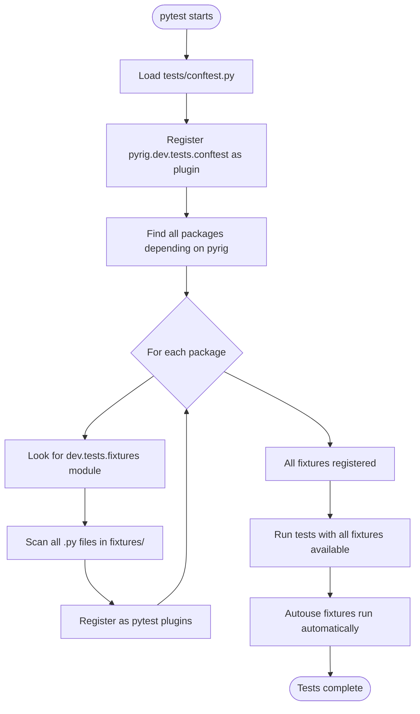

# Testing System

## Overview

pyrig's testing system is a comprehensive framework that automatically enforces best practices through pytest fixtures. The system uses **autouse fixtures** that run automatically on every test execution, ensuring code quality, test coverage, and project consistency without manual intervention.

**Key Concept:** Tests don't just verify your code works—they enforce that your project follows best practices.

## How the Testing System Works

### The Discovery Mechanism

pyrig uses a multi-package fixture discovery system that automatically finds and registers fixtures across your entire dependency graph.



### Step-by-Step Process

#### 1. **Load conftest.py**
```python
# tests/conftest.py
pytest_plugins = ["pyrig.dev.tests.conftest"]
```
Your project's conftest.py registers pyrig's conftest as a plugin.

#### 2. **Discover Fixtures Across Packages**
```python
# From pyrig/dev/tests/conftest.py
fixtures_pkgs = get_same_modules_from_deps_depen_on_dep(fixtures, pyrig)

for pkg in fixtures_pkgs:
    for path in absolute_path.rglob("*.py"):
        pytest_plugin_paths.append(rel_plugin_path)

pytest_plugins = [
    ModulePath.relative_path_to_module_name(path) 
    for path in pytest_plugin_paths
]
```

This discovers:
- `pyrig.dev.tests.fixtures` and all its submodules
- `your_package.dev.tests.fixtures` and all its submodules
- Fixtures from any package depending on pyrig

#### 3. **Register All Fixtures**
All discovered Python files are added to `pytest_plugins`, making their fixtures available globally.

#### 4. **Autouse Fixtures Run Automatically**
Fixtures decorated with `@autouse_session_fixture`, `@autouse_module_fixture`, etc. run automatically without being explicitly requested in tests.

## Autouse Fixtures: Enforcing Best Practices

pyrig provides autouse fixtures at different scopes that automatically enforce best practices.

### Session-Scoped Autouse Fixtures

These run **once per test session** (before any tests start):

#### `assert_root_is_correct`
**Purpose:** Ensures all ConfigFiles are correct and up-to-date.

**What it does:**
- Checks if all ConfigFile subclasses pass `is_correct()`
- If any are incorrect, runs `pyrig mkroot` to fix them
- Ensures your project configuration is always synchronized

**Why it matters:** Prevents tests from running with outdated or incorrect configuration files.

#### `assert_no_namespace_packages`
**Purpose:** Ensures all packages have `__init__.py` files.

**What it does:**
- Scans for namespace packages (packages without `__init__.py`)
- Automatically creates missing `__init__.py` files
- Fails the test if any were missing (after creating them)

**Why it matters:** Namespace packages can cause import issues and are not supported by pyrig.

#### `assert_all_src_code_in_one_package`
**Purpose:** Ensures project has a single source package.

**What it does:**
- Verifies only one source package exists (besides `tests/` and `docs/`)
- Fails if multiple top-level packages are found

**Why it matters:** Enforces clean project structure with one main package.

#### `assert_all_modules_tested`
**Purpose:** Ensures every source module has a corresponding test module.

**What it does:**
- Walks the source package structure
- Checks that `tests/` mirrors the structure
- Automatically creates missing test files with `pyrig mktests`
- Fails if any test files were missing (after creating them)

**Why it matters:** Ensures 100% structural test coverage—every module has tests.

#### `assert_no_unit_test_package_usage`
**Purpose:** Ensures pytest is used instead of unittest.

**What it does:**
- Scans all Python files for "unittest" usage
- Fails if unittest is found

**Why it matters:** Enforces consistent use of pytest across the project.

#### `assert_dependencies_are_up_to_date`
**Purpose:** Ensures all dependencies are at their latest versions.

**What it does:**
- Runs `uv sync --upgrade` to check for updates
- Fails if any dependencies were updated

**Why it matters:** Keeps dependencies current and prevents dependency drift.

#### `assert_src_runs_without_dev_deps`
**Purpose:** Ensures source code doesn't import dev dependencies.

**What it does:**
- Copies project to temporary directory
- Installs only production dependencies (no dev group)
- Attempts to import all source modules
- Fails if any dev dependencies are imported

**Why it matters:** Prevents accidental dev dependency usage in production code.

#### `assert_src_does_not_use_dev`
**Purpose:** Ensures `src/` doesn't import from `dev/`.

**What it does:**
- Scans all source code for imports from `dev` modules
- Fails if any `dev` imports are found

**Why it matters:** Enforces separation between production code (`src/`) and development tools (`dev/`).

#### `assert_all_dev_deps_in_deps`
**Purpose:** Ensures all standard dev dependencies are installed.

**What it does:**
- Checks that pyrig's standard dev dependencies are in `pyproject.toml`
- Fails if any are missing

**Why it matters:** Ensures all required development tools are available.

#### `assert_project_mgt_is_up_to_date`
**Purpose:** Ensures uv is at the latest version.

**What it does:**
- Runs `uv self update`
- Fails if uv was updated

**Why it matters:** Keeps the package manager current for best performance and features.

#### `assert_version_control_is_installed`
**Purpose:** Ensures git is installed.

**What it does:**
- Runs `git --version`
- Fails if git is not found

**Why it matters:** pyrig requires git for version control operations.

#### `assert_container_engine_is_installed`
**Purpose:** Ensures Podman is installed.

**What it does:**
- Runs `podman --version`
- Fails if Podman is not found (skipped in CI)

**Why it matters:** Ensures containerization tools are available for deployment.

### Module-Scoped Autouse Fixtures

These run **once per test module**:

#### `assert_all_funcs_and_classes_tested`
**Purpose:** Ensures every function and class in a module has tests.

**What it does:**
- Gets the source module corresponding to the test module
- Checks that every function and class has a corresponding test
- Fails if any are missing

**Why it matters:** Enforces 100% coverage at the function/class level.

**Example:**
```python
# my_package/src/utils.py
def helper_function():
    pass

class HelperClass:
    pass

# tests/test_my_package/test_src/test_utils.py
def test_helper_function():  # ✅ Required
    pass

class TestHelperClass:  # ✅ Required
    pass
```

### Class-Scoped Autouse Fixtures

These run **once per test class**:

#### `assert_all_methods_tested`
**Purpose:** Ensures every method in a class has tests.

**What it does:**
- Gets the source class corresponding to the test class
- Checks that every method has a corresponding test method
- Fails if any are missing

**Why it matters:** Enforces 100% coverage at the method level.

**Example:**
```python
# my_package/src/calculator.py
class Calculator:
    def add(self, a, b):
        return a + b
    
    def subtract(self, a, b):
        return a - b

# tests/test_my_package/test_src/test_calculator.py
class TestCalculator:
    def test_add(self):  # ✅ Required
        pass
    
    def test_subtract(self):  # ✅ Required
        pass
```

## Regular Fixtures

pyrig also provides non-autouse fixtures that you can use in your tests.

### Factory Fixtures

#### `config_file_factory`
**Purpose:** Create ConfigFile instances that use temporary directories.

**Usage:**
```python
def test_my_config(config_file_factory):
    TestConfig = config_file_factory(MyConfigFile)
    # TestConfig.get_path() now returns path in tmp_path
    TestConfig()
    assert TestConfig.get_path().exists()
```

**Why it's useful:** Prevents tests from modifying real configuration files.

#### `builder_factory`
**Purpose:** Create Builder instances that use temporary directories.

**Usage:**
```python
def test_my_builder(builder_factory):
    TestBuilder = builder_factory(MyBuilder)
    # TestBuilder.get_artifacts_dir() now returns path in tmp_path
    TestBuilder()
    assert TestBuilder.get_artifacts_dir().exists()
```

**Why it's useful:** Prevents tests from creating artifacts in the real `dist/` directory.

### Assertion Fixtures

#### `assert_no_untested_objs`
**Purpose:** Provides a function to assert all objects have tests.

**Usage:**
```python
def test_module_coverage(assert_no_untested_objs):
    import my_module
    assert_no_untested_objs(my_module)  # Checks all functions/classes
```

**What it checks:**
- All functions in the module have test functions
- All classes in the module have test classes
- All methods in classes have test methods

**Why it's useful:** Allows manual coverage checks in addition to autouse fixtures.

#### `main_test_fixture`
**Purpose:** Tests that the main entry point is callable.

**Usage:**
```python
def test_main(main_test_fixture):
    # Fixture automatically tests main is callable
    pass
```

**What it does:**
- Verifies `uv run <package>` works
- Verifies `uv run <package> main` works
- Runs the main module to ensure it executes

**Why it's useful:** Ensures your package's entry point is properly configured.

## Fixture Scopes Explained

pyrig organizes fixtures by pytest scope:

### Function Scope (Default)
**Runs:** Once per test function

**Use for:** Test-specific setup that should be isolated

**Example:**
```python
@pytest.fixture
def temp_file(tmp_path):
    """Create a temporary file for this test."""
    file = tmp_path / "test.txt"
    file.write_text("content")
    return file
```

### Class Scope
**Runs:** Once per test class

**Use for:** Setup shared across test methods in a class

**Example:**
```python
@pytest.fixture(scope="class")
def database_connection():
    """Create database connection for all tests in class."""
    conn = create_connection()
    yield conn
    conn.close()
```

### Module Scope
**Runs:** Once per test module

**Use for:** Expensive setup shared across a module

**Example:**
```python
@pytest.fixture(scope="module")
def api_client():
    """Create API client for all tests in module."""
    return APIClient()
```

### Session Scope
**Runs:** Once per test session (all tests)

**Use for:** Global setup that should happen once

**Example:**
```python
@pytest.fixture(scope="session")
def test_database():
    """Create test database for entire session."""
    db = create_test_db()
    yield db
    db.drop()
```

## Fixture Decorators

pyrig provides convenient decorators for creating fixtures:

### Scoped Fixture Decorators

```python
from pyrig.dev.utils.testing import (
    function_fixture,
    class_fixture,
    module_fixture,
    package_fixture,
    session_fixture,
)

@function_fixture
def my_function_fixture():
    return "data"

@session_fixture
def my_session_fixture():
    return "data"
```

**Equivalent to:**
```python
@pytest.fixture(scope="function")
def my_function_fixture():
    return "data"

@pytest.fixture(scope="session")
def my_session_fixture():
    return "data"
```

### Autouse Fixture Decorators

```python
from pyrig.dev.utils.testing import (
    autouse_function_fixture,
    autouse_class_fixture,
    autouse_module_fixture,
    autouse_package_fixture,
    autouse_session_fixture,
)

@autouse_session_fixture
def setup_logging():
    """Runs automatically once per session."""
    import logging
    logging.basicConfig(level=logging.DEBUG)

@autouse_module_fixture
def reset_state():
    """Runs automatically once per module."""
    global_state.reset()
```

**Equivalent to:**
```python
@pytest.fixture(scope="session", autouse=True)
def setup_logging():
    import logging
    logging.basicConfig(level=logging.DEBUG)

@pytest.fixture(scope="module", autouse=True)
def reset_state():
    global_state.reset()
```

## Creating Custom Fixtures

### In Your Project

Add custom fixtures to `tests/fixtures.py`:

```python
# tests/fixtures.py
"""Custom fixtures for my project."""

import pytest

@pytest.fixture
def mock_api():
    """Provide a mock API client."""
    from unittest.mock import Mock
    api = Mock()
    api.get.return_value = {"status": "success"}
    return api

@pytest.fixture
def sample_data():
    """Provide sample test data."""
    return {
        "users": [
            {"id": 1, "name": "Alice"},
            {"id": 2, "name": "Bob"},
        ]
    }
```

These fixtures are automatically discovered and available in all tests.

### In a Package Depending on pyrig

Create `<package>/dev/tests/fixtures/` directory:

```
my_package/
├── dev/
│   └── tests/
│       └── fixtures/
│           ├── __init__.py
│           ├── factories.py
│           └── mocks.py
└── ...
```

All Python files in this directory are automatically registered as pytest plugins.

### Creating Autouse Fixtures

To create your own autouse fixtures:

```python
# tests/fixtures.py
"""Custom fixtures for my project."""

from pyrig.dev.utils.testing import autouse_session_fixture

@autouse_session_fixture
def ensure_test_environment():
    """Ensure we're running in test environment."""
    import os
    assert os.getenv("ENVIRONMENT") == "test", "Must run in test environment"
```

This fixture will run automatically before any tests.

## How Autouse Fixtures Enforce Best Practices

### Automatic Test Generation

When `assert_all_modules_tested` finds missing test files:

```bash
$ pytest
================================ FAILURES =================================
AssertionError: Found missing tests. Tests skeletons were automatically created for:
    - tests/test_my_package/test_src/test_new_module.py

Please verify the changes and commit them.
```

The fixture:
1. Detects missing test file
2. Runs `pyrig mktests` to create it
3. Fails the test to alert you
4. Next run passes (file now exists)

### Automatic Configuration Sync

When `assert_root_is_correct` finds incorrect configs:

```bash
$ pytest
================================ FAILURES =================================
AssertionError: ConfigFiles were incorrect. Running pyrig mkroot to fix them.

Please verify the changes and commit them.
```

The fixture:
1. Detects incorrect ConfigFile
2. Runs `pyrig mkroot` to fix it
3. Fails the test to alert you
4. Next run passes (configs now correct)

### Dependency Updates

When `assert_dependencies_are_up_to_date` finds updates:

```bash
$ pytest
================================ FAILURES =================================
AssertionError: Expected none of ['Updated'], got: Updated package: requests 2.31.0 -> 2.32.0

Please review the changes and commit them.
```

The fixture:
1. Runs `uv sync --upgrade`
2. Detects updates were applied
3. Fails to alert you
4. You review and commit the changes
5. Next run passes

## Real-World Examples

### Example 1: Testing a New Module

You create a new module:

```python
# my_package/src/calculator.py
def add(a, b):
    return a + b

def subtract(a, b):
    return a - b
```

Run tests:

```bash
$ pytest
# assert_all_modules_tested creates tests/test_my_package/test_src/test_calculator.py
# assert_all_funcs_and_classes_tested requires test_add and test_subtract
```

You must implement:

```python
# tests/test_my_package/test_src/test_calculator.py
def test_add():
    from my_package.src.calculator import add
    assert add(2, 3) == 5

def test_subtract():
    from my_package.src.calculator import subtract
    assert subtract(5, 3) == 2
```

### Example 2: Testing a ConfigFile

```python
# tests/test_my_package/test_dev/test_configs/test_my_config.py
def test_my_config(config_file_factory):
    from my_package.dev.configs.my_config import MyConfigFile

    # Create test version that uses tmp_path
    TestConfig = config_file_factory(MyConfigFile)

    # Initialize (creates file in tmp_path)
    TestConfig()

    # Verify file was created
    assert TestConfig.get_path().exists()

    # Verify content is correct
    content = TestConfig.get_file_content()
    assert "expected content" in content
```

### Example 3: Testing a Builder

```python
# tests/test_my_package/test_dev/test_builders/test_my_builder.py
def test_my_builder(builder_factory):
    from my_package.dev.builders.my_builder import MyBuilder

    # Create test version that uses tmp_path
    TestBuilder = builder_factory(MyBuilder)

    # Build (creates artifacts in tmp_path)
    TestBuilder()

    # Verify artifacts were created
    artifacts = TestBuilder.get_artifacts()
    assert len(artifacts) > 0
    assert artifacts[0].exists()
```

### Example 4: Custom Autouse Fixture

```python
# tests/fixtures.py
"""Custom fixtures for my project."""

from pyrig.dev.utils.testing import autouse_function_fixture

@autouse_function_fixture
def reset_cache():
    """Clear cache before each test."""
    from my_package.src.cache import cache
    cache.clear()
    yield
    cache.clear()
```

This ensures every test starts with a clean cache.

## Common Patterns

### Pattern 1: Fixture with Setup and Teardown

```python
@pytest.fixture
def temp_database(tmp_path):
    """Create and cleanup temporary database."""
    db_path = tmp_path / "test.db"
    db = create_database(db_path)

    yield db  # Test runs here

    # Cleanup after test
    db.close()
    db_path.unlink()
```

### Pattern 2: Fixture with Parameters

```python
@pytest.fixture(params=["sqlite", "postgres", "mysql"])
def database_type(request):
    """Parametrize tests across database types."""
    return request.param

def test_database_operations(database_type):
    # This test runs 3 times, once for each database type
    db = create_database(database_type)
    assert db.is_connected()
```

### Pattern 3: Fixture Composition

```python
@pytest.fixture
def user_data():
    """Provide user data."""
    return {"name": "Alice", "email": "alice@example.com"}

@pytest.fixture
def authenticated_user(user_data):
    """Create authenticated user from user_data."""
    return authenticate(user_data)

def test_user_profile(authenticated_user):
    # Uses both fixtures
    assert authenticated_user.is_authenticated
```

### Pattern 4: Conditional Fixtures

```python
import pytest
from pyrig.src.git.git import running_in_github_actions

@pytest.fixture
def skip_in_ci():
    """Skip test if running in CI."""
    if running_in_github_actions():
        pytest.skip("Cannot run in CI")

def test_local_only(skip_in_ci):
    # This test only runs locally
    pass
```

## Best Practices

### ✅ DO

- **Use appropriate scopes** - Session for expensive setup, function for isolation
- **Use factory fixtures** - For ConfigFiles and Builders in tests
- **Add docstrings** - Explain what the fixture provides
- **Use yield for cleanup** - Ensure resources are released
- **Keep fixtures focused** - One fixture, one responsibility
- **Use autouse sparingly** - Only for truly global setup/validation
- **Test your fixtures** - Ensure they work correctly

### ❌ DON'T

- **Don't modify real files** - Use `tmp_path` or factory fixtures
- **Don't make fixtures stateful** - Each test should be independent
- **Don't ignore autouse failures** - They indicate real problems
- **Don't skip autouse fixtures** - They enforce critical best practices
- **Don't create circular dependencies** - Keep fixtures independent
- **Don't use fixtures for assertions** - Use them for setup/teardown

## Troubleshooting

### Problem: Autouse fixture failing

**Symptom:** Test fails with assertion from autouse fixture

**Cause:** Project violates a best practice

**Solution:** Fix the underlying issue, don't skip the fixture

**Example:**
```bash
AssertionError: Found missing tests for: my_package.src.utils.helper_function
```

**Fix:** Create the missing test:
```python
def test_helper_function():
    from my_package.src.utils import helper_function
    # Implement test
```

### Problem: Fixture not found

**Symptom:** `fixture 'my_fixture' not found`

**Cause:** Fixture not in discoverable location

**Solution:** Add to `tests/fixtures.py`:
```python
# tests/fixtures.py
import pytest

@pytest.fixture
def my_fixture():
    return "value"
```

### Problem: Fixture runs too often

**Symptom:** Expensive fixture slows down tests

**Cause:** Using function scope (default)

**Solution:** Use appropriate scope:
```python
@pytest.fixture(scope="session")  # Runs once
def expensive_setup():
    return create_expensive_resource()
```

### Problem: Test modifies real files

**Symptom:** Tests create files in project directory

**Cause:** Not using factory fixtures

**Solution:** Use factory fixtures:
```python
def test_config(config_file_factory):
    TestConfig = config_file_factory(MyConfigFile)
    # Now uses tmp_path
```

## Related Documentation

- [conftest.md](config-files/conftest.md) - The conftest.py configuration
- [fixtures-init.md](config-files/fixtures-init.md) - The fixtures.py file
- [multi-package-architecture.md](multi-package-architecture.md) - Cross-package discovery
- [architecture.md](architecture.md) - System architecture overview

