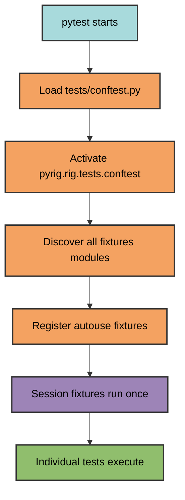
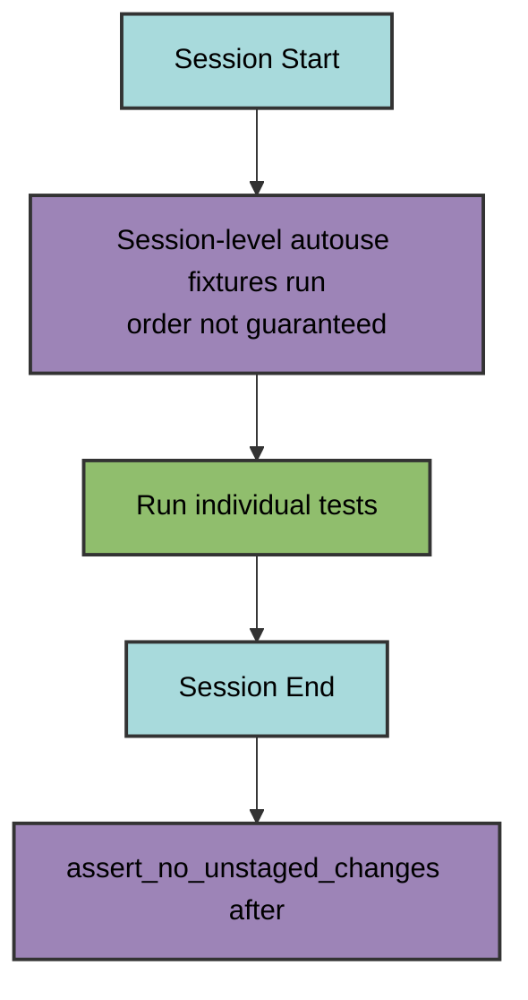

# Autouse Fixtures

Autouse fixtures run automatically in all packages depending on pyrig,
validating project health and enforcing conventions without explicit invocation.

## How Autouse Works



Autouse fixtures run automatically based on their scope without being referenced
in test signatures.

## Session-Level Fixtures

Run once per test session before any tests execute.

### `assert_no_unstaged_changes`

**Purpose**: Prevent tests from running with uncommitted changes in CI.

**Assertion**: Checks `git status` before and after test session for unstaged
changes.

**Scope**: Session (CI only, will not run on local development)

**Why**: Ensures clean state in CI/CD pipelines.

---

### `assert_root_is_correct`

**Purpose**: Validate project configuration files are correct.

**Assertion**:

- Checks all `ConfigFile` subclasses with `is_correct()`
- Runs `make_project_root()` if any incorrect
- Creates `.scratch.py` in CI (needed so the `ConfigFile` system does not
  complain that is_correct() is False)

**Scope**: Session

**Why**: Ensures project structure matches pyrig conventions before tests run.

---

### `assert_no_namespace_packages`

**Purpose**: Ensure all packages have `__init__.py` files.

**Assertion**:

- Scans project for namespace packages (directories without `__init__.py`)
- Creates missing `__init__.py` files
- Fails if any namespace packages found

**Scope**: Session

**Why**: Prevents namespace package issues and ensures proper package structure.

---

### `assert_all_src_code_in_one_package`

**Purpose**: Enforce single source package structure.

**Assertion**:

- Verifies only one source package exists at the root (besides `tests`)
- Ensures the source package contains only: `src/`, `dev/`, `resources/`
  subdirectories and `main.py`
- Prevents code from being scattered across multiple top-level packages

**Scope**: Session

**Why**: Maintains clean project structure with a single source of truth. All
application code should be in `src/`, development tools in `dev/`, and resources
in `resources/`. This enforces the convention that imports use
`my_project.src.module` rather than `my_project.module`, which provides clear
separation between the package namespace and source code.

---

### `assert_src_package_correctly_named`

**Purpose**: Verify source package name matches project name.

**Assertion**:

- Checks that source package name is derived from project name
- Ensures naming convention is followed (project-name → project_name)

**Scope**: Session

**Why**: Maintains consistent naming between project and package. The convention
pyrig asserts here is that the project name is the same as the package name, but
with dashes instead of underscores. This is the convention we use for all our
projects.

---

### `assert_all_modules_tested`

**Purpose**: Ensure every source module has a test module with tests for all
functions, classes, and methods.

**Assertion**:

- Walks entire source package
- Checks for corresponding test modules
- Verifies all functions and classes have test counterparts
- Verifies all methods in classes have test counterparts
- Generates missing test skeletons using `MirrorTestConfigFile`
- Fails if any tests missing

**Scope**: Session

**Why**: Enforces complete test coverage at module, function, class, and method
level. We think it is good to call at least every function. This has shown
during pyrig's development already that it catches a lot of things early and
helps long term. We recognize it can be annoying, but we believe it is worth it
for real projects in the long run.

---

### `assert_no_unit_test_package_usage`

**Purpose**: Prevent `unittest` usage in favor of pytest.

**Assertion**: Scans all Python files for "unittest" string, excluding
triple-quoted docstrings to avoid false positives from documentation.

**Scope**: Session

**Why**: Maintains consistent testing framework across codebase. If you want
mocks, please use pytest-mock, it is already installed as dev dependency via
pyrig-dev.

---

### `assert_dependencies_are_up_to_date`

**Purpose**: Verify dependencies are already up to date.

**Assertion**:

- Runs `uv lock --upgrade` to check for available updates
- Runs `uv sync` to check for missing installations
- Fails if either command makes changes

**Scope**: Session

**Why**: Enforces that dependencies are kept current. If this fails, run
`uv lock --upgrade && uv sync` locally and commit the updated lock file. This
ensures your project uses the latest compatible versions when dependencies are
specified with `>=` constraints.

---

### `assert_src_runs_without_dev_deps`

**Purpose**: Verify source code has no dev dependencies.

**Assertion**:

- Copies project to temp directory
- Installs dependencies with `uv sync --no-group dev`
- Verifies pytest is not installed or importable
- Imports all modules in `src/` to catch dev dependency imports
- Runs `uv run --no-group dev <project> --help` to verify CLI works

**Scope**: Session

**Why**: Ensures production code doesn't depend on development tools. This
catches accidental imports of dev dependencies in source code.

---

### `assert_src_does_not_use_dev`

**Purpose**: Prevent `src` from importing `dev` code.

**Assertion**: Scans all source files for dev imports of packages depending on
pyrig using regex pattern matching, excluding triple-quoted docstrings to avoid
false positives from documentation.

**Scope**: Session

**Why**: Maintains separation between production and development code.

---

### `assert_project_mgt_is_up_to_date`

**Purpose**: Ensure project management tool (uv) is latest version.

**Assertion**: Runs `uv self update` and expects either:

- Success message indicating already on latest version
- Acceptable failure (GitHub rate limit, network issues)

**Scope**: Session (local only, skipped in CI)

**Why**: Keeps the package manager tooling current for development. Unlike
dependency updates, this actively updates `uv` if a new version is available.

---

## Fixture Execution Order

**Note**: The execution order of session-level autouse fixtures is not
guaranteed by pytest and may vary between test runs. The diagram below shows the
logical grouping and scope hierarchy, not a guaranteed execution sequence.



**Session-level fixtures** (run once, order not guaranteed):

- `assert_no_unstaged_changes` (before and after)
- `assert_root_is_correct`
- `assert_no_namespace_packages`
- `assert_all_src_code_in_one_package`
- `assert_src_package_correctly_named`
- `assert_all_modules_tested`
- `assert_no_unit_test_package_usage`
- `assert_dependencies_are_up_to_date`
- `assert_src_runs_without_dev_deps`
- `assert_src_does_not_use_dev`
- `assert_project_mgt_is_up_to_date` (local only)

## Creating Custom Autouse Fixtures

Define autouse fixtures in your package's fixtures module:

```python
from pyrig.rig.utils.testing import autouse_session_fixture

@autouse_session_fixture
def my_custom_validation() -> None:
    """Custom validation that runs automatically."""
    # Your validation logic
    assert some_condition, "Validation failed"
```

Available decorators:

- `@autouse_session_fixture` - Runs once per test session
- `@autouse_package_fixture` - Runs once per test package
- `@autouse_module_fixture` - Runs once per test module
- `@autouse_class_fixture` - Runs once per test class
- `@autouse_function_fixture` - Runs for every test function

Custom autouse fixtures automatically run in all packages that depend on your
package.
