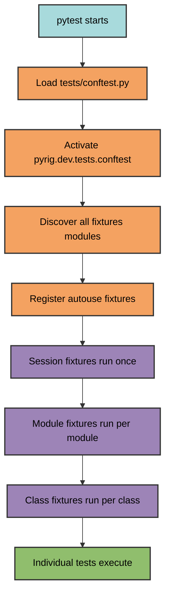
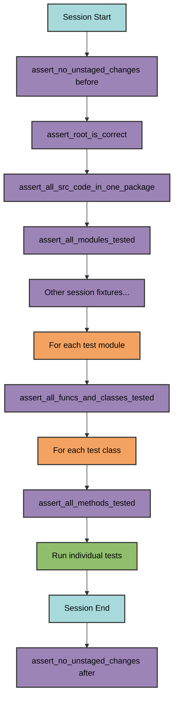

# Autouse Fixtures

Autouse fixtures run automatically in all packages depending on pyrig, validating project health and enforcing conventions without explicit invocation.

## How Autouse Works



Autouse fixtures run automatically based on their scope without being referenced in test signatures.

## Session-Level Fixtures

Run once per test session before any tests execute.

### `assert_no_unstaged_changes`

**Purpose**: Prevent tests from running with uncommitted changes in CI.

**Assertion**: Checks `git status` before and after test session for unstaged changes.

**Scope**: Session (CI only, will not run on local development)

**Why**: Ensures clean state in CI/CD pipelines.

---

### `assert_root_is_correct`

**Purpose**: Validate project configuration files are correct.

**Assertion**: 
- Checks all `ConfigFile` subclasses with `is_correct()`
- Runs `make_project_root()` if any incorrect
- Creates `.experiment.py` in CI (needed so the `ConfigFile` system does not complain that is_correct() is False)

**Scope**: Session

**Why**: Ensures project structure matches pyrig conventions before tests run.

---

### `assert_all_src_code_in_one_package`

**Purpose**: Enforce single source package structure.

**Assertion**: Verifies only one source package exists (besides `tests` and `docs`).
Also ensures all other code is in the src package by checking that the first layer is just
src, dev and main.py

**Scope**: Session

**Why**: Maintains clean project structure with single source of truth. The point of this is that all your code should in src.
Some might not like that you have to import everything via my_project.src.module instead of just my_project.module, but we think the benefits outweigh the costs.
If you do not want that I suppose you could add an import * from src to your __init__.py in my_project/__init__.py.

---

### `assert_all_modules_tested`

**Purpose**: Ensure every source module has a test module.

**Assertion**:
- Walks entire source package
- Checks for corresponding test modules
- Generates missing test skeletons for missing modules
- Fails if any tests missing

**Scope**: Session

**Why**: Enforces complete test coverage at module level.
We think it is good to call at least every function. This has shown during pyrigs development already
that it catches a lot of things early and helps long term. We recognize it can be annoying, bit we believe it is worth it for real projects in the long run. 

---

### `assert_no_unit_test_package_usage`

**Purpose**: Prevent `unittest` usage in favor of pytest.

**Assertion**: Scans all Python files for "unittest" string.

**Scope**: Session

**Why**: Maintains consistent testing framework across codebase. If you want mocks, please use pytest-mock, it is already installed as dev dependency via pyrig-dev.

---

### `assert_dependencies_are_up_to_date`

**Purpose**: Verify dependency lock file is current.

**Assertion**:
- Runs `uv lock --upgrade` (should not update)
- Runs `uv sync` (should not install)
- Fails if any changes occur

This basically exists to keep your project automatically updated as long as your dependencies are defined with >=.

**Scope**: Session

**Why**: Ensures updated and current dependencies and venv.

---

### `assert_pre_commit_is_installed`

**Purpose**: Ensure pre-commit hooks are active.

**Assertion**: Runs `pre-commit install` and verifies success message.

**Scope**: Session

**Why**: Activates code quality checks before commits.

---

### `assert_src_runs_without_dev_deps`

**Purpose**: Verify source code has no dev dependencies.

**Assertion**:
- Copies project to temp directory
- Runs `uv run --no-group dev <project> --help`
- Verifies CLI works without dev group

Also imports all src modules, to assert a minimum of sanity.

**Scope**: Session

**Why**: Ensures production code doesn't depend on development tools.

---

### `assert_src_does_not_use_dev`

**Purpose**: Prevent `src` from importing `dev` code.

**Assertion**: Scans all source files for dev imports of packages depending on pyrig using regex pattern matching. 

**Scope**: Session

**Why**: Maintains separation between production and development code.

---

### `assert_all_dev_deps_in_deps`

**Purpose**: Verify standard dev dependencies are declared.

**Assertion**: Checks `STANDARD_DEV_DEPS` is subset of declared dependencies.

**Scope**: Session

**Why**: Ensures required development tools are available.

---

### `assert_project_mgt_is_up_to_date`

**Purpose**: Ensure project management tool (uv) is latest version.

**Assertion**: Checks uv version and updates if needed.

**Scope**: Session (local only, skipped in CI)

**Why**: Keeps tooling current for development.

These fixtures that update tools and stuff are failing if they do, just so you know it happened and does not it silently.
---

## Module-Level Fixtures

Run once per test module.

### `assert_all_funcs_and_classes_tested`

**Purpose**: Ensure all functions and classes in module have tests.

**Assertion**:
- Gets current test module from pytest request
- Finds corresponding source module
- Verifies all functions and classes have test counterparts
- Generates missing test skeletons
- Fails if any tests missing

**Scope**: Module

**Why**: Enforces complete test coverage at function/class level.

This does not fail if the src module does not exist. This way you can have extra test files outside of the mirrored structure.

---

## Class-Level Fixtures

Run once per test class.

### `assert_all_methods_tested`

**Purpose**: Ensure all methods in class have tests.

**Assertion**:
- Gets current test class from pytest request
- Finds corresponding source class
- Verifies all methods have test counterparts
- Generates missing test skeletons
- Fails if any tests missing

**Scope**: Class

**Why**: Enforces complete test coverage at method level.

---

## Fixture Execution Order

Note: The order of autouse fixtures is not guaranteed and usually random.



## Creating Custom Autouse Fixtures

Define autouse fixtures in your package's fixtures module:

```python
from pyrig.dev.utils.testing import autouse_session_fixture

@autouse_session_fixture
def my_custom_validation() -> None:
    """Custom validation that runs automatically."""
    # Your validation logic
    assert some_condition, "Validation failed"
```

Available decorators:
- `@autouse_session_fixture` - Runs once per test session
- `@autouse_module_fixture` - Runs once per test module
- `@autouse_class_fixture` - Runs once per test class
- `@autouse_function_fixture` - Runs for every test function

Custom autouse fixtures automatically run in all packages that depend on your package.

