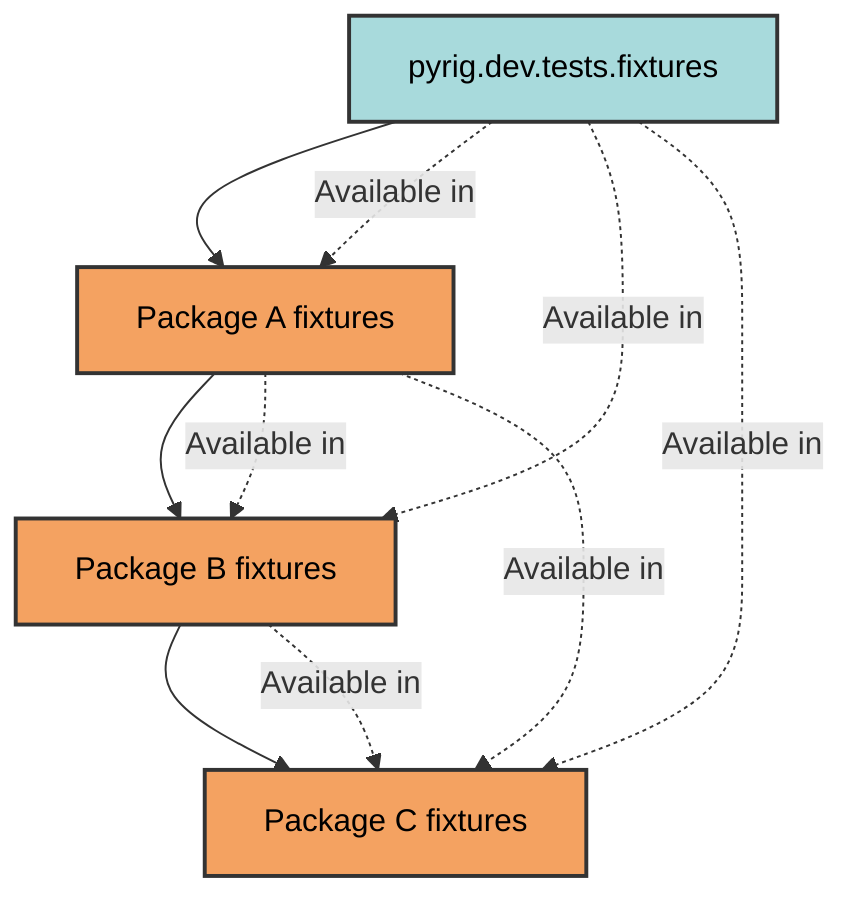
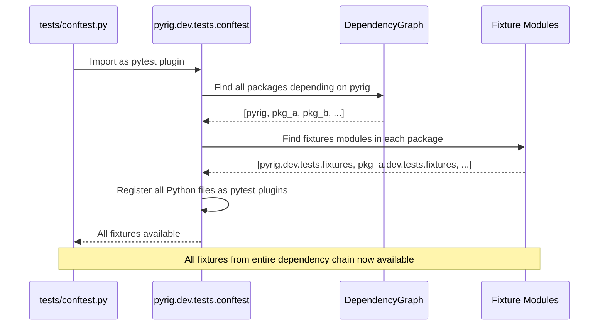
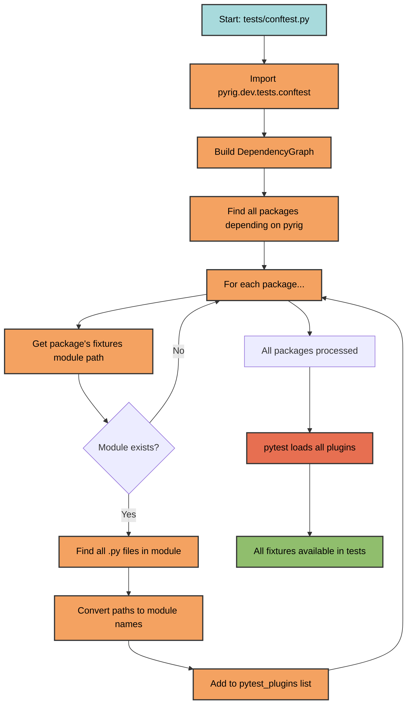

# Fixture Sharing

pyrig automatically shares fixtures across all packages in the dependency chain through a multi-package plugin architecture.

## How It Works

Every package depending on pyrig inherits all fixtures from pyrig and its dependencies:



## Plugin Discovery

The discovery process happens automatically in `tests/conftest.py`:



### Discovery Steps



**Detailed Steps:**

1. **Find dependent packages**: Uses dependency graph to find all packages depending on pyrig
2. **Locate fixtures modules**: Finds equivalent of `pyrig.dev.tests.fixtures` in each package
3. **Collect Python files**: Recursively finds all `.py` files in fixtures modules
4. **Register as plugins**: Adds all files to `pytest_plugins` list

## Integration

### In Your Package

Pyrig will generate `tests/conftest.py`:

```python
"""Pytest configuration for tests."""

pytest_plugins = ["pyrig.dev.tests.conftest"]
```

This single line activates:
- All pyrig fixtures
- All fixtures from packages you depend on
- Automatic fixture discovery for your package
- All autouse fixtures from the entire chain

### Adding Custom Fixtures

Create fixtures in your package's fixtures module:

```
myapp/
└── dev/
    └── tests/
        └── fixtures/
            ├── __init__.py
            ├── my_fixtures.py      # Custom fixtures
```

**Important**: Unlike the CLI framework (which auto-decorates functions as Typer commands), fixtures must be explicitly decorated with:
- `@pytest.fixture` from pytest, or
- Scope-specific decorators from `pyrig.dev.utils.testing` (`@session_fixture`, `@module_fixture`, etc.)

Pyrig does not auto-decorate fixture functions.

These fixtures automatically become available to:
- Your package's tests
- All packages that depend on your package

## Built-in Fixtures

### Factory Fixtures

#### `config_file_factory`

Creates test versions of `ConfigFile` subclasses using temporary paths:

```python
def test_my_config(config_file_factory):
    TestConfig = config_file_factory(MyConfigFile)
    # TestConfig.get_path() returns path in tmp_path
    config = TestConfig()
    assert TestConfig.get_path().exists()
```

**Purpose**: Isolate config file tests from actual project files. 
Prevents file generation in your project if you define cutsom subclasses of Config Files

#### `builder_factory`

Creates test versions of `Builder` subclasses using temporary paths:

```python
def test_my_builder(builder_factory):
    TestBuilder = builder_factory(MyBuilder)
    # TestBuilder.get_artifacts_dir() returns path in tmp_path
    builder = TestBuilder()
    builder.build()
    assert TestBuilder.get_artifacts_dir().exists()
```

**Purpose**: Isolate artifact generation tests from actual build directories.

### Assertion Fixtures
These are mainly only used internally by pyrig.

#### `assert_no_untested_objs`

Validates that all objects in a module, class, or function have corresponding tests:

```python
def test_my_module(assert_no_untested_objs):
    import myapp.src.module
    assert_no_untested_objs(myapp.src.module)
```

**Purpose**: Programmatically verify test coverage for specific objects.

#### `main_test_fixture`

Tests that the main entry point works correctly:

```python
def test_main(main_test_fixture: None) -> None:
    """Test main entry point."""
    assert main_test_fixture is None
```

**Purpose**: Verify CLI `--help` works and main function is callable.

## Fixture Scopes

Use pyrig's scope decorators for custom fixtures:

```python
from pyrig.dev.utils.testing import (
    session_fixture,
    module_fixture,
    class_fixture,
    function_fixture,
)

@session_fixture
def database_connection():
    """Shared across entire test session."""
    return create_connection()

@module_fixture
def module_setup():
    """Shared across test module."""
    return setup_module()
```

## Multi-Package Example

```
pyrig (base package)
├── fixtures: config_file_factory, builder_factory, main_test_fixture
│
Package A (depends on pyrig)
├── fixtures: database_fixture, api_client_fixture
│   └── Inherits: All pyrig fixtures
│
Package B (depends on Package A)
├── fixtures: custom_fixture
    └── Inherits: All pyrig + Package A fixtures

When Package B tests run:
✓ config_file_factory (from pyrig)
✓ builder_factory (from pyrig)
✓ main_test_fixture (from pyrig)
✓ database_fixture (from Package A)
✓ api_client_fixture (from Package A)
✓ custom_fixture (from Package B)
```

All fixtures are automatically discovered and available without any additional configuration.

