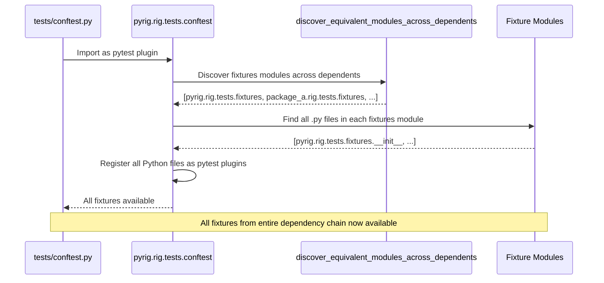
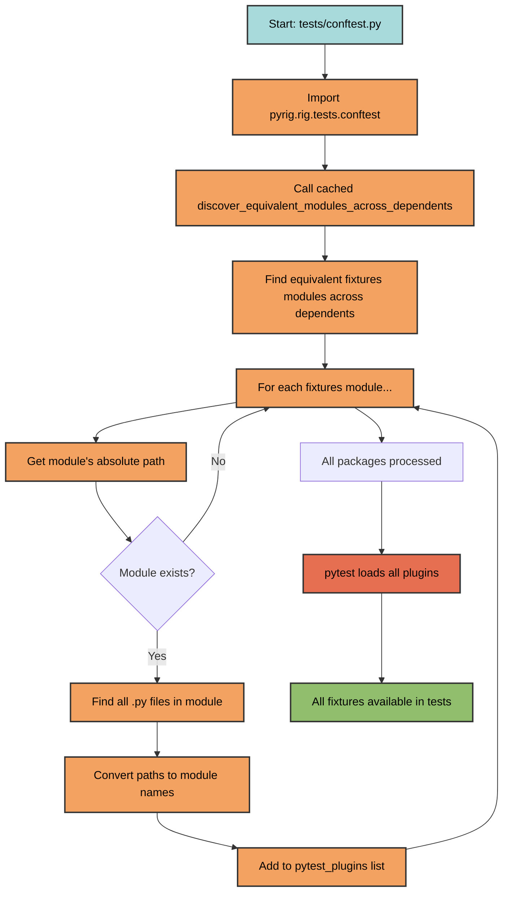

# Fixture Sharing

pyrig automatically shares fixtures across all packages in the dependency chain
through a multi-package plugin architecture.

## How It Works

Every package depending on pyrig inherits all fixtures from pyrig and its
dependencies:


## Plugin Discovery

The discovery process happens automatically in `tests/conftest.py`:



### Discovery Steps



**Detailed Steps:**

1. **Discover equivalent fixtures modules**: Uses
   `discover_equivalent_modules_across_dependents` (which internally uses
   `DependencyGraph`) to find `rig.tests.fixtures` in pyrig and all dependent
   packages
2. **Collect Python files**: Recursively finds all `.py` files in each
   discovered fixtures module
3. **Convert to module names**: Converts file paths to dotted module names
4. **Register as plugins**: Adds all module names to `pytest_plugins` list

## Integration

### In Your Package

Pyrig will generate `tests/conftest.py`:

```python
"""Pytest configuration for tests."""

pytest_plugins = ["pyrig.rig.tests.conftest"]
```

This single line activates:

- All pyrig fixtures
- All fixtures from packages you depend on
- Automatic fixture discovery for your package
- All autouse fixtures from the entire chain

### Adding Custom Fixtures

Create fixtures in your package's fixtures module:

```text
myapp/
└── rig/
    └── tests/
        └── fixtures/
            ├── __init__.py
            ├── my_fixtures.py      # Custom fixtures
```

**Important**: Unlike the CLI framework (which auto-decorates functions as Typer
commands), fixtures must be explicitly decorated with `@pytest.fixture` from
pytest (or its scoped variants like `@pytest.fixture(scope="session")`).

Pyrig does not auto-decorate fixture functions.

These fixtures automatically become available to:

- Your package's tests
- All packages that depend on your package

## Built-in Fixtures

### Factory Fixtures

#### `config_file_factory`

Creates test versions of `ConfigFile` subclasses using temporary paths:

```python
def test_my_config(config_file_factory):
    TestConfig = config_file_factory(MyConfigFile)
    # TestConfig.path() returns path in tmp_path
    config = TestConfig()
    assert TestConfig.path().exists()
```

**Purpose**: Isolate config file tests from actual project files. Prevents file
generation in your project if you define custom subclasses of ConfigFile.

#### Testing BuilderConfigFile subclasses

Use `config_file_factory` to create test versions of `BuilderConfigFile`
subclasses using temporary paths:

```python
def test_my_builder(config_file_factory):
    TestBuilder = config_file_factory(MyBuilder)
    # TestBuilder.path() returns path in tmp_path
    builder = TestBuilder()
    builder.build()
    assert TestBuilder.parent_path().exists()
```

**Purpose**: Isolate artifact generation tests from actual build directories.

### Assertion Fixtures

#### `main_test_fixture`

Tests that the main entry point works correctly:

```python
def test_main(main_test_fixture: None) -> None:
    """Test main entry point."""
    assert main_test_fixture is None
```

**Purpose**: Verify CLI `--help` works and main function is callable.

## Fixture Scopes

Use pytest's built-in `scope` parameter for custom fixtures:

```python
import pytest

@pytest.fixture(scope="session")
def database_connection():
    """Shared across entire test session."""
    return create_connection()

@pytest.fixture(scope="module")
def module_setup():
    """Shared across test module."""
    return setup_module()
```

`pyrig.rig.utils.testing` provides skip markers for conditional test execution:

- `skip_fixture_test` — skip placeholder tests for fixture functions
- `skip_in_github_actions` — skip tests that cannot run in CI
- `skip_if_no_internet` — skip tests requiring internet connectivity

## Multi-Package Example

```text
pyrig (base package)
├── fixtures: config_file_factory, main_test_fixture
│
Package A (depends on pyrig)
├── fixtures: database_fixture, api_client_fixture
│   └── Inherits: All pyrig fixtures
│
Package B (depends on Package A)
├── fixtures: custom_fixture
    └── Inherits: All pyrig + Package A fixtures

When Package B tests run:
✓ config_file_factory (from pyrig)
✓ main_test_fixture (from pyrig)
✓ database_fixture (from Package A)
✓ api_client_fixture (from Package A)
✓ custom_fixture (from Package B)
```

All fixtures are automatically discovered and available without any additional
configuration.
