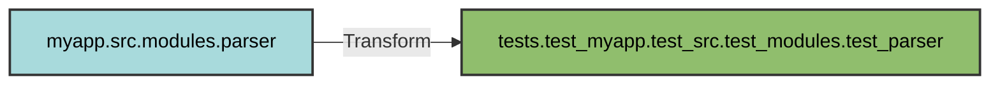
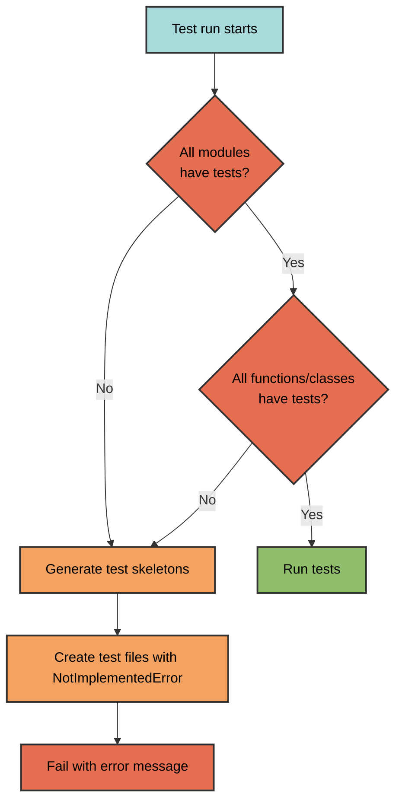

# Test Structure

pyrig enforces a strict mirrored structure between source code and tests, ensuring comprehensive test coverage through convention.

## Naming Conventions

| Source | Test | Prefix |
|--------|------|--------|
| `module.py` | `test_module.py` | `test_` |
| `function_name()` | `test_function_name()` | `test_` |
| `ClassName` | `TestClassName` | `Test` |
| `method_name()` | `test_method_name()` | `test_` |

## Directory Structure

Tests mirror the source package structure with prefixed names:

```
Source:                          Tests:
myapp/                          tests/
├── src/                        └── test_myapp/
│   ├── modules/                    └── test_src/
│   │   ├── __init__.py                 └── test_modules/
│   │   ├── parser.py                       ├── __init__.py
│   │   └── utils.py                        ├── test_parser.py
│   └── api/                                └── test_utils.py
│       └── client.py                   └── test_api/
└── dev/                                    └── test_client.py
    └── configs/                    └── test_dev/
        └── base.py                     └── test_configs/
                                            └── test_base.py
```

## Structure Mapping



### Transformation Rules

1. **Add `tests` prefix** to the import path
2. **Prefix each package** with `test_`
3. **Prefix module name** with `test_`
4. **Prefix class names** with `Test`
5. **Prefix function names** with `test_`

Example:
```python
# Source: myapp.src.parser.Parser.parse
# Test:   tests.test_myapp.test_src.test_parser.TestParser.test_parse
```

## Test Content Requirements

Every source object must have a corresponding test:

```python
# Source: myapp/src/calculator.py
class Calculator:
    def add(self, a: int, b: int) -> int:
        return a + b
    
    def subtract(self, a: int, b: int) -> int:
        return a - b

# Required: tests/test_myapp/test_src/test_calculator.py
class TestCalculator:
    def test_add(self) -> None:
        calc = Calculator()
        assert calc.add(2, 3) == 5
    
    def test_subtract(self) -> None:
        calc = Calculator()
        assert calc.subtract(5, 3) == 2
```

## Automatic Test Generation

When tests are missing, pyrig automatically generates skeleton tests:



### Generated Skeleton

```python
def test_function_name() -> None:
    """Test function."""
    raise NotImplementedError
```

Generate manually:
```bash
uv run pyrig mktests
```

## Coverage Requirements

**Minimum 90% code coverage** is enforced:

```toml
[tool.pytest.ini_options]
addopts = "--cov=myapp --cov-report=term-missing --cov-fail-under=90"
testpaths = ["tests"]
```

### What Must Be Tested

- Every module must have a test module
- Every function must have a test function
- Every class must have a test class
- Every method must have a test method
- 90% of code lines must be executed

### Checking Coverage

```bash
uv run pytest                    # Fails if coverage < 90%
uv run pytest --cov-report=html  # Generate HTML report in htmlcov/
```

## Validation

Three levels of automatic validation ensure complete test coverage:

1. **Session-level**: Validates all modules have test modules
2. **Module-level**: Validates all functions and classes have tests
3. **Class-level**: Validates all methods have tests

All validation happens automatically through autouse fixtures.

