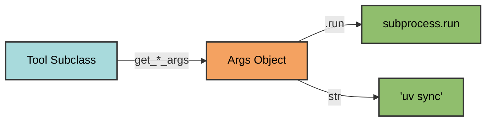
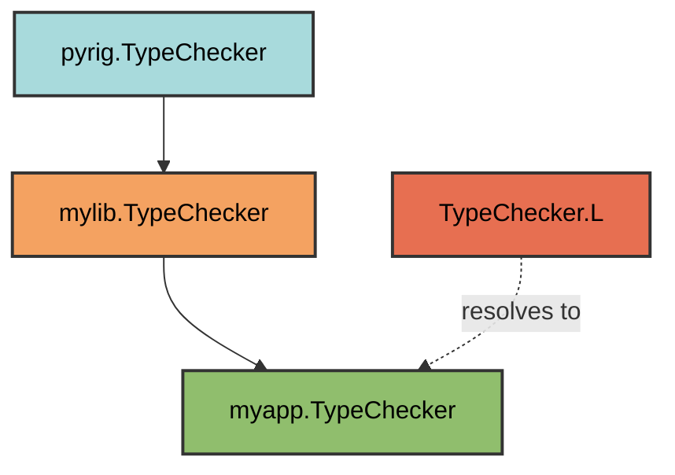
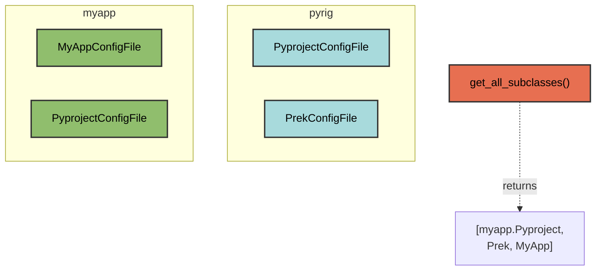

# Tool Architecture

pyrig's tools system provides type-safe wrappers around command-line tools
through a composable `Tool` and `Args` pattern. This document explains the
**design philosophy** and **extensibility mechanisms** - for API details, see
the source docstrings.

## Design Philosophy

The tools system is built on three core principles:

1. **Single Source of Truth**: Each tool has one wrapper class that defines all
   its commands
2. **Automatic Propagation**: Customizations in dependent packages automatically
   apply everywhere
3. **Explicit Over Implicit**: Commands are constructed as inspectable `Args`
   objects before execution



## Two Extension Mechanisms

pyrig provides two complementary patterns for customization. Understanding when
to use each is essential:

| Mechanism | Purpose | Used For |
|-----------|---------|----------|
| **`.L` (Leaf)** | Get the deepest subclass of a Tool or ConfigFile | Internal pyrig operations that should use your customizations |
| **`get_all_subclasses()`** | Discover all ConfigFile implementations | Finding all configs to generate, including new ones you define |

### The `.L` Pattern: Dynamic Tool Resolution

The `.L` property resolves to the **deepest subclass** in the inheritance chain.
pyrig uses `.L` internally so your customizations propagate automatically.



**Example: How prek uses `.L`**

The prek config file uses `.L` to reference tools:

```python
# pyrig/rig/configs/git/pre_commit.py
hooks = [
    cls.get_hook("lint-code", Linter.L.get_check_fix_args()),
    cls.get_hook("check-types", TypeChecker.L.get_check_args()),
    # ...
]
```

Because it uses `TypeChecker.L` (not `TypeChecker` directly), if you subclass
`TypeChecker` to use mypy:

```python
# myapp/rig/tools/type_checker.py
from pyrig.rig.tools.type_checker import TypeChecker as BaseTypeChecker

class TypeChecker(BaseTypeChecker):
    @classmethod
    def get_name(cls) -> str:
        return "mypy"
```

The prek config **automatically** uses mypy. No need to override the
config file itself.

### The `get_all_subclasses()` Pattern: ConfigFile Discovery

For `ConfigFile` classes, pyrig uses `get_all_subclasses()` to discover **all
non-abstract implementations** across all dependent packages. This enables:

- Adding entirely new config files by creating new `ConfigFile` subclasses
- Overriding existing configs by subclassing them (the parent is discarded)



Note: `pyrig.PyprojectConfigFile` is **not** in the result because
`myapp.PyprojectConfigFile` subclasses it - only leaf classes are returned.

## Dynamic vs Static: When Each Applies

Not everything in pyrig uses dynamic resolution. Understanding the difference
prevents confusion:

### Dynamic (Uses `.L` - Your Subclass Applies Automatically)

| Component | Why Dynamic |
|-----------|-------------|
| Prek hooks | Uses `Tool.L.get_*_args()` to build commands |
| CLI commands | Uses `Tool.L` for all operations |
| Most config file content | Generated from `Tool.L` or `ConfigFile.L` |

**If you subclass a Tool, these automatically use your version.**

### Static (Hardcoded - Requires Override)

| Component | Why Static | What To Override |
|-----------|------------|------------------|
| GitHub Actions workflow steps | External action references can't be dynamic | Subclass the `Workflow` and override `step_*` methods |
| External tool versions | Pinned for reproducibility | Subclass and override version constants |

#### Example: Container Engine in Workflows

The workflow uses a hardcoded GitHub Action for Podman:

```python
# pyrig/rig/configs/base/workflow.py
def step_install_container_engine(cls, ...):
    return cls.get_step(
        uses="redhat-actions/podman-install@main",  # Hardcoded!
        ...
    )
```

Even if you subclass `ContainerEngine` to use Docker, the workflow still
installs Podman. You must **also** subclass the workflow:

```python
# myapp/rig/configs/workflows/build.py
from pyrig.rig.configs.workflows.build import BuildWorkflow as BaseBuildWorkflow

class BuildWorkflow(BaseBuildWorkflow):
    @classmethod
    def step_install_container_engine(cls, *, step=None):
        return cls.get_step(
            step_func=cls.step_install_container_engine,
            uses="docker/setup-buildx-action@v3",
            step=step,
        )
```

## Subclassing Guide

### Extending a Tool (Add Behavior)

```python
# myapp/rig/tools/linter.py
from pyrig.rig.tools.linter import Linter as BaseLinter
from pyrig.src.processes import Args

class Linter(BaseLinter):
    @classmethod
    def get_check_args(cls, *args: str) -> Args:
        # Always include --show-source
        return super().get_check_args("--show-source", *args)
```

### Replacing a Tool (Change the CLI)

```python
# myapp/rig/tools/type_checker.py
from pyrig.rig.tools.type_checker import TypeChecker as BaseTypeChecker

class TypeChecker(BaseTypeChecker):
    @classmethod
    def get_name(cls) -> str:
        return "mypy"  # Use mypy instead of ty
```

### Adding a New ConfigFile

```python
# myapp/rig/configs/my_config.py
from pathlib import Path
from pyrig.rig.configs.base.toml import TomlConfigFile

class MyAppConfigFile(TomlConfigFile):
    @classmethod
    def get_parent_path(cls) -> Path:
        return Path()

    @classmethod
    def _get_configs(cls) -> dict:
        return {"app": {"name": "myapp"}}
```

This config is **automatically discovered** and generated when `pyrig init`
runs.

### Overriding an Existing ConfigFile

```python
# myapp/rig/configs/pyproject.py
from pyrig.rig.configs.pyproject import PyprojectConfigFile as BasePyproject

class PyprojectConfigFile(BasePyproject):
    @classmethod
    def _get_configs(cls) -> dict:
        config = super()._get_configs()
        config["tool"]["myapp"] = {"custom": "setting"}
        return config
```

The parent class is automatically excluded from discovery.

## Tool Replacement Complexity

| Replacement | Complexity | What's Needed |
|-------------|------------|---------------|
| ty → mypy | **Low** | Just subclass `TypeChecker.get_name()` |
| ruff → black | **Low** | Subclass `Linter.get_name()` and adjust methods |
| Podman → Docker | **Medium** | Subclass Tool + override workflow steps |
| uv → pip | **High** | Affects nearly everything |

**Note**: We have not exhaustively tested all replacement scenarios. You may
need additional adjustments beyond what is documented. We recommend using
pyrig's default tools - they were chosen for their quality and integration.

### Why Some Replacements Need More Work

- **ty → mypy**: Prek uses `TypeChecker.L`, so it's automatic
- **Podman → Docker**: Workflow steps use hardcoded GitHub Actions, not `.L`

The rule: **If pyrig uses `.L`, your subclass applies automatically. If it's
hardcoded (like external action references), you must override.**

## See Also

- [Trade-offs](../more/drawbacks.md) - What you sacrifice and gain with pyrig
- [Tooling](../more/tooling.md) - Why pyrig chose each tool
